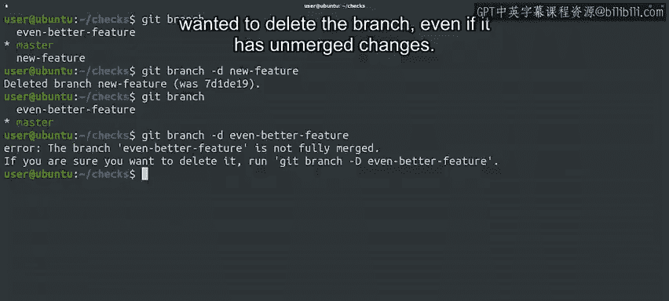

#  027：Git分支管理教程（第3课） 🌿


## 概述

在本节课中，我们将学习Git分支的基本操作，包括如何切换分支、查看分支状态以及删除分支。通过实际操作，你将理解分支在Git中的工作原理及其重要性。

---

## 回顾与当前状态

上一节我们介绍了如何创建新分支并向其添加提交。现在，让我们通过调用`git status`和`ls`命令来检查仓库的当前状态。

```bash
git status
ls
```

结果显示，我们当前位于“even_better_feature”分支，工作树是干净的，并且新文件“free_memory.py”存在于工作树中。

---

## 切换分支与HEAD指针

现在，让我们使用`git checkout master`命令切换回主分支，并列出该分支上的最近两次提交。

```bash
git checkout master
git log --oneline -2
```

当我们使用`git checkout`切换分支时，Git在底层会改变HEAD指针的指向。通过这次切换，HEAD从指向“even_better_feature”分支的最新提交，改为指向主分支的最新提交。

因此，“even_better_feature”分支的提交不会显示在主分支的历史中，最新的快照是我们之前见过的第二个条目。

---

## 工作目录的变化

记住，当我们切换分支时，Git还会将工作目录中的文件更改为HEAD当前指向的快照。让我们查看当前目录的内容。

```bash
ls
```

“free_memory.py”文件不见了。这演示了当我们切换分支时，Git会更新工作目录和提交历史，以反映该分支中项目的快照。

当我们在新分支上提交更改时，这些更改会被添加到该分支的历史中。由于“free_memory.py”是在另一个分支上提交的，它不会出现在主分支的历史或工作目录中。

---

## 分支的本质

经过这一系列操作后，需要注意的一点是，每个分支只是指向一系列快照中特定提交的指针。创建新分支非常容易，因为不需要复制任何数据。

当我们切换到另一个分支时，我们实际上是在检出不同的提交，并同时更新HEAD和工作目录的内容。HEAD随着我们的移动而浮动，就像一个自由的灵魂。

---

## 删除分支

我们已经看到了如何创建和切换分支，那么如果我们想删除一个不再需要的分支呢？我们可以使用`git branch -d`命令来实现。

以下是删除分支的步骤：

首先，列出当前仓库中的分支。

```bash
git branch
```

然后，通过调用`git branch -d new_feature`命令删除“new_feature”分支。

```bash
git branch -d new_feature
```

就这样，我们的分支被删除了。我们可以通过再次调用`git branch`来确认它已不存在。

```bash
git branch
```

如果要删除的分支中有尚未合并回主分支的更改，Git会通过错误提示告知我们。幸运的是，Git还会提供命令，让我们在确定要删除分支时执行，即使它有未合并的更改。

但我们暂时不会这样做。实际上，我们希望将这些更改合并回仓库中。

---



## 总结

本节课我们一起学习了Git分支管理的核心操作。我们了解了如何切换分支、查看分支状态，以及删除不需要的分支。通过实际操作，我们看到了分支在Git中的工作原理，以及它们如何帮助我们高效管理项目版本。

在下一节课中，我们将学习如何将分支中的更改合并回主分支，敬请期待！