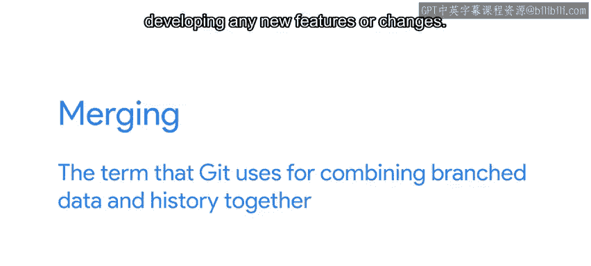
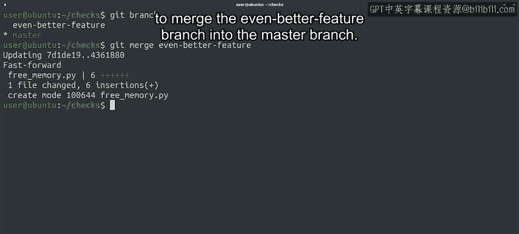
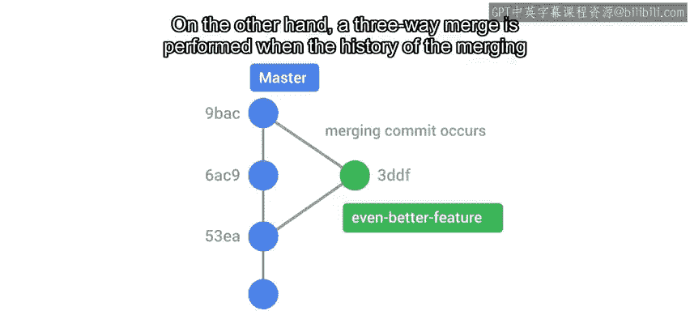

#  028：Git分支管理 - 合并操作详解 🧩


在本节课中，我们将学习Git中一个核心操作：**合并（Merge）**。我们将了解合并的基本概念、两种主要的合并算法（快进合并与三方合并），以及合并过程中可能出现的冲突情况。掌握这些知识，你将能够有效地整合不同分支的代码变更。

---

## 概述：什么是合并？



在Git中管理分支的一个典型工作流是：为开发任何新功能或修改创建一个独立的分支。一旦新功能开发完成且状态良好，我们便将这个独立分支合并回代码的主干（如`master`分支）。

**合并**是Git用于将分支数据和历史记录组合在一起的术语。

---

## 执行合并操作

我们将使用 `git merge` 命令。这个命令允许我们获取一个Git分支的独立快照和历史记录，并将其整合到另一个分支中。



让我们用上一个视频中的示例分支来尝试一下。

首先，确认我们当前位于`master`分支：
```bash
git checkout master
```

然后，执行合并命令，将 `even-better-feature` 分支合并到 `master` 分支：
```bash
git merge even-better-feature
```

现在，我们已经让`master`分支同步了最新内容。可以通过查看 `git log` 来验证这一点。

---

## 合并算法：快进合并 vs. 三方合并

Git使用两种不同的算法来执行合并：**快进合并（Fast-forward）** 和 **三方合并（Three-way merge）**。

我们刚刚执行的合并就是一个**快进合并**的例子。当被检出的分支（例如`master`）的所有提交，也都存在于要被合并的分支（例如`even-better-feature`）中时，就会发生这种合并。在这种情况下，我们可以说两个分支的提交历史没有分叉。Git只需要将分支的指针更新到同一个提交即可，不需要进行实际的代码合并。

另一方面，当合并分支的历史以某种方式分叉，并且没有一条清晰的线性路径可以通过快进来组合它们时，就会执行**三方合并**。



---

## 理解三方合并与冲突

当两个分支分叉后，在其中一个分支上进行了新的提交，就会发生三方合并。在我们的例子中，如果我们在创建了其他分支之后，又在`master`分支上进行了提交，就会出现这种情况。

此时，Git会通过创建一个**新的合并提交**来将分支历史联系在一起。它会将两个分支尖端的快照与**最近的共同祖先**（即分叉点之前的那个提交）的快照进行合并。

为了成功合并，Git会尝试找出如何组合这两个快照：
*   如果修改发生在不同的文件，或同一文件的不同部分，Git会接受所有更改并将它们整合到结果中。
*   如果修改发生在**同一文件的同一部分**，Git将不知道如何合并这些更改，尝试合并将导致**合并冲突**。

这听起来可能有点吓人，但请不要惊慌。Git不会放弃，我们将在下一个视频中学习如何解决这些冲突。

---

## 总结

本节课中，我们一起学习了Git的核心合并操作。我们了解了执行合并的基本命令 `git merge`，并深入探讨了Git使用的两种合并策略：**快进合并**和**三方合并**。我们还初步认识了合并过程中可能出现的**冲突**及其原因。理解这些概念是进行高效团队协作和代码版本管理的基础。在下一课中，我们将具体学习如何解决合并冲突。