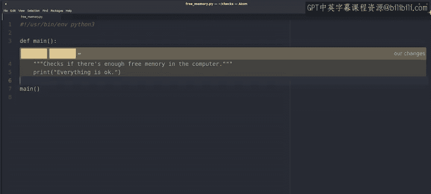
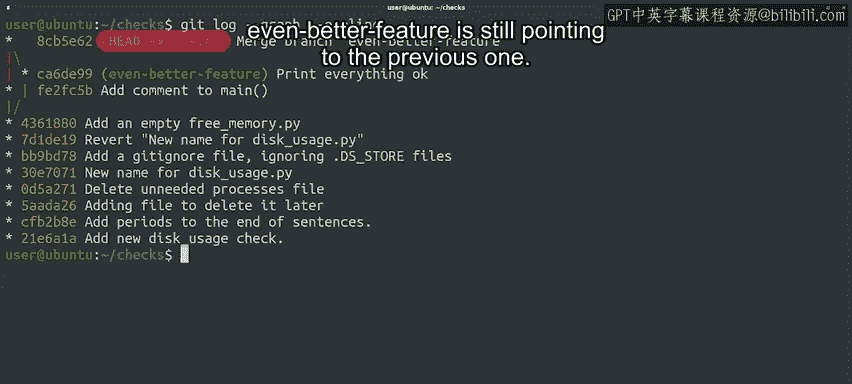

#  029：28_合并冲突 🛠️


在本节课中，我们将学习如何处理Git中的合并冲突。合并冲突发生在两个分支对同一文件的同一部分进行了不同的修改，而Git无法自动决定如何合并时。我们将通过一个具体示例，演示如何识别、解决冲突，并最终完成合并。

## 概述

有时，我们尝试合并的两个分支可能对同一文件的同一部分进行了编辑。这将导致所谓的“冲突”。通常，Git可以自动为我们合并文件，但当出现合并冲突时，Git需要一些帮助来决定如何处理。

## 创建冲突场景

上一节我们介绍了分支的基本操作，本节中我们来看看如何模拟一个合并冲突。

首先，我们在`master`分支上编辑`free_memory.py`文件，将`pass`语句替换为一个关于`main`函数功能的注释。

```python
# 主函数应打印系统内存信息
```

完成更改后，保存文件并将其提交到`master`分支。

接下来，我们切换到`even-better-feature`分支，并在文件的相同位置进行另一处修改。这次，我们将`pass`调用替换为一个`print`函数调用。

```python
print("一切正常")
```

保存此更改并将其提交到`even-better-feature`分支。

现在，我们的文件已经设置好，即将产生冲突。

## 尝试合并并发现冲突

让我们再次检出`master`分支，并尝试将`even-better-feature`分支合并进来。

```bash
git checkout master
git merge even-better-feature
```

Git会提示它尝试自动合并`free_memory.py`文件的两个版本，但不知道如何操作。这表明发生了合并冲突。

我们可以使用`git status`命令来获取更多信息。

```bash
git status
```



`git status`命令提供了许多额外信息。它告诉我们当前存在未合并的文件，我们需要修复这些冲突，或者如果我们认为合并是个错误，可以中止合并。它还提示我们需要对每个未合并的文件运行`git add`命令，以标记冲突已解决。

## 解决冲突

以下是解决冲突的步骤：

1.  **打开冲突文件**：在文本编辑器中打开`free_memory.py`文件。Git已在文件中添加了标记，告诉我们代码的哪些部分存在冲突。
    ```
    <<<<<<< HEAD
    # 主函数应打印系统内存信息
    =======
    print("一切正常")
    >>>>>>> even-better-feature
    ```
    *   `<<<<<<< HEAD`和`=======`之间的内容是当前分支（`master`）的内容。
    *   `=======`和`>>>>>>> even-better-feature`之间的内容是待合并分支（`even-better-feature`）的内容。

2.  **手动编辑文件**：我们需要决定保留哪个版本，或者完全更改文件内容。在本例中，我们决定保留两个语句，并删除合并标记。修改后的文件内容如下：
    ```python
    # 主函数应打印系统内存信息
    print("一切正常")
    ```

3.  **标记冲突已解决**：保存文件后，运行`git add`命令来标记冲突已解决。
    ```bash
    git add free_memory.py
    ```

4.  **检查合并状态**：再次运行`git status`，可以看到Git提示所有冲突都已解决，我们只需要运行`git commit`来完成合并。
    ```bash
    git status
    ```

5.  **完成合并提交**：运行`git commit`。Git会显示一个与其他提交不同的注释，因为它是一个合并提交。注释会自动包含合并了哪个分支以及哪个文件存在冲突（现已解决）的信息。我们可以在此基础上添加更多描述。
    ```bash
    git commit
    ```
    在打开的编辑器中，我们可以在自动生成的描述后添加一行，例如“保留了两个分支的代码行”，然后保存并退出。

至此，合并冲突已成功解决。

## 查看提交历史

要查看解决冲突后的提交历史，我们可以使用`git log`命令的两个便捷选项：`--graph`用于以图形方式查看提交，`--oneline`用于每行只显示一个提交的概要。

```bash
git log --graph --oneline
```



这种格式帮助我们更好地理解提交历史和合并是如何发生的。我们可以看到新添加的合并提交，以及被合并的两个独立提交（一个来自`master`分支，另一个来自`even-better-feature`分支）。我们还可以看到`master`指针指向了合并提交，而`even-better-feature`指针仍指向其之前的提交。

## 处理复杂冲突与中止合并

在我们的示例中，解决冲突是直接且简单的。但在实际工作中，情况并非总是如此。合并冲突有时可能很棘手、复杂，并且分布在多个文件中。

如果你想放弃合并并重新开始，可以使用`git merge --abort`命令作为“逃生舱口”。

```bash
git merge --abort
```

这将停止合并过程，并将工作目录中的文件重置回合并发生之前的上一次提交状态。

## 总结

本节课中我们一起学习了Git合并冲突的处理。你现在已经知道如何创建、删除和切换分支，并且了解到每个分支都代表指向一个提交的指针和一系列独立的快照。你还学会了如何使用`git merge`命令将这些提交合并回主干。

出色的工作。这确实不是容易的内容。接下来，你将找到一份总结所有这些分支技术的速查表，随后还有一个测验来巩固这些概念。