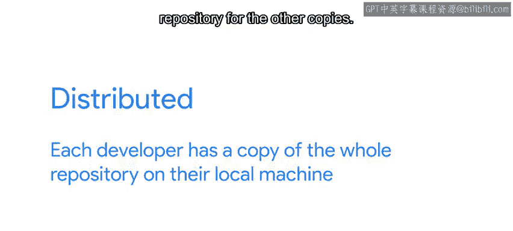
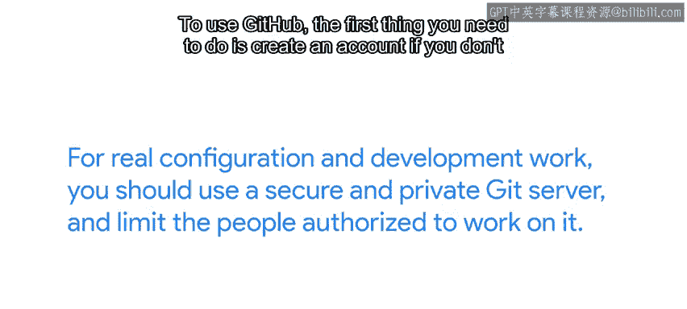

#  032：什么是GitHub？🤔

在本节课中，我们将要学习什么是GitHub，以及它如何作为Git的远程仓库托管服务，帮助我们进行团队协作和代码管理。

---

在之前的视频中，我们提到Git是一个**分布式版本控制系统**。  
分布式意味着每个开发者本地机器上都拥有整个仓库的一个完整副本。

## 从本地到远程：协作的桥梁 🌉

上一节我们介绍了Git的分布式特性，本节中我们来看看如何将这些分散的副本连接起来。

每个副本都是彼此对等的，但我们可以将其中一个副本托管在服务器上，并将其作为其他副本的**远程仓库**。  
这让我们能够通过这台服务器在不同副本之间同步工作。

任何人都可以创建这样的Git服务器，许多公司也拥有类似的内部服务。

## 托管服务：GitHub登场 🚀

如果你不想自己搭建Git服务器并托管仓库，可以使用像GitHub这样的在线服务。  
**GitHub是一个基于Web的Git仓库托管服务**。

除了Git的版本控制功能，GitHub还包含额外的功能，例如：
*   错误跟踪
*   Wiki
*   任务管理

GitHub让我们能够在网络上共享和访问仓库，并将其复制或克隆到本地计算机以便进行工作。

GitHub因其强大的功能集而成为流行选择，但它并非唯一选择。  
提供类似功能的其他服务包括**Bitbucket**和**GitLab**。

在本课程的剩余部分，我们将使用GitHub进行示例演示，但你可以自由选择最适合你需求的工具。

## GitHub的账户与仓库 📦

要使用GitHub，首先需要创建一个账户（如果还没有的话）。在线注册是免费且相对简单的。

完成注册后，你可以创建自己的仓库，或为其他项目的仓库做贡献。

GitHub为公共和私有仓库提供免费的Git服务器访问权限。  
它对免费私有仓库的贡献者数量有限制，并提供按月付费的无限制私有仓库服务。

我们的示例将使用免费仓库，这对于教育用途、小型个人项目或开源开发来说是合适的。

## 重要安全提示 ⚠️

以下是关于如何管理这些仓库的一个重要警告。

如果黑客掌握了关于你组织IT基础设施的信息，他们可能会利用这些信息试图入侵你的网络。  
因此，请确保将这些信息视为机密。

对于真实的配置和开发工作，你应该使用安全、私有的Git服务器，并限制有权在其上工作的人员。

---

本节课中我们一起学习了GitHub的核心概念：它是一个基于Web的Git仓库托管平台，为分布式协作提供了中心化的桥梁。我们了解了它的基本功能、账户创建以及使用时的安全注意事项。

如果你还没有GitHub账户，现在是一个创建的好时机。请访问 Github.com 注册他们的服务。完成之后，可以继续观看下一个视频，我们将介绍与GitHub的一些基本交互操作。