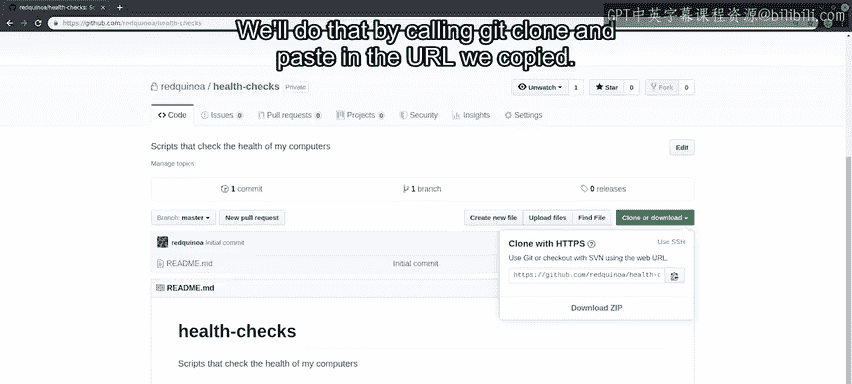
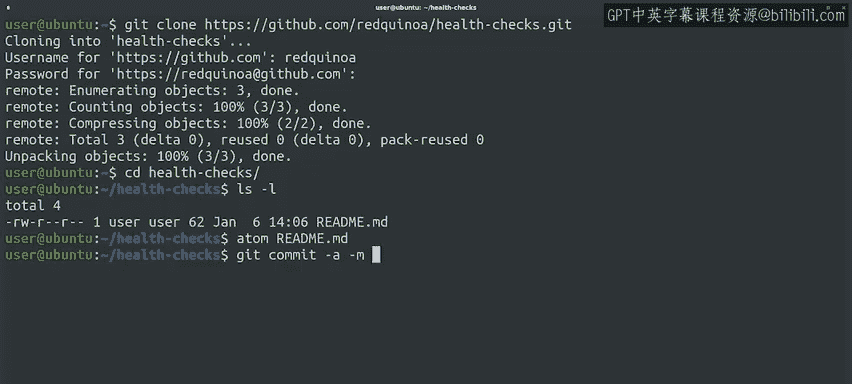
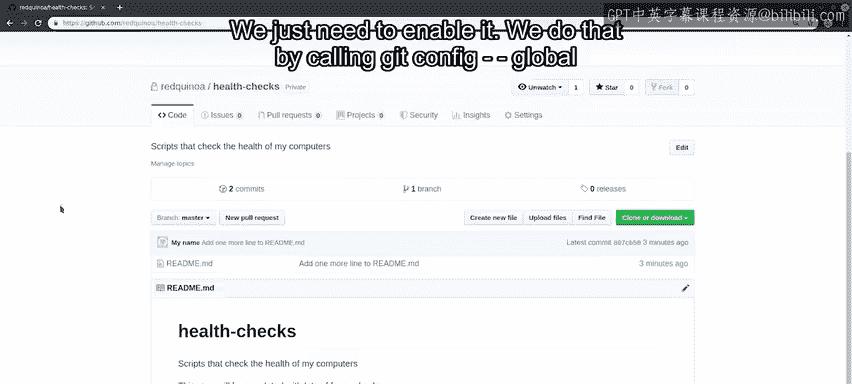
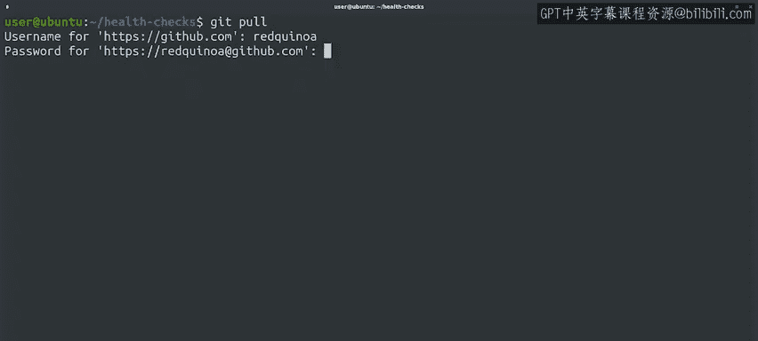

#  033：与GitHub的基本交互 🚀


在本节课中，我们将学习如何与GitHub进行基本交互，包括创建远程仓库、克隆到本地、推送更改以及拉取更新。我们将通过一个简单的“健康检查”脚本仓库示例来演示整个流程。

---

## 概述

GitHub是一个在线服务，用于托管Git仓库。要使用它，首先需要创建一个账户。创建账户后，就可以在GitHub上建立新的仓库，并与本地仓库进行同步。本节将引导你完成从创建远程仓库到进行基本版本控制操作的全过程。

---

## 创建GitHub仓库

上一节我们介绍了Git的基本概念，本节中我们来看看如何在GitHub上创建一个新的远程仓库。

以下是创建新仓库的步骤：

1.  登录GitHub账户后，点击左侧的“Create a repository”链接。
2.  进入仓库创建向导。首先，为仓库命名，例如 `health-checks`。
3.  填写仓库描述，例如“用于检查计算机健康状况的脚本”。
4.  选择仓库的可见性，可以选择“Public”（公开）或“Private”（私有）。本例中选择“Private”。
5.  向导提供初始化选项，如添加README文件、`.gitignore`文件或许可证。本例中仅选择“Initialize this repository with a README”。
6.  点击“Create repository”按钮完成创建。

完成后，一个全新的远程仓库就准备就绪了。

---

## 克隆远程仓库

现在我们已经有了一个远程仓库，下一步是将其复制到本地计算机上，以便进行工作。

我们使用 `git clone` 命令来实现这一点。该命令的基本格式是：



```bash
git clone <repository_url>
```

操作步骤如下：

1.  在GitHub仓库页面，找到并复制仓库的URL。
2.  在本地终端中，运行 `git clone` 命令并粘贴复制的URL。
3.  首次操作时，GitHub会要求输入用户名和密码进行身份验证。

命令执行后，远程仓库的完整副本就被下载到了本地机器上，并自动创建了一个与仓库同名的目录（例如 `health-checks`）。

---

## 进行本地修改并提交

进入克隆下来的本地仓库目录后，可以看到目前只有一个GitHub自动生成的README.md文件。这个文件使用Markdown格式。

我们可以修改这个文件来添加内容。修改完成后，需要将更改提交到本地仓库。



之前我们学习过几种提交方式，这里使用一个快捷命令来一次性完成暂存和提交：

```bash
git commit -a -m "Updated README with project description"
```

这个命令中的 `-a` 参数会自动暂存所有已跟踪文件的更改，`-m` 参数则用于添加提交信息。

---

## 推送更改到远程仓库

本地提交完成后，我们需要将这些更改同步到GitHub上的远程仓库。

使用 `git push` 命令可以将本地提交的“快照”推送到远程仓库。其基本命令是：

```bash
git push
```

运行此命令后，可能需要再次输入密码。推送成功后，在GitHub仓库页面上刷新，就能看到README文件的内容已经更新。

这样，我们就成功地将本地计算机上的更改推送到了GitHub托管的远程仓库中。

---

## 配置凭证缓存

你可能注意到，在克隆和推送时都需要输入密码。有几种方法可以避免每次操作都进行验证。

一种方法是配置Git的凭证助手来缓存密码。Git自带了一个凭证缓存助手，只需启用它即可。



启用凭证缓存的命令是：

```bash
git config --global credential.helper cache
```

启用后，首次操作仍需输入凭证，之后在15分钟的有效期内，后续操作将不再需要输入密码。

为了验证缓存是否生效，可以尝试使用 `git pull` 命令从远程仓库拉取更新（即使没有新内容）。首次执行 `git pull` 时需要凭证，之后在同一窗口期内则不需要。

```bash
git pull
```



---

## 总结

本节课中我们一起学习了与GitHub交互的核心工作流：

1.  **创建远程仓库**：在GitHub上建立新的项目仓库。
2.  **克隆仓库**：使用 `git clone` 将远程仓库复制到本地。
3.  **本地修改与提交**：在本地工作，并使用 `git commit` 记录更改。
4.  **推送更改**：使用 `git push` 将本地提交同步到GitHub。
5.  **管理凭证**：使用 `git config credential.helper cache` 缓存登录信息，简化操作。

我们演示了从零开始创建一个私有仓库，进行简单修改，并完成本地与远程同步的完整过程。在后续课程中，我们将深入探讨这些命令背后的原理以及更高级的协作技巧。