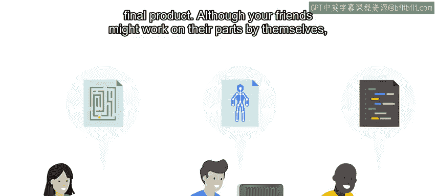
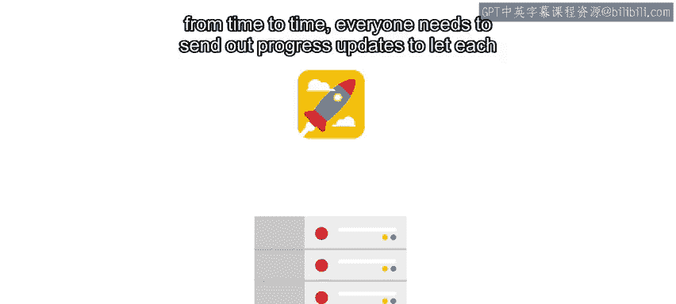
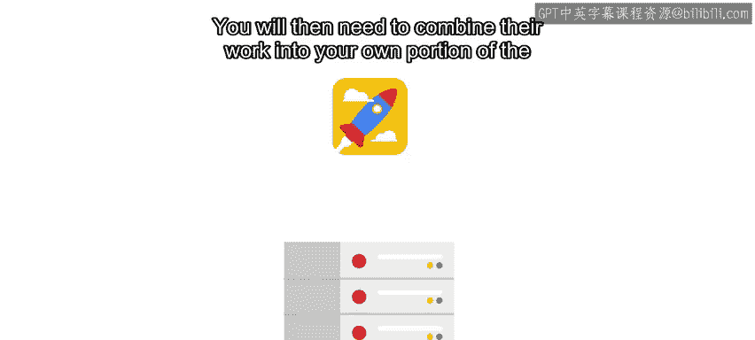
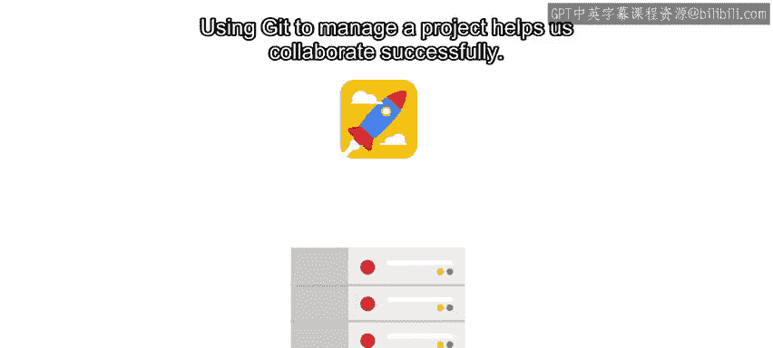
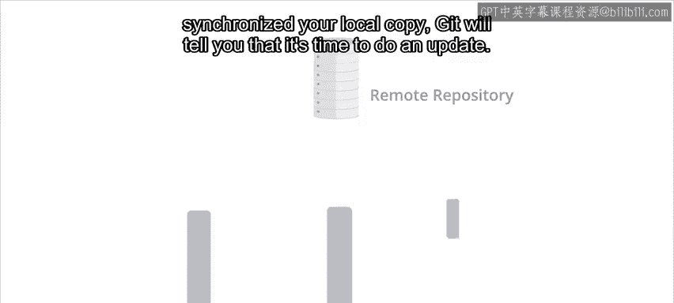
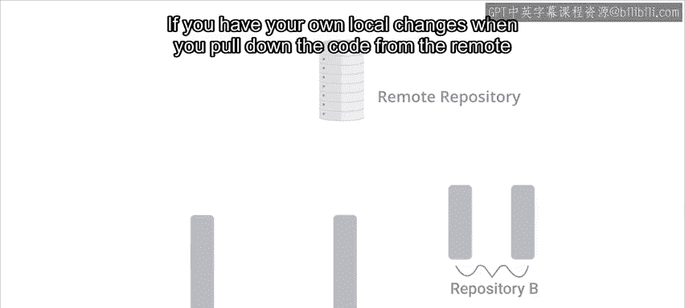
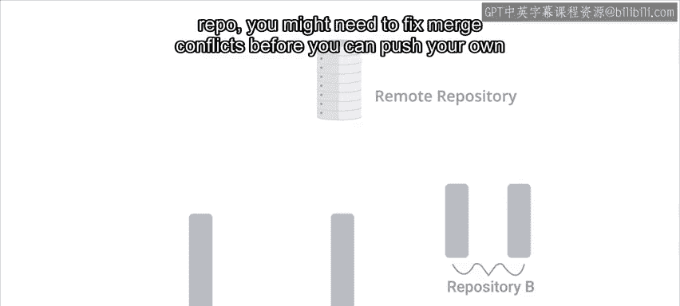
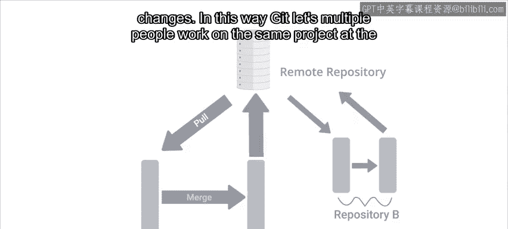
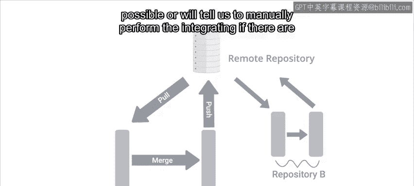
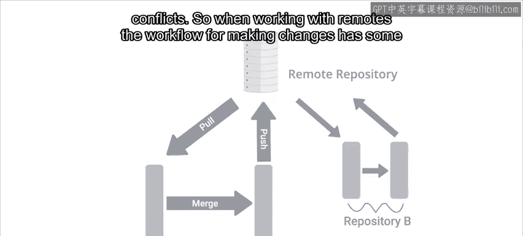

#  034：什么是远程仓库？🌐

在本节课中，我们将要学习Git中一个核心概念——远程仓库。我们将了解远程仓库是什么，为什么它在协作中至关重要，以及它如何与我们的本地仓库互动。

---

当我们克隆新创建的GitHub仓库时，我们的本地Git仓库就与一个远程仓库建立了联系。

远程仓库是Git分布式协作特性的重要组成部分。它们允许多个开发者从各自的工作站为同一个项目做出贡献，彼此独立地修改项目的本地副本。当他们需要分享更改时，可以发出Git命令从远程仓库拉取代码，或将代码推送到远程仓库。

上一节我们介绍了本地仓库的基本操作，本节中我们来看看如何通过远程仓库进行团队协作。

## 远程仓库的托管方式

有多种方式可以托管远程仓库。正如我们所提到的，有许多基于互联网的Git托管服务提供商，例如 **GitHub**、**Bitbucket** 或 **GitLab**，它们提供类似的服务。我们也可以在自有网络上搭建Git服务器来托管私有仓库。

一个本地托管的Git服务器几乎可以在任何平台上运行，包括Linux、Mac OS或Windows。这样做的好处包括更高的隐私性、控制权和可定制性。

## 理解分布式协作：一个比喻

为了更好地理解远程仓库和分布式特性，想象一下你正和朋友们一起设计一款电脑游戏。

你们每个人负责游戏的不同部分：一个人设计关卡，另一个人设计角色，其他人则编写图形、物理和游戏玩法的代码。

所有这些部分最终都需要整合到一个地方，形成最终产品。虽然你的朋友们可能会独立完成各自的部分，但大家时不时需要发送进度更新，让彼此知道各自的工作内容。

然后，你需要将他们的工作合并到你负责的项目部分中，以确保所有内容兼容。使用Git来管理项目能帮助我们成功协作。

以下是这个协作流程的步骤：
1.  每个人在自己的本地仓库中独立开发项目的一部分，甚至可能使用独立的分支。
2.  偶尔，他们会将完成的代码推送到一个中央远程仓库。
3.  其他人可以从这个远程仓库拉取代码，并将其整合到自己的新开发中。

## 远程仓库如何工作？

除了像 `master` 这样的本地开发分支，Git还会保存已提交到远程仓库的提交副本以及远程分支的副本。

如果自你上次同步本地副本以来，有人更新了远程仓库，Git会告诉你该进行更新了。

如果你有自己的本地更改，当你从远程仓库拉取代码时，在推送自己的更改之前，可能需要解决合并冲突。

通过这种方式，Git允许多个人同时处理同一个项目。拉取新代码时，如果可能，它会自动合并更改；如果存在冲突，则会告诉我们手动执行整合。

## 使用远程仓库的工作流程

因此，当使用远程仓库时，进行更改的工作流程会包含一些额外的步骤。

我们仍然会修改、暂存和提交本地更改。提交之后，我们需要从远程仓库获取任何新的更改，必要时进行手动合并，只有在这之后，才能将我们的更改推送到远程仓库。

以下是标准的工作流程：
1.  `git add` 和 `git commit`：在本地进行修改和提交。
2.  `git fetch`：从远程仓库获取最新更改。
3.  `git merge`（或 `git rebase`）：必要时手动合并更改。
4.  `git push`：将本地提交推送到远程仓库。

## 连接到远程仓库

Git支持多种方式连接到远程仓库。最常见的一些方式是使用HTTP、HTTPS和SSH协议及其对应的URL。

*   **HTTP**：通常用于允许对仓库进行只读访问。换句话说，它允许人们克隆你仓库的内容，但不允许他们推送新内容。
*   **HTTPS 和 SSH**：两者都提供了用户身份验证方法，因此你可以控制谁有权推送代码。

如果你对这些协议的讨论感到困惑，建议你回顾一下我的同事Gion关于这些主题的视频。你可以在接下来的阅读材料中找到链接。

工作的分布式特性意味着可以向仓库推送代码的人数没有限制。控制谁可以向你的仓库推送代码，并确保只授予你信任的人访问权限，这是一个好主意。像GitHub这样的网络服务提供了许多不同的机制来控制对仓库的访问，其中一些对公众开放，而另一些仅对企业用户可用。

---

本节课中我们一起学习了远程仓库的概念。我们了解了远程仓库是团队协作的中心枢纽，它如何与本地仓库交互，以及使用远程仓库时的基本工作流程和连接方式。掌握远程仓库是进行高效Git协作的关键一步。

接下来，我们将深入探讨一些让我们与远程仓库交互的具体命令。