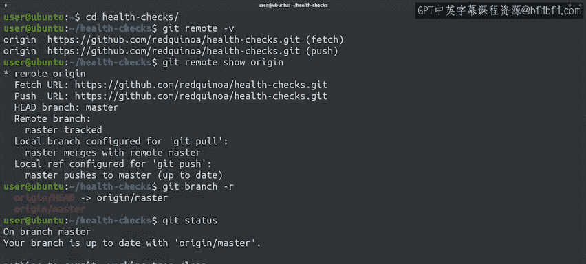

#  035：使用远程仓库 🖥️

在本节课中，我们将学习如何与远程仓库进行交互，包括查看远程仓库信息、理解远程分支的概念，以及如何检查本地与远程仓库的同步状态。

## 概述

当我们使用 `git clone` 命令获取远程仓库的本地副本时，Git 会默认将该远程仓库命名为 `origin`。

## 查看远程仓库配置

我们可以通过运行 `git remote -v` 命令来查看该远程仓库的配置信息。

以下是远程仓库 `origin` 的详细信息：

*   **获取URL**：用于从远程仓库拉取数据。
*   **推送URL**：用于向远程仓库推送数据。

这两个 URL 通常指向同一个位置。但在某些情况下，获取 URL 可能使用 HTTP 协议（只读访问），而推送 URL 使用 HTTPS 或 SSH 协议（用于访问控制）。只要拉取时读取的仓库内容与推送时写入的内容一致，这种配置就是可行的。

## 远程仓库与分支

远程仓库会被分配一个名称，默认名称是 `origin`。这允许我们在同一个 Git 目录中跟踪多个远程仓库。虽然这不是典型用法，但在与不同团队协作处理相关项目时可能很有用。

如果我们想获取关于远程仓库的更多信息，可以运行 `git remote show origin` 命令。这里会显示大量信息，包括之前看到的获取和推送 URL，以及本地和远程分支的信息。

目前，我们只有一个同时存在于本地和远程的 `master` 分支，因此信息看起来有些重复。一旦开始拥有更多分支，尤其是在本地和远程仓库中存在不同分支时，这些信息就会变得更加复杂。

## 理解远程分支

那么，我们所说的远程分支到底是什么呢？在与远程仓库交互时，Git 会使用远程分支来保存远程仓库中数据的副本。

我们可以通过运行 `git branch -r` 命令来查看当前 Git 仓库正在跟踪的远程分支。这些分支是只读的。我们可以像查看本地分支一样查看它们的提交历史，但不能直接修改其内容。

要修改远程分支的内容，我们必须遵循之前提到的工作流程：首先，将任何新的更改拉取到我们的本地分支；然后，将这些更改与我们本地的修改合并；最后，将我们的更改推送到远程仓库。

## 检查同步状态

还记得我们如何使用 `git status` 来检查本地更改的状态吗？我们也可以使用 `git status` 来检查远程分支的更改状态。

现在，由于我们正在与远程仓库协作，`git status` 会提供额外的信息。它会告诉我们，我们的分支是否与 `origin/master` 分支保持同步。这意味着名为 `origin` 的远程仓库中的 `master` 分支与我们本地的 `master` 分支拥有相同的提交记录。

## 总结

本节课中，我们一起学习了如何配置和查看远程仓库信息，理解了远程分支的只读特性及其作用，并掌握了使用 `git status` 检查本地与远程仓库同步状态的方法。如果本地分支与远程分支不同步，我们该如何处理呢？这将是下一节视频要讨论的内容。