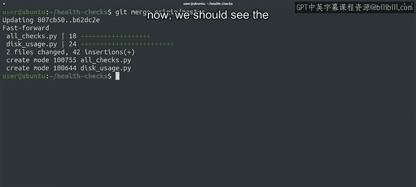

#  036：Git 远程协作与同步更新 🚀

## 概述

在本节课中，我们将学习如何从远程仓库获取最新的更改，并将其同步到本地仓库。我们将重点介绍 `git fetch` 和 `git merge` 命令的使用，以及如何查看远程分支的提交历史。

---

## 远程仓库状态检查

上一节我们介绍了远程仓库的基本概念，本节中我们来看看如何检查远程仓库的状态。

当我们学习远程仓库时，同事 Blue Kaale 向我们的仓库添加了一些文件。

我们可以使用 GitHub 网站浏览提交的更改。

但我们希望学习如何通过命令行交互来完成此操作。

因为您在工作中可能需要以这种方式操作。

无论使用哪种平台与 Git 交互，操作方式都相同。

首先，让我们查看 `git remote show origin` 命令的输出。

请注意，它显示本地分支已过时。

当仓库中有尚未在本地反映的提交时，会发生这种情况。

Git 不会自动保持远程和本地分支同步。

它等待我们准备好后执行命令来移动数据。

---

## 获取远程更改

为了同步数据，我们使用 `git fetch` 命令。

该命令将远程仓库中完成的提交复制到远程分支，以便我们可以看到其他人提交的内容。

现在让我们调用它，看看会发生什么。

获取的内容将下载到我们仓库的远程分支。

因此它不会自动镜像到我们的本地分支。

我们可以在这些分支上运行 `git checkout` 来查看工作树。

我们可以运行 `git log` 来查看提交历史。

通过运行 `git log origin/master`，让我们查看远程仓库中的当前提交。

查看此输出，我们可以看到远程 origin 的分支指向最新的提交。

而本地 master 分支指向我们之前所做的上一个提交。

---

## 检查本地状态

现在让我们看看如果运行 `git status` 会发生什么。

`git status` 会告诉我们，我们的分支中有一个尚未拥有的提交。

它通过告知我们的分支落后于远程 origin/master 分支来实现这一点。

如果我们想将分支集成到我们的 master 分支中，可以执行合并操作。

该操作将 origin/master 分支合并到我们的本地 master 分支中。

为此，我们将调用 `git merge origin/master`。

很好，我们已经将远程仓库的 master 分支的更改合并到我们的本地分支中。

请注意 Git 如何告诉我们代码是使用快进方式集成的。

它还显示添加了两个文件：`all_checks.py` 和 `disk_usage.py`。

如果我们现在查看分支上的日志输出，应该会看到新的提交。

---

## 确认同步结果

我们看到现在我们的 master 分支与远程 origin/master 分支保持同步。

通过此操作，我们已将分支更新到最新更改。

我们可以像这样使用 `git fetch` 来查看远程仓库中发生的更改。

如果我们对它们满意，可以使用 `git merge` 将它们集成到本地分支中。

从远程仓库获取提交并将其合并到本地仓库是一个非常常见的 Git 操作。

有一个方便的命令可以让我们在一个操作中完成所有这些步骤。

我们将在下一个视频中查看该命令。

---

## 总结

本节课中我们一起学习了如何使用 `git fetch` 获取远程仓库的最新提交，以及如何使用 `git merge` 将这些更改合并到本地分支。我们还了解了如何检查远程分支的状态和提交历史，确保本地仓库与远程仓库保持同步。