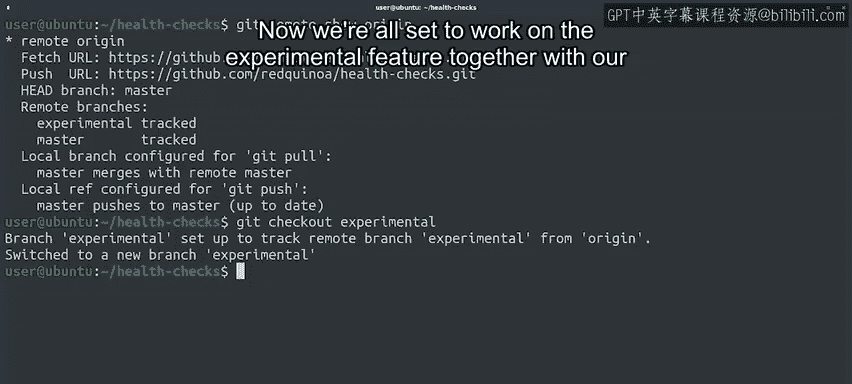

#  037：Git协作与远程仓库管理 🚀


在本节课中，我们将学习如何与远程Git仓库进行协作，重点掌握如何获取远程更新、合并更改以及处理远程分支。我们将通过具体的命令和示例，帮助你理解如何高效地与团队成员同步代码。

## 概述

上一节我们介绍了远程仓库的基本概念和`git fetch`、`git merge`的基本工作流程。本节中，我们将学习一个更高效的命令`git pull`，它结合了获取和合并操作。同时，我们还将探讨如何查看和管理远程分支，例如创建一个与远程分支对应的本地分支。这些技能对于团队协作开发至关重要。

## 使用 `git pull` 自动获取与合并

由于`git fetch`（获取）和`git merge`（合并）这两个操作非常频繁，Git提供了一个便捷的命令`git pull`来一次性完成这两项工作。

运行`git pull`命令会获取当前分支的远程副本，并自动尝试将其合并到当前的本地分支中。

以下是检查同事是否对仓库进行了新更改的示例：

```bash
git pull
```

仔细观察命令输出，你会发现它包含了我们之前见过的`fetch`和`merge`命令的输出信息。首先，它从远程仓库获取了更新内容（包括一个新分支），然后对本地master分支执行了一次快进合并。

我们可以看到`all_checks.py`文件也被更新了。我们可以使用`git log -p -1`来查看具体的更改内容，会发现同事添加了一个`check_disk_full`函数，其中包含了我们之前看到的`disk_usage.py`中的代码。查看完毕后，按`q`键退出日志查看器。

## 处理远程分支

当我们调用`git pull`时，注意到还有一个名为`experimental`的新远程分支。我们的同事Blue告知我们，他正在这个分支上开发一个新功能。

我们可以运行`git remote show origin`来查看关于这个新分支的信息。输出显示有一个名为`experimental`的远程分支，而我们本地还没有对应的分支。

为了创建它的本地分支，我们可以运行：

```bash
git checkout experimental
```

当我们检出`experimental`分支时，Git自动将远程分支的内容复制到了新建的本地分支中，工作目录也随之更新为该分支的内容。现在，我们就可以和同事一起在这个实验性功能上协作开发了。

## 选择性获取远程更新

在上一个例子中，我们调用`git pull`时同时获取了`master`分支和`experimental`分支的内容，并且如果`master`有更新，它也会自动合并到本地。

如果我们只想获取所有远程分支的内容，而不希望自动合并任何内容到本地分支，可以使用`git remote update`命令。



```bash
git remote update
```

这个命令会获取所有远程分支的更新内容，之后我们可以根据需要，再单独执行`git checkout`或`git merge`。

## 命令总结

我们已经学习了多种与远程仓库交互的方式。以下是涉及的核心命令列表：

*   `git pull`：获取远程更改并自动合并到当前分支。
*   `git remote show origin`：查看远程仓库（如origin）的详细信息，包括分支状态。
*   `git checkout <branch_name>`：切换到指定分支。如果分支不存在但远程存在，则会创建跟踪远程分支的本地分支。
*   `git remote update`：获取所有远程分支的最新内容，但不进行合并。

## 总结

本节课中我们一起学习了如何高效地更新本地仓库以同步团队工作。我们掌握了`git pull`命令来简化获取与合并流程，学会了如何查看远程分支信息并创建对应的本地分支进行协作，也了解了`git remote update`用于非自动合并的场景。你现在已经具备了基本的远程协作能力。

在接下来的课程中，我们将探讨当更改无法通过快进合并解决时会发生什么，特别是当我们尝试推送更改并产生冲突时的处理方法。但在深入学习之前，请务必通过测验来巩固本节课的实践知识。