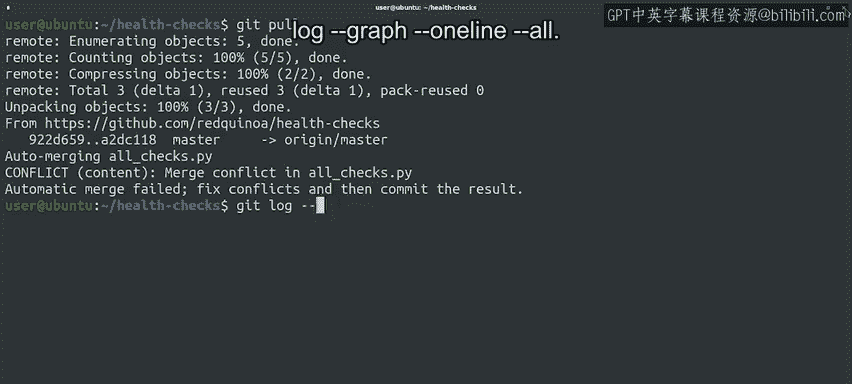
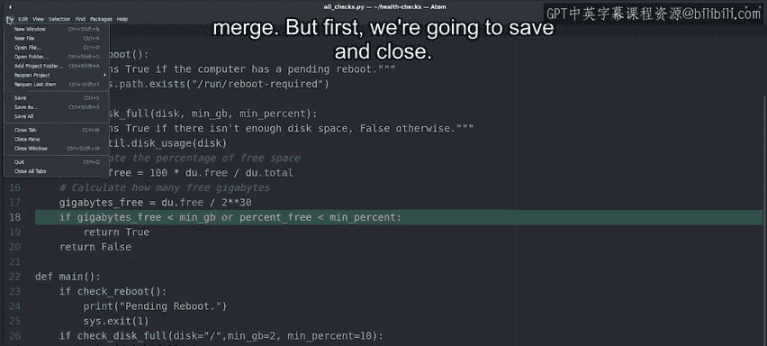
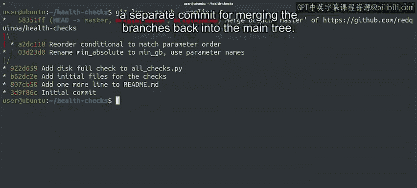

#  038：拉取-合并-推送工作流 🛠️


在本节课中，我们将要学习当远程仓库有新的提交，而你的本地也有未推送的更改时，如何通过“拉取-合并-推送”的工作流来同步代码并解决可能出现的冲突。

## 概述

上一节我们介绍了如何从远程仓库获取和拉取数据。本节中我们来看看，当我们准备推送本地更改到远程仓库时，却发现远程仓库已经有了新的更改，该如何处理。我们将学习完整的“拉取-合并-推送”流程，并解决合并过程中出现的冲突。

## 准备推送本地更改

我们首先对 `all_checks.py` 脚本进行一项改进。回想课程初期修复磁盘空间检查函数中的错误时，我们曾两次进行千兆字节转换。当时代码容易出错的部分原因是我们传递数字时没有明确说明这些数字的用途。

我们可以通过将 `min_absolute` 参数重命名为 `min_gb` 来使代码更清晰，这样就能明确函数期望接收的是千兆字节。

```python
# 改进前
def check_disk_usage(disk, min_absolute, min_percent):
    ...

# 改进后：重命名参数
def check_disk_usage(disk, min_gb, min_percent):
    ...
```

另一种让代码更清晰的方法是，在调用函数时使用参数名称。

```python
# 改进前调用
check_disk_usage(“/”, 2*2**30, 10)

# 改进后调用：使用参数名
check_disk_usage(disk=“/”, min_gb=2*2**30, min_percent=10)
```

通过使用参数名，我们的调用变得清晰，甚至可以改变值的顺序，代码仍然能正常工作。

我们完成了更改，现在像往常一样暂存并提交它。

首先使用 `git add -p` 查看我们做的更改并接受它们。
然后创建一个提交信息，说明我们将 `min_absolute` 重命名为 `min_gb`，并且在调用时使用了参数名。

```bash
git add -p
git commit -m “Rename min_absolute to min_gb and use parameter names in invocation”
```

我们已经完成了更改、暂存和提交。现在应该可以推送到远程仓库了。

## 遇到推送冲突

但此时，假设有一位协作者也进行了更改。当我们尝试运行 `git push` 时，操作失败了。

```bash
git push
```

你能分析出这里出了什么问题吗？有几个提示：当我们尝试推送时，Git 拒绝了我们的更改。这是因为远程仓库包含了一些我们本地分支没有的更改，Git 无法进行快进合并。



你可能还记得我们讨论 Git 合并算法时提到过，当分支历史出现分叉时，需要进行三方合并。和往常一样，Git 在错误信息中提供了一些有用的信息，特别是关于使用 `git pull` 来集成远程更改的部分。

这意味着我们需要在推送之前，先将本地的远程跟踪分支与远程仓库同步。我们之前学过，可以使用 `git pull` 来完成这个操作。

```bash
git pull
```

Git 尝试自动合并本地和远程对 `all_checks.py` 的更改，但发现了一个冲突。

## 分析冲突原因

首先，我们通过 `git log --graph --oneline --all` 查看所有分支的提交图。


这个图向我们展示了树中不同的提交和位置。我们可以看到 `master` 分支、`origin/master` 分支和 `experimental` 分支。图表表明，我们当前的提交和 `origin/master` 分支中的提交有一个共同的祖先，但它们并不直接前后相连。这意味着我们需要进行三方合并。

为了解详情，我们运行 `git log -p origin/master` 来查看该提交中的实际更改。

我们发现，同事决定重新排列函数中的条件子句顺序，以匹配参数传递给函数的顺序。他们恰好更改了我们重命名 `min_gb` 变量时更改的同一行代码，这导致了 Git 无法自动解决的冲突。

## 手动解决冲突

我们需要通过编辑文件来移除冲突标记以解决冲突。首先退出日志视图。

我们看到问题发生在条件语句中。第一行显示我们的更改，`min_absolute` 被重命名为 `min_gb`。第二行显示旧的变量名，但检查的顺序不同。

我们需要决定如何处理。例如，我们可以保留新的顺序，但使用 `min_gb` 这个新变量名。

有一点需要注意：Git 会尝试所有可能的自动合并，只有当自动合并失败时，才会留下需要手动解决的冲突。在本例中，我们可以看到我们做的其他更改都成功合并了，无需干预。只有发生在文件同一行的更改需要我们的输入。

我们在这里修复了冲突。由于文件很短，我们可以快速检查是否还有其他冲突。对于更大的文件，在整份文件中搜索冲突标记（`>>>>>>`）可能更有意义，这可以让我们检查是否还有未解决的冲突。

## 完成合并与推送

很好，现在我们已经解决了冲突，可以完成合并了。你还记得怎么做吗？



我们需要添加 `all_checks.py` 文件，然后调用 `git commit` 来完成合并。

```bash
git add all_checks.py
git commit
```

编辑器显示的信息表明，它正在执行远程分支与本地分支的合并。我们可以为此消息添加额外信息，例如说明我们修复了 `check_disk_usage` 函数中的条件语句，以使用新的变量名和新的顺序。

我们的合并终于准备好了。可以再次尝试推送到远程仓库。

```bash
git push
```

是的，在解决冲突之后，我们成功地将工作推送到了远程仓库。

现在，通过调用 `git log --graph --oneline` 查看 `master` 分支的提交历史。



😊，我们看到最新的提交是合并提交，后面跟着导致合并冲突的两个提交，它们在图中处于分叉的路径上。正如我们之前指出的，当 Git 需要进行三方合并时，我们最终会得到一个单独的提交，用于将分支合并回主树。


## 总结

本节课中我们一起学习了如何成功完成“拉取-合并-推送”的周期，即使这意味着需要进行一些手动合并。这是一个复杂的练习，如果某些部分看起来仍然有点令人畏惧，这是正常的。我们第一次遇到合并冲突时都会感到恐慌。但别担心，通过练习会变得更容易。

为了练习处理合并冲突，你可以在不同的目录中拥有两个仓库副本，然后尝试编辑相同文件的相同行。你可以按照这里展示的例子操作，或者自己想一些练习。

接下来，我们将讨论在远程仓库中使用分支。