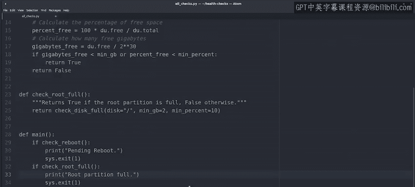
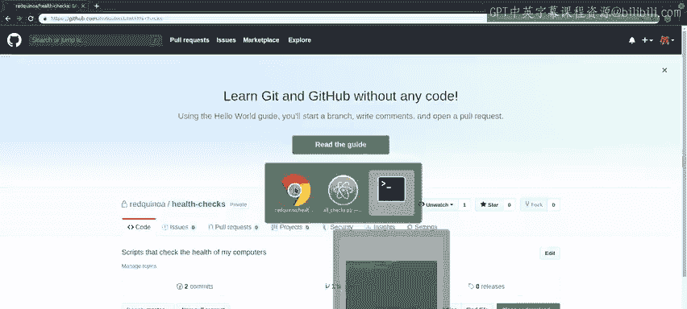
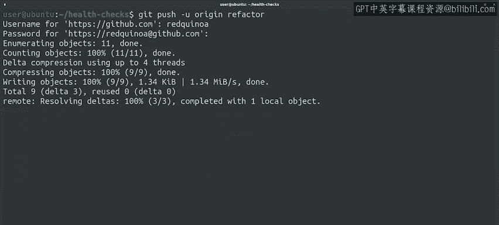

#  039：Git分支推送与代码重构实践 🚀


在本节课中，我们将学习如何在Git中创建并推送远程分支，同时通过一个实际的Python脚本重构案例，演示如何优化代码结构、减少重复，并确保代码的可维护性。我们将涵盖分支的优势、代码重构的步骤，以及如何将本地分支推送到远程仓库供团队协作。

---

## 分支的优势 🌳

上一节我们介绍了Git的基本操作，本节中我们来看看为什么在开发中使用分支是推荐的最佳实践。

使用Git进行新功能开发或大型重构时，建议创建独立的分支。这样做有多重优势。

例如，完成新功能可能需要较长时间。在此期间，主分支中可能出现需要紧急修复的关键错误。

通过使用独立分支，你可以在主分支中修复错误、发布新版本，然后返回继续开发功能，而无需在代码准备就绪前进行集成。

使用独立分支的另一个优势是，你甚至可以从同一代码树中发布两个或更多版本，一个稳定版，一个测试版。这样，任何破坏性更改都可以在全面发布前在少量用户或计算机上进行测试。

---

## 创建并切换至新分支 🔄

以下是创建并切换至新分支的步骤：

1.  首先，我们可以先创建分支再切换，或者使用一条命令同时完成创建与切换。
2.  使用命令 `git checkout -b <新分支名>` 来创建并切换到新分支。

我们已准备好开始重构工作。让我们打开文件查看一下。

---

## 识别并开始重构代码 🛠️

我们注意到 `all_checks.py` 脚本中存在重复的代码模式。

对于每个调用的检查函数，我们都判断其返回 `True` 或 `False`。当返回 `True` 时，我们打印错误并退出。如果添加新的检查，我们将不得不再次重复此模式。此外，如果计算机存在多个问题，只会打印第一个问题的错误信息。

因此，让我们重构代码以避免重复，并打印所有相关错误。我们将逐步进行，使每次提交自成一体。

---

## 第一步：创建包装函数

我们要做的第一件事是创建一个无参数的函数来检查磁盘是否已满，以匹配现有模式。这个新的包装函数将为我们传递正确的参数。

```python
def check_disk_full():
    """检查磁盘使用率是否超过80%"""
    return check_disk_usage(disk="/", min_gb=2, min_percent=10)  # 示例参数
```

然后，我们将更改代码以调用此函数，并更新错误信息使其更准确。更改函数后，保存并测试代码。




很好，运行正常。让我们提交这个更改。


---

## 第二步：使用循环消除重复

我们已准备好重构的下一步以避免代码重复。

我们将创建一个列表，包含要调用的函数名称和检查成功时要打印的消息。

```python
checks_to_perform = [
    (check_cpu_usage, "错误：CPU使用率超过80%"),
    (check_disk_full, "错误：可用磁盘空间不足20%"),
    # 可以在此添加更多检查项
]
```

之后，添加一个 `for` 循环来遍历检查列表和消息列表。

```python
for check_func, error_msg in checks_to_perform:
    if check_func():
        print(error_msg)
        sys.exit(1)
```

然后，调用检查函数。如果返回值为 `True`，则打印消息并以错误代码1退出。完成此操作后，我们可以删除已替换的旧代码。

完成此更改后，再次保存并测试脚本是否仍能运行。是的，它仍然有效。让我们提交这个新更改。

至此，我们已经重构了代码以避免重复。当前代码的功能与旧代码相同。当我们准备添加新检查时，只需将函数名和错误消息添加到检查列表即可。

---

## 第三步：显示多个错误信息

我们想要做的最后一个更改是让脚本在多个检查失败时显示多条消息。

为此，我们在迭代前添加一个名为 `everything_ok` 的布尔变量。

```python
everything_ok = True
error_messages = []

for check_func, error_msg in checks_to_perform:
    if check_func():
        error_messages.append(error_msg)
        everything_ok = False

if not everything_ok:
    for msg in error_messages:
        print(msg)
    sys.exit(1)
```

如果某个检查发现问题，将此变量更改为 `False`，然后在完成所有检查后才以错误代码退出。

好的，最后一次保存并测试，看看是否有效。

现在，让我们为此更改进行最终提交。

---

## 推送分支到远程仓库 📤

这样，我们的重构分支中就有了三次提交。在将任何内容合并到主分支之前，我们希望将其推送到远程仓库，以便协作者可以查看代码、测试它，并告知我们是否已准备好合并。

首次将分支推送到远程仓库时，需要在 `git push` 命令中添加更多参数。



我们需要添加 `-u` 标志来创建上游分支（这是指远程仓库的另一种说法）。

我们还必须指定要推送到 `origin` 仓库，并且我们正在推送 `refactor` 分支。

命令如下：
```bash
git push -u origin refactor
```


Git给出了大量信息。它告诉我们，如果需要，可以创建一个拉取请求。我们将在后面详细讨论拉取请求。目前，我们很高兴看到新的 `refactor` 分支已在远程仓库中创建，这正是我们想要的。

---

## 总结 📝

本节课中我们一起学习了Git分支管理的重要实践。我们通过一个复杂的例子，整合了本课程中学到的许多概念，并实践了一些有趣的Python编程技巧，包括：
1.  **创建与使用分支**：理解了使用独立分支进行开发的优势。
2.  **代码重构**：通过创建函数包装器、使用列表和循环来消除代码重复，并改进错误报告机制。
3.  **推送远程分支**：使用 `git push -u origin <分支名>` 命令首次将本地分支推送到远程仓库，以便团队协作。

如果仍有不清楚的地方，可以随时重看本视频并在计算机上跟随操作，直到熟悉这些步骤。

现在我们的分支已推送到远程仓库，可以由协作者进行审查。假设他们同意，接下来该如何将此分支合并回主分支呢？我们将在下一个视频中讨论。