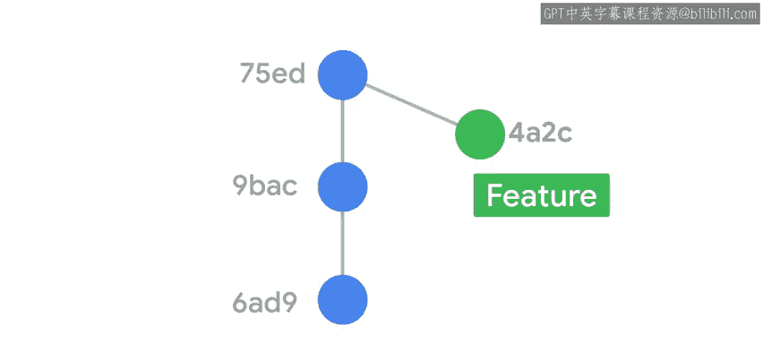
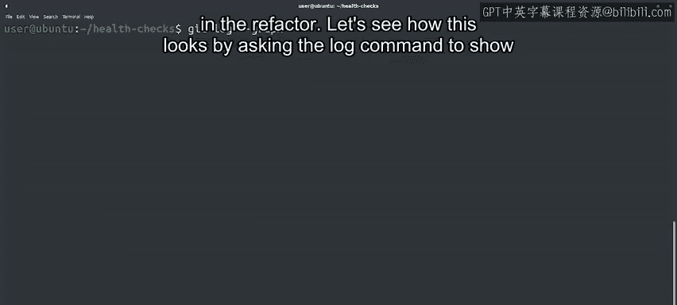

#  040：Git变基操作详解 🔄

在本节课中，我们将学习Git中的**变基**操作。我们将了解变基的含义、它与合并的区别，以及如何通过变基来保持项目历史的线性结构，从而便于代码调试和问题追踪。

## 概述

上一节我们介绍了分支合并的两种方式。本节中，我们来看看另一种整合分支更改的方法：**变基**。

在之前的视频中我们提到，当分支经过充分审查和测试后，可以将其合并回主分支。这可以由我们或他人完成。一种选择是使用之前讨论过的`git merge`命令。另一种选择是使用`git rebase`命令。**变基**意味着更改用于我们分支的基准提交。

## 理解变基的含义

为了理解这意味着什么，让我们快速回顾一下到目前为止学到的关于合并的知识。

正如我们在之前的许多示例中所见，当我们在仓库历史的某个时间点创建分支时，Git知道两个分支上提交的最新提交。如果在我们尝试合并时只有一个分支有新的更改，Git将能够快速前进并应用更改。但是，如果在我们尝试合并时两个分支都有新的更改，Git将创建一个新的合并提交以进行三方合并。

三方合并的问题在于，由于历史记录的分叉，当在我们的代码中发现问题时，我们很难调试，并且需要理解问题是在哪里引入的。

通过更改我们的提交从分支历史中分离出来的基准，我们可以在新的基准之上重新应用新的提交。这允许Git执行快速前进合并，并保持历史记录的线性。

## 如何进行变基操作

以下是执行变基的步骤：

我们运行命令`git rebase`，后跟我们想要设置为新基准的分支。当我们这样做时，Git将尝试在该分支的最新提交之后重新应用我们的提交。如果更改是在文件的不同部分进行的，这将自动工作，但如果更改是在其他文件中进行的，则需要手动干预。

让我们通过将我们的重构分支变基到主分支上来检查这个过程。

首先，我们将检出主分支并拉取远程仓库中的最新更改。

Git告诉我们，它已经用我们同事所做的一些更改更新了主分支。

此时，我们在重构分支中的更改不能再通过快速前进合并到主分支中。这是因为现在主分支中有一个额外的提交，而重构分支中没有。

让我们通过要求日志命令显示所有分支的当前图表来查看这种情况。

## 分析分支历史图表

理解这个图表中发生的一切可能需要一点时间。但对于理解复杂的历史树来说，它可能非常有用。正如你所看到的，重构分支在与主分支头部当前提交的共同祖先之前有三个提交。如果我们现在合并我们的分支，将导致三方合并，但我们希望保持历史记录的线性。我们将通过对主分支进行重构分支的变基来实现这一点。

像往常一样，Git为我们提供了一堆有用的信息。它说它回退了HEAD并在其之上重新应用了我们的工作，幸运的是，一切都成功了。

让我们现在查看我们分支的`git log --graph --oneline`输出。

现在我们可以看到主分支与我们的提交列表呈线性历史。我们准备将我们的提交合并回仓库的主干，并进行快速前进。

## 完成合并与清理

为此，我们将检出主分支并合并重构分支。太棒了，我们能够通过快速前进合并我们的分支，并保持历史记录的线性。

我们现在已经完成了重构，可以删除该分支，包括远程和本地分支。

要删除远程分支，我们将调用`git push --delete origin refactor`。要删除本地分支，我们将调用`git branch -D refactor`。是的，我们的重构完成了，我们现在可以将更改推回远程仓库。

## 总结

在本节课中，我们一起学习了Git的变基操作。我们有一个针对主分支旧提交创建的功能分支，因此我们将功能分支变基到主分支的最新提交，然后将功能分支合并回主分支。这是一个复杂的练习。所以如果你仍然对发生了什么感到困惑，请花时间复习，也许可以想出你自己使用变基的例子。接下来，我们将看另一个如何使用变基的例子。