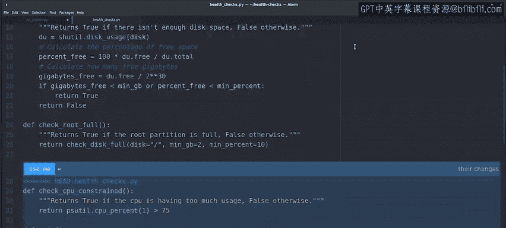
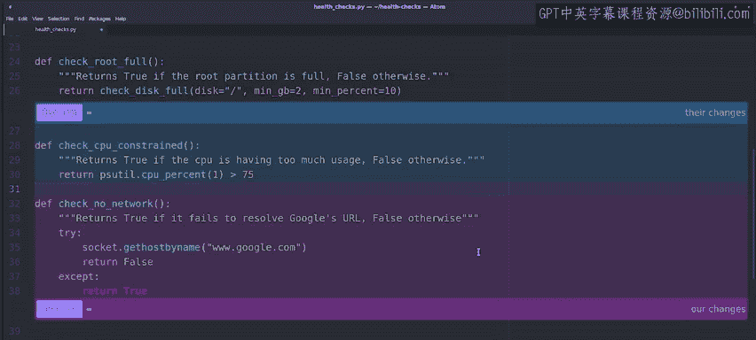
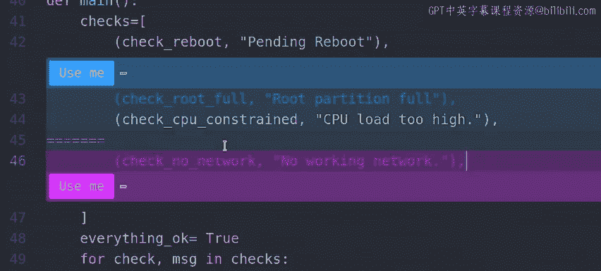
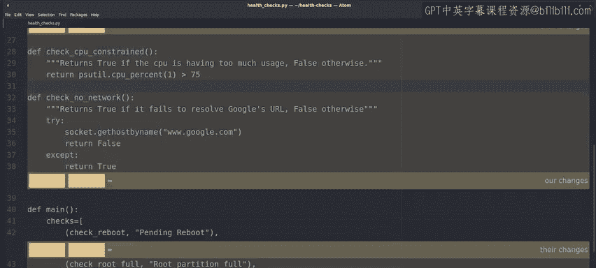
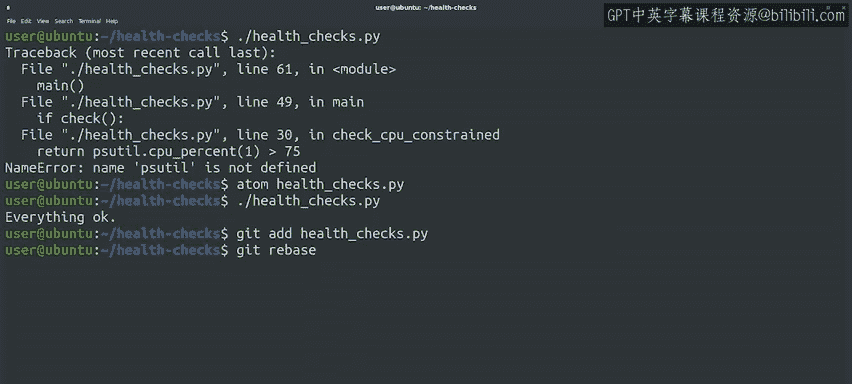

#  041：另一个变基示例 🔄


## 概述

在本节课中，我们将学习 Git 变基操作的另一个常见应用场景：当你在主分支上直接进行修改，而同时你的协作者也提交了更改时，如何使用变基来保持项目历史的线性，避免不必要的合并提交。

上一节我们介绍了如何使用变基来整合功能分支。本节中，我们来看看如何在主分支上直接工作时，使用变基来同步他人的更改。

## 保持历史线性的变基操作

当你在主分支上进行一个足够小的修改，而不需要创建单独的功能分支时，你的协作者可能恰好同时提交了更改。为了保持项目历史的线性，避免出现分叉的合并提交，我们可以使用 `git rebase` 命令。

以下是操作步骤：

1.  **首先，进行你的本地修改并提交。**
    例如，我们为脚本添加一个检查网络连通性的新函数。

    ```python
    import socket

    def check_no_network():
        """如果无法解析 Google.com 的 URL，则返回 True"""
        try:
            socket.gethostbyname("www.google.com")
            return False
        except:
            return True
    ```

    然后，将这个新检查添加到检查列表中，并提交更改。

    ```bash
    git commit -a -m "添加简单的网络连通性检查"
    ```

2.  **接着，获取远程仓库的最新更改。**
    在推送你的提交之前，先使用 `git fetch` 命令获取协作者可能已推送的更改。这个命令会将远程分支（如 `origin/master`）的更新下载到本地，但不会自动合并到你的当前分支。

    ```bash
    git fetch
    ```

3.  **然后，执行变基操作。**
    现在，对你的本地 `master` 分支执行变基，将其基于更新后的 `origin/master`。这相当于将你的新提交“重新播放”在协作者的最新提交之上。

    ```bash
    git rebase origin/master
    ```

## 处理变基冲突

如果协作者的更改与你的修改冲突了，Git 会暂停变基过程并提示你解决冲突。这与处理合并冲突类似。

以下是解决冲突的步骤：



1.  Git 会输出冲突信息，并告诉你哪个文件存在冲突。
2.  打开冲突文件，你会看到类似下面的冲突标记：
    ```
    <<<<<<< HEAD
    # 这是协作者添加的代码（当前`origin/master`的代码）
    =======
    # 这是你添加的代码（你试图应用的提交中的代码）
    >>>>>>> your-commit-hash
    ```
3.  手动编辑文件，保留你想要的最终代码，并删除所有 `<<<<<<<`、`=======` 和 `>>>>>>>` 冲突标记。
4.  保存文件后，使用 `git add` 命令将解决后的文件标记为已解决。
5.  最后，使用 `git rebase --continue` 命令继续完成变基过程。

    ```bash
    git add health_checks.py
    git rebase --continue
    ```

    如果中途想放弃整个变基操作，可以使用 `git rebase --abort`。



## 变基完成与验证





变基成功完成后，你的本地提交历史将变成线性。你可以使用以下命令查看简洁的图形化历史：



```bash
git log --graph --oneline
```

此时，你的更改已经整洁地应用在了项目的最新状态之上，没有产生额外的合并提交。现在，你可以安全地将更改推送到远程仓库：

```bash
git push origin master
```

## 总结

本节课中我们一起学习了 `git rebase` 的另一个重要用途：在协作开发中，当你在主分支上直接提交后，通过 **获取（fetch）-> 变基（rebase）-> 推送（push）** 的工作流，将你的更改基于远程最新代码重新应用，从而保持项目提交历史的线性。

与上一课的变基应用相比，两者的核心操作相同，但目的略有差异：一个用于整合功能分支，另一个用于同步主分支上的并行修改。保持线性历史有助于调试，特别是在需要定位首次引入问题的提交时。

`git rebase` 是一个非常强大的工具，它还可以用于重排提交顺序或压缩多个提交。你无需记忆所有用法，在实践中遇到相应需求时学习即可。接下来，我们将总结在团队协作中使用 Git 的一些最佳实践。