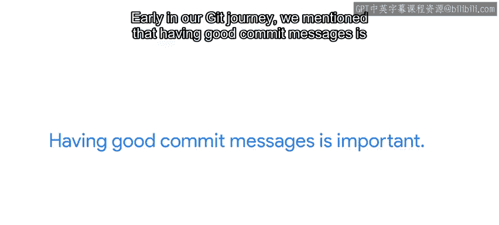

#  042：Git协作最佳实践指南 🚀


在本节课中，我们将学习使用Git进行团队协作时的最佳实践。我们将探讨如何高效同步分支、管理代码变更、处理多版本项目，以及安全使用Rebase等高级功能。掌握这些实践能帮助团队减少冲突、提升协作效率。

## 同步分支的重要性

上一节我们介绍了远程仓库的基本操作，本节中我们来看看协作时的首要原则：保持分支同步。

开始任何工作前，务必先同步你的分支。这样能确保你基于最新版本进行修改，从而最小化冲突风险或减少变基需求。

具体操作如下：
```bash
git pull origin <branch_name>
```

## 管理代码变更

在同步分支后，我们需要关注如何有效地管理代码变更。

最佳实践是避免单次提交包含大量且互不相关的修改。应尽量保持每次变更小而独立。

以下是具体建议：

*   单一职责提交：例如，若为清晰性重命名变量，不应在同一提交中添加新功能代码。
*   分拆提交：将不同修改拆分为多个提交，便于理解每个提交的意图。
*   频繁推送与拉取：经常推送本地更改，并在开始工作前拉取远程更新，可降低冲突概率。

## 使用功能分支

当进行大型功能开发时，合理的分支策略至关重要。

在大型变更中，应使用独立的功能分支。这允许你在新分支上开发功能，同时仍能在其他分支（如主分支）上修复错误。

为了使功能分支的最终合并更顺畅，应定期将主分支的更改合并回功能分支。这样在最终合并时，就不会积累大量冲突。

## 维护多版本项目

在软件开发中，经常需要同时维护项目的多个版本。

常见做法是将项目的最新版本放在主分支（master），而将稳定版本放在单独的分支（例如stable）。每当宣布稳定版本发布时，再将更改合并到这个独立分支。

使用这种双分支策略时，某些针对稳定版本的错误修复，如果与最新版本无关，可以直接在稳定分支上进行。

## 谨慎使用Rebase

在之前的课程中，我们学习了如何使用Rebase来保持历史线性的方法。Rebase有助于定位错误，但需谨慎使用。

执行Rebase时，我们重写了分支的历史——旧提交被新提交替换。这些新提交基于与之前不同的代码快照，并拥有完全不同的哈希值。这对本地变更可行，但对于已发布并被其他协作者下载的变更，则可能引发严重问题。

因此，通用规则是：**不应对已推送到远程仓库的变更执行Rebase**。Git服务器通常会拒绝试图重写分支历史的推送。虽然可以强制Git接受更改，但除非你完全清楚后果，否则这不是一个好主意。

在我们之前的功能分支示例中，我们先在本地对分支执行Rebase，然后将其合并到主分支，最后删除旧分支。这样，我们没有将Rebase后的变更推送到功能分支本身，只推送到尚未见过这些变更的主分支。

## 编写有效的提交信息



在Git学习之旅初期，我们曾提到编写良好的提交信息非常重要。

当你独自工作时这已很重要，因为好的提交信息能帮助未来的你理解当时的情况。而在团队协作中，它更为关键，因为它为你的协作者提供了更多关于你为何进行此更改的上下文，并能在必要时帮助他们解决冲突。

所以，请致力于成为一名优秀的协作者，并牢记添加那些清晰的提交信息。

## 处理合并冲突

只要我们与他人协作，就难免会遇到合并冲突，这确实令人头疼。在遇到复杂的合并冲突并试图调试结果时，挫折感是难免的。

如果遇到这类合并冲突，我的第一步是向后回溯：撤销我所做的一切，然后检查源代码是否仍能正常工作。接着，再缓慢地逐段添加代码，直到发现问题所在。这个方法通常能帮我度过难关，也确实揭示过一些奇怪的情况。

接下来，我们将有一份阅读材料，汇总所有与解决冲突相关的命令，之后还有一个快速练习测验。

---

本节课中我们一起学习了Git协作的核心最佳实践，包括同步分支、管理小型提交、使用功能分支、维护多版本项目、安全使用Rebase、编写清晰提交信息以及处理合并冲突的基本思路。遵循这些实践能显著提升团队协作的顺畅度和代码库的可维护性。