#  045：在GitHub上进行简单的拉取请求 🛠️

在本节课中，我们将学习如何使用GitHub查看他人的代码并与他们协作。我们将通过一个具体的例子，了解如何通过GitHub的Web界面直接提交一个简单的拉取请求（Pull Request），来为同事的项目修复一个拼写错误。

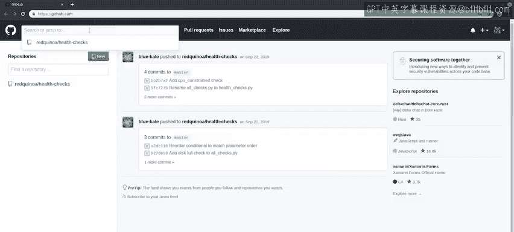

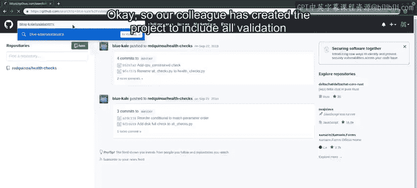

## 概述：协作与代码审查

正如我们之前提到的，GitHub是一个用于查看他人代码并与之协作的平台。让我们通过查看同事Blue Kaale的一个项目来了解这一过程。

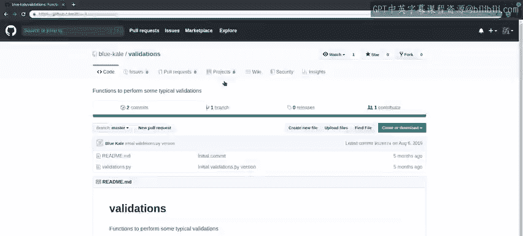

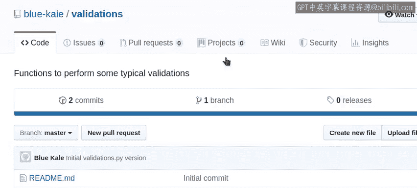

## 发现并修复问题

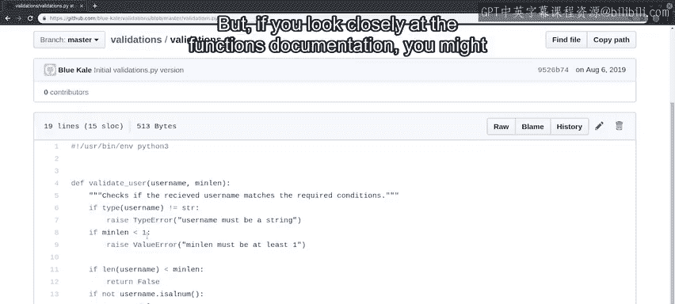

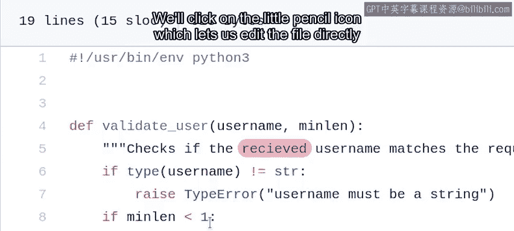

我们的同事创建了一个包含所有验证函数的项目。让我们查看一下 `validations.py` 文件。

我们看到了一个验证用户名的函数代码。但是，如果你仔细查看函数的文档字符串，可能会注意到一个拼写错误。

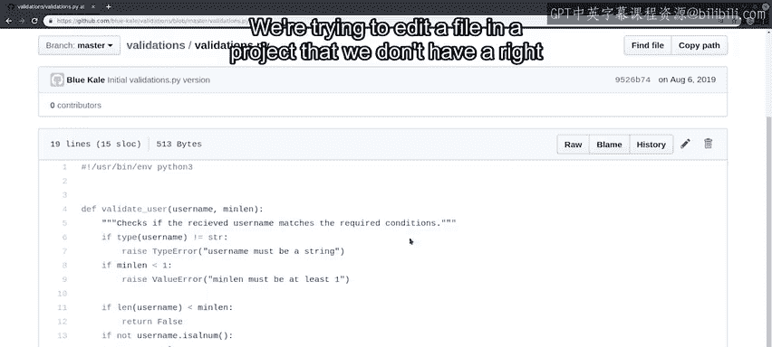

我们可以通过修复这个拼写错误来改进同事的代码。让我们开始操作。

## 创建分支与Fork

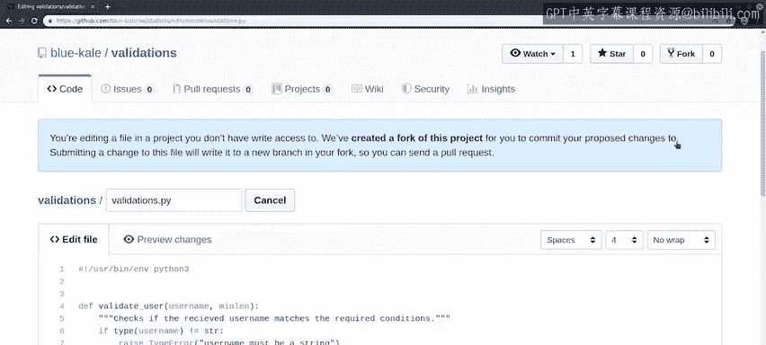

我们将点击小铅笔图标，这允许我们直接从Web界面编辑文件。

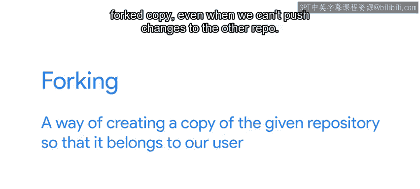

当我们尝试编辑一个我们没有直接写入权限的项目中的文件时，GitHub会提示我们。它为我们创建了这个项目的一个**Fork**，我们可以将更改提交到这个Fork。如果我们提交对此文件的更改，它将创建一个新的分支，以便我们可以发送一个**拉取请求**。

那么，什么是Fork呢？**Fork** 是创建给定代码库副本的一种方式，使其归属于我们的用户账户。

换句话说，即使我们无法向原始代码库推送更改，我们的用户也能向Fork副本推送更改。在GitHub上协作时，典型的工作流程是首先创建代码库的Fork，然后在本地Fork上工作。

一个Fork的代码库就像一个普通的代码库，区别在于GitHub知道它是从哪个代码库Fork而来的。这样，我们最终可以通过创建**拉取请求**将我们的更改合并回主代码库。

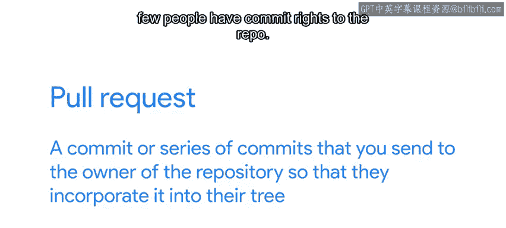

**拉取请求** 是你发送给代码库所有者的一系列提交，以便他们将其合并到他们的代码树中。

## GitHub的典型工作流程

这是在GitHub上工作的典型方式，因为在大多数项目中，只有少数人对代码库拥有提交权限。但是，任何人都可以通过发送拉取请求来建议补丁、错误修复甚至新功能，然后拥有提交权限的人可以应用这些请求。

通常，代码库的所有者会在合并更改之前对其进行审查，检查它们是否符合项目的开发指南、许可证是否有效等。

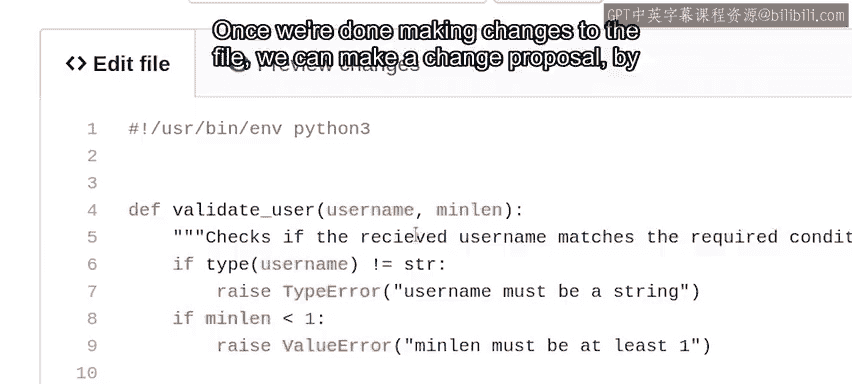

## 实际操作：提交更改

让我们修复文件中的拼写错误，看看拉取请求是什么样子的。

完成对文件的更改后，我们可以通过向下滚动并填写更改描述来提出更改建议。在本例中，我们修复了函数文档中的拼写错误。

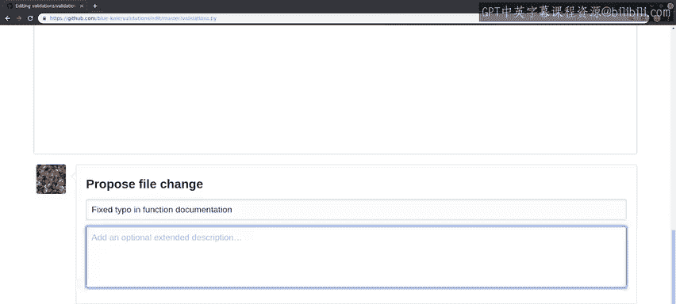

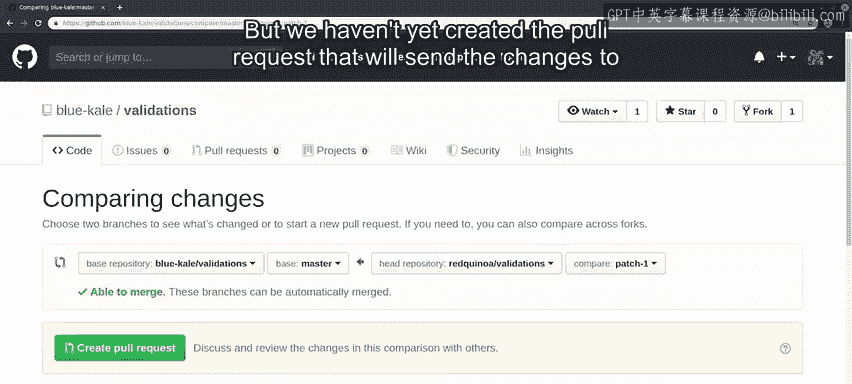

点击“提议文件更改”按钮将在我们Fork的代码库中创建一个提交，这样我们就可以将更改发送给我们的同事。现在让我们这样做。

我们已经在Fork的代码库上创建了一个提交。但我们还没有创建将更改发送给原始代码库所有者的拉取请求。

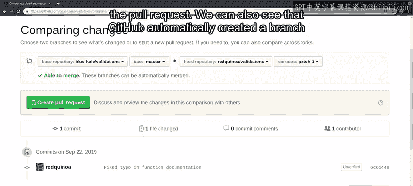

在这个屏幕上，我们可以看到关于我们更改的大量信息。我们可以看到哪些代码库和分支参与了拉取请求的创建。

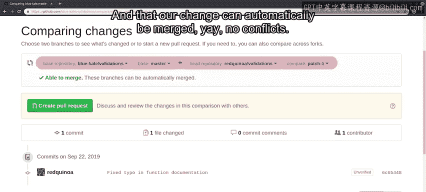

我们还可以看到GitHub自动为我们创建了一个名为 `patch-1` 的分支，并且我们的更改可以自动合并。太好了，没有冲突。这个窗口还允许我们在创建实际的拉取请求之前审查更改。当我们准备好后，只需点击“创建拉取请求”按钮。

## 创建拉取请求

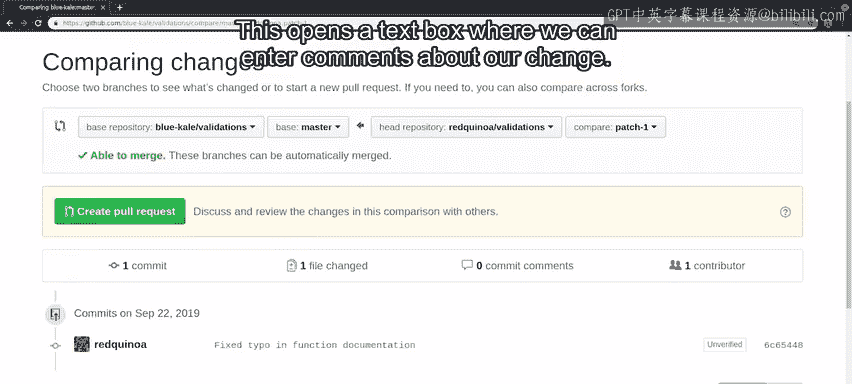

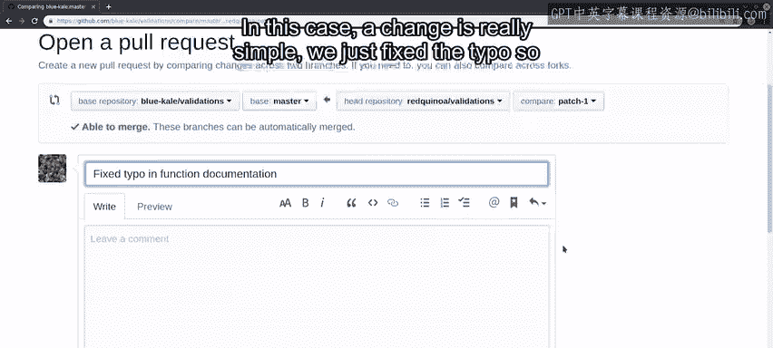

这将打开一个文本框，我们可以在其中输入关于我们更改的评论。在本例中，我们的更改非常简单，只是修复了一个拼写错误，所以没有额外需要添加的内容。

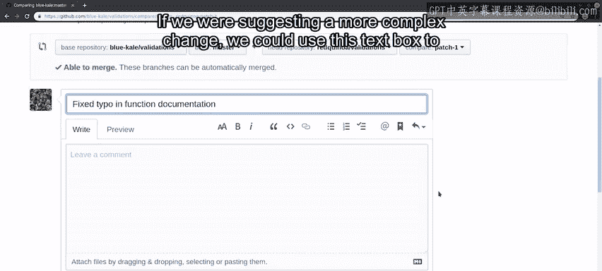

如果我们建议一个更复杂的更改，我们可以使用这个文本框来提供更多背景信息。

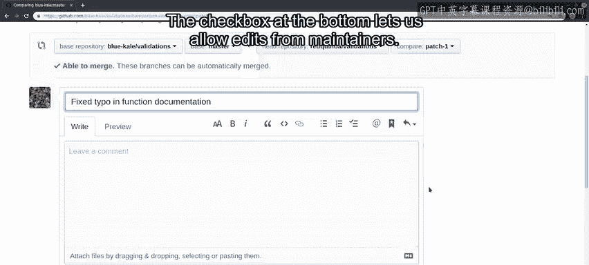

底部的复选框允许我们允许维护者进行编辑。这可能很有用，例如，如果项目维护者在合并我们的更改时，已经有了更多提交，我们的更改需要变基。通过允许编辑，维护者可以自己完成，而不必要求我们去做——工作量更少。是的，请允许。好的，我们准备好了。让我们点击“创建拉取请求”。

## 完成与后续

很好，我们已经用我们的更改创建了一个拉取请求。

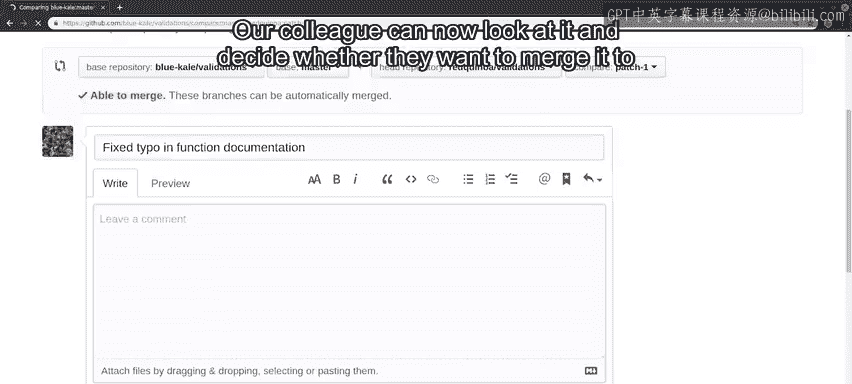

我们的同事现在可以查看它，并决定是否要将其合并到项目中。在本视频中，我们探讨了创建拉取请求的最简单方法，即直接通过GitHub界面进行操作。通过使用这个工作流程，你已经可以开始为GitHub上的项目做贡献了。

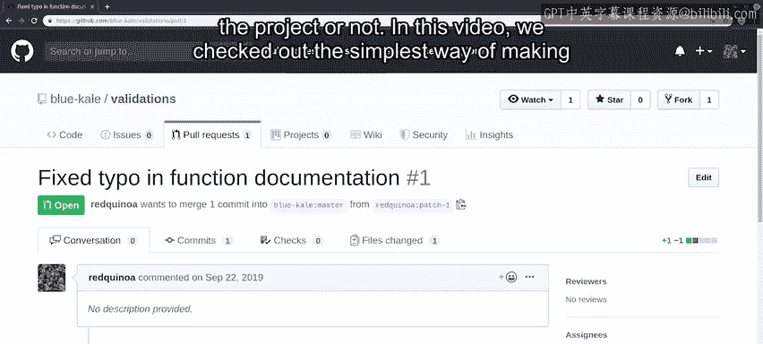

接下来，我们将了解如何进行更复杂的拉取请求。

## 总结

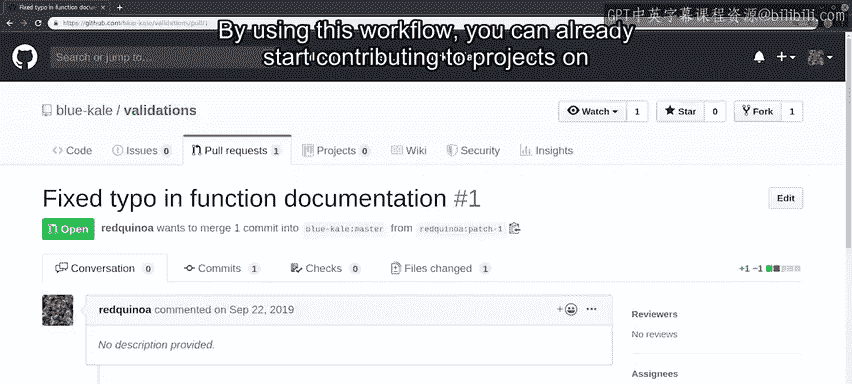

本节课中，我们一起学习了GitHub协作的核心概念：**Fork** 和 **拉取请求**。我们通过一个修复拼写错误的实际例子，演示了如何查看他人代码、创建Fork、直接在线编辑文件、提交更改并最终发起一个拉取请求的全过程。这是参与开源项目或团队协作的基础且重要的第一步。