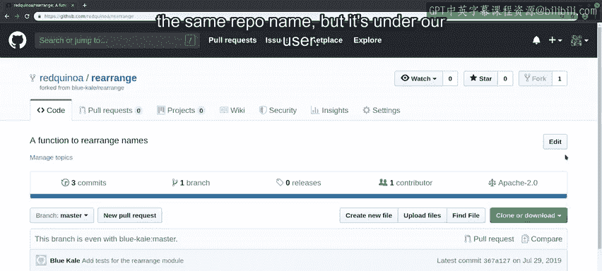
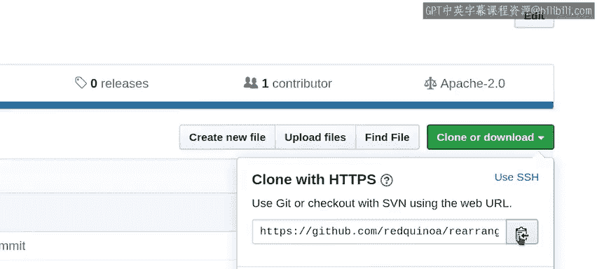
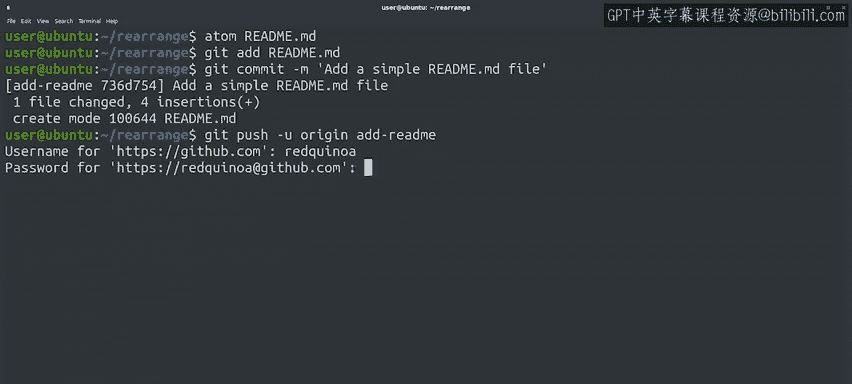
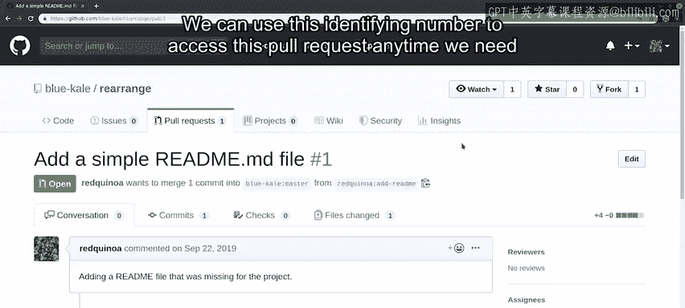

#  046：GitHub 典型拉取请求工作流 🚀


在本节课中，我们将学习如何在GitHub上完成一个典型的拉取请求工作流。我们将从创建代码库的分支开始，在本地进行修改，然后将这些更改推送回GitHub并创建拉取请求。

## 概述

上一节我们介绍了如何在GitHub网页界面上直接编辑文件来创建简单的拉取请求。本节中，我们将看看如何对更复杂的更改使用更完整的工作流。这包括在本地计算机上处理代码库，并使用我们已学到的所有Git命令。

## 创建分支

首先，我们需要为想要贡献的代码库创建一个分支。以下是具体步骤：

1.  导航到目标代码库页面。
2.  点击页面右上角的 **Fork** 按钮。
3.  等待几秒钟，GitHub会为你的账户创建一个该代码库的副本。



这个副本将包含代码库的当前状态，包括所有文件和提交历史。创建完成后，你会进入一个与你账户关联的、同名的新代码库页面。



## 克隆到本地

现在，我们已经在GitHub上创建了分支。接下来，我们需要在本地计算机上获取一份副本。

1.  在你的分支代码库页面上，复制其URL。
2.  在终端中，使用 `git clone` 命令和该URL。

```bash
git clone <你复制的URL>
```

执行后，你会获得一个包含代码库内容的新目录。

## 进行本地更改

拥有了代码库的本地副本后，我们就可以进行所需的更改了。例如，假设这个项目目前缺少一个 `README.md` 文件。



首先，我们创建一个新的分支来进行这项工作：

```bash
git checkout -b add-readme
```

然后，创建并编辑 `README.md` 文件。`.md` 扩展名表示我们使用Markdown，这是一种轻量级标记语言，可以编写格式简单的纯文本文件。

编辑完成后，保存文件并提交更改：

```bash
git add README.md
git commit -m "Add README file"
```

## 推送更改并创建拉取请求

要将更改推送到我们的分支代码库并创建远程分支，使用以下命令：

```bash
git push -u origin add-readme
```

推送成功后，GitHub通常会提示你可以为此分支创建拉取请求。

在创建拉取请求之前，务必检查代码是否可以成功合并。GitHub会显示你的更改是否可以自动合并。如果不行，你可能需要根据原始代码库的当前分支进行变基操作。

在创建拉取请求的页面，你需要填写评论来解释此次更改的原因。这有助于审核者理解为何应该将你的更改合并到主分支。你可以说明这是在修复错误、添加新功能，还是像本例一样补充缺失的文档。

同时，务必检查页面底部显示的差异对比，确保你发送的更改完全正确。

确认无误后，点击 **Create pull request** 按钮。创建成功后，你会获得一个用于在GitHub上跟踪此拉取请求的唯一标识号。

## 后续互动



创建拉取请求后，项目维护者可能会提出疑问、给出评论，甚至要求你修改拉取请求。例如，他们可能指出你的新功能缺少一些文档。在这种情况下，你需要根据反馈进一步更新你的分支。

## 总结

本节课我们一起学习了GitHub上完整的拉取请求工作流。我们从创建分支开始，将代码库克隆到本地，创建新分支并进行修改，然后推送更改并最终创建拉取请求。记住，清晰的沟通和确保代码可合并是成功提交拉取请求的关键。