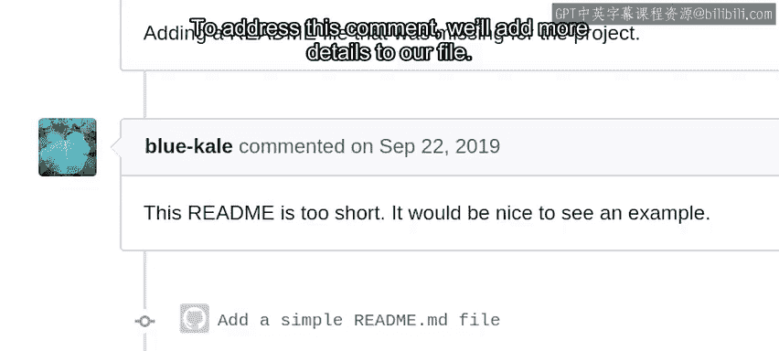
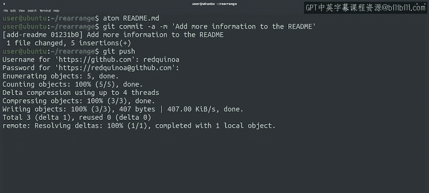
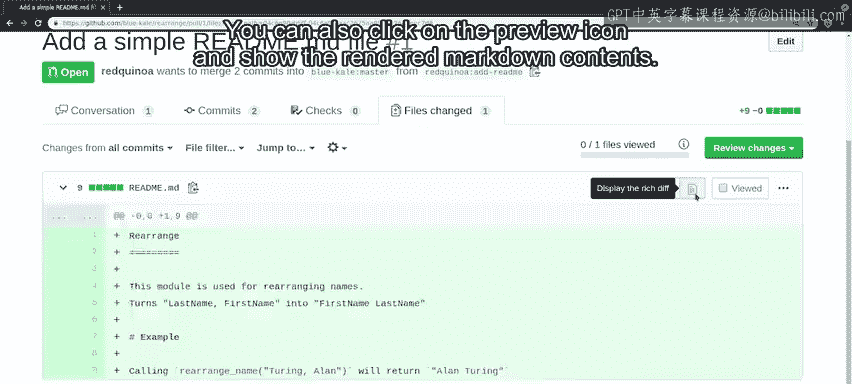

#  047：更新现有的拉取请求 🔄

## 概述

在本节课中，我们将学习如何在收到项目维护者的反馈后，更新已提交的拉取请求。我们将了解如何根据评论修改代码、提交更改，并确保这些更改自动关联到原有的拉取请求中。

---

当我们提交拉取请求后，通常会收到项目维护者的一些评论，要求进行改进。

这些改进可能包括添加文档或测试。

也可能需要确保更改适用于所有情况，或符合项目的风格指南。

收到这些评论没有问题。这实际上表明项目维护者对我们的更改感兴趣。

为了让我们的更改获得批准，处理这些评论非常重要。

例如，如果被要求添加文档，我们就去完成它。

回到我们的更改，看起来我们收到了一位同事的评论。

评论说我们的README文件太简短，希望我们添加一个示例。

为了处理这条评论，我们将向文件中添加更多细节。

---

我们将首先解释该函数将“姓 名”重新排列为“名 姓”。

然后我们将添加一个示例，说明调用`rearrange_name`函数并传入“Tring Allen”作为参数。

将返回“Alan Tring”。好的，我们稍微充实了README文件。

现在我们可以像往常一样添加更改并将其提交到代码库。

让我们运行`git commit`并传递一条提交消息，说明我们已向README添加了更多信息。

之后，我们将把更改推送到代码库。

---

好的，既然我们已经将更改推送回代码库，让我们在GitHub中检查我们的拉取请求。

在“提交”选项卡中，我们可以看到我们的两次提交。我们的提交现在显示为同一拉取请求的一部分。

这里需要注意的是，我们只是将提交推送到之前相同的分支，而GitHub自动将其添加到拉取请求中。

如果我们想创建一个单独的拉取请求，则需要创建一个新分支。

如果我们转到“文件更改”选项卡，可以看到受拉取请求影响的所有文件。

无论它们是在哪次提交中更改的。当我们查看由一次提交或一系列提交生成的差异时。

GitHub将为我们所做的更改显示彩色的差异。

它将使用绿色表示新增的行，红色表示被删除的行。如果只有一行的一部分发生了更改。

它将高亮显示该行的特定部分。在这种情况下，这是一个新文件。

所以所有行都是新增的。请注意，即使有两次单独的提交，我们也只看到一个文件。

我们看到的是我们的代码库与我们为其创建拉取请求的原始代码库之间的差异。

我们还可以单击预览图标，显示渲染后的Markdown内容。

---

GitHub渲染我们的文件并高亮显示更改。

请记住，GitHub上的每个项目的工作方式可能略有不同。

有些项目可能要求你的拉取请求中只有一个提交。

其他项目可能要求你在拉取请求准备合并回主分支时，基于最新的master分支进行变基。

GitHub允许项目设置其贡献指南。

每当你在项目中创建新的拉取请求或议题时，都会找到指向这些指南的链接。

因此，请确保你已阅读这些指南，并且你的拉取请求符合它们。在本视频中。

我们看到了如何通过在本地Git仓库中进行新的提交并将其推送到远程仓库来更新我们的拉取请求。

我们之前已经看到了如何使用GitWeb界面创建新的拉取请求。

并且我们可以使用此界面来更新拉取请求。

当我们想要进行的更改很小时，这可能很方便。

例如修复拼写错误或在文档中添加额外的句子。接下来。

我们将讨论如果要求你将更改压缩为单个提交时该怎么办。

---

## 总结

本节课中，我们一起学习了如何响应代码审查反馈并更新拉取请求。关键步骤包括：根据评论在本地修改代码，提交更改到同一分支，以及推送后GitHub会自动将新提交关联到原有拉取请求。我们还了解了不同项目可能有不同的协作规范，例如要求单一提交或变基，因此务必阅读项目的贡献指南。