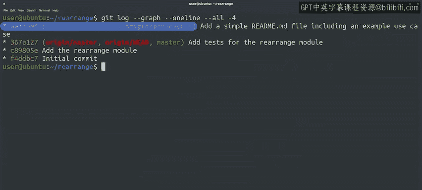
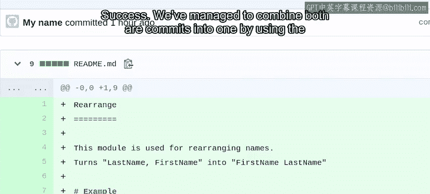

#  048：Git 交互式变基与压缩提交 🛠️


## 概述

在本节课中，我们将学习如何使用 Git 的交互式变基功能来压缩多个提交。这在你需要整理提交历史、合并多个小改动为一个逻辑清晰的提交时非常有用。我们将重点介绍 `git rebase -i` 命令，并演示如何安全地重写已推送到远程仓库（如 GitHub 拉取请求）的提交历史。

---

## 为何以及何时可以重写历史

上一节我们介绍了变基的基本概念。本节中我们来看看在什么情况下可以安全地重写提交历史。

之前我们强调过，当提交已经发布（推送到公共仓库）后，你不应该重写历史。这是因为其他人可能已经基于这些内容同步了他们的仓库。

然而，在**拉取请求**的上下文中，这条规则可以放宽。通常只有你自己克隆了你复刻的仓库，因此重写你个人分支上的历史是安全的。

假设项目维护者要求我们将两个更改合并为一个提交，并提供一个比我们最初提交的更详细的描述。我们可以通过使用交互式变基命令来实现这个目标。

---

## 使用交互式变基

以下是使用 `git rebase -i` 进行交互式变基的步骤。

1.  **启动交互式变基**
    我们将 `master` 分支作为参数传递给命令。
    ```bash
    git rebase -i master
    ```

2.  **理解编辑器中的选项**
    命令执行后，文本编辑器会打开，按从旧到新的顺序列出所有选中的提交。通过更改每行的第一个单词，我们可以选择要对提交执行的操作。
    默认操作是 `pick`，它表示接受提交并将其变基到我们选择的分支上（这与不带 `-i` 标志的 `git rebase` 行为一致）。但现在我们可以将操作更改为其他命令。

    文件中的注释说明了我们可以对提交使用的所有不同命令。例如：
    *   `reword`：保留更改，但修改提交信息。
    *   `edit`：编辑提交，以添加或删除其中的更改。
    *   `squash` 和 `fixup`：用于合并提交。两者都将所选提交的内容合并到列表中的前一个提交中。区别在于对提交信息的处理：
        *   选择 `squash` 时，提交信息会被合并，并且编辑器会打开让我们进行必要的修改。
        *   选择 `fixup` 时，该提交的提交信息会被丢弃。

3.  **压缩提交**
    在我们的例子中，我们希望使用 `squash` 来合并两个提交，同时修改提交描述。因此，我们将第二行的 `pick` 命令改为 `squash`，使其合并到第一个提交中。

4.  **编辑合并后的提交信息**
    保存并退出编辑器后，Git 会提供另一个文件让我们编辑，即合并后的提交信息。Git 在注释中显示了一些有用信息，包括修改了哪些文件以及正在合并哪些提交。
    我们可以通过添加关于更改的更多信息来改进描述，例如添加一个示例用例。

5.  **完成变基**
    编辑好提交信息后，保存并退出编辑器。变基操作就完成了。我们可以使用 `git show` 命令来检查最新的提交及其包含的更改，确认两个更改已成功合并为一个包含完整新文件和正确提交信息的提交。

---

## 处理本地与远程分支的差异

在尝试将此更改推送到我们的仓库之前，让我们先检查一下状态。

1.  **检查状态**
    运行 `git status`。Git 会告诉我们本地分支有一个提交（即我们刚刚完成的变基），而 `origin/add-readme` 远程分支有两个提交（即我们之前已推送到仓库的那两个提交）。

2.  **查看历史图谱**
    运行以下命令查看提交历史图谱：
    ```bash
    git log --graph --oneline --all -4
    ```
    我们可以看到，推送到 `origin/add-readme` 分支的两个提交与当前在我们本地 `add-readme` 分支中的提交位于不同的路径上。每当我们执行变基时都会出现这种情况，因为旧的提交在远程仓库中，而我们的本地仓库中有一个不同的新提交。

---

## 强制推送更新

那么，当我们运行 `git push` 时会发生什么？让我们试试看。

正如预期，Git 不喜欢我们尝试推送这个更改，因为它无法快进合并。但在这种情况下，我们不想创建合并提交，而是想用新提交替换旧的提交。

为此，我们需要使用 `-f` 或 `--force` 标志进行强制推送：
```bash
git push -f
```
这个命令会强制 Git 按原样将当前快照推送到仓库。

推送成功后，再次运行 `git log --graph --oneline --all -4` 查看历史图谱。这次，在 `master` 分支之上只有一个提交，之前的分歧已经消失。



最后，查看拉取请求的内容，确认我们已成功地将两个提交合并为一个。

---



## 总结

本节课中我们一起学习了如何使用 Git 的交互式变基 (`git rebase -i`) 来压缩多个提交。我们了解了在拉取请求的上下文中安全重写历史的场景，掌握了将 `pick` 改为 `squash` 来合并提交并编辑信息的具体步骤，并学会了在重写历史后如何使用 `git push -f` 来强制更新远程分支。这些工具在维护清晰、整洁的提交历史时非常有用。

你已经掌握了在 GitHub 上创建拉取请求、更新拉取请求以及压缩提交的方法。接下来，你将找到我们所使用命令的参考列表以及获取更多信息的链接，之后还有一个快速测验来检查你是否理解了所有内容。