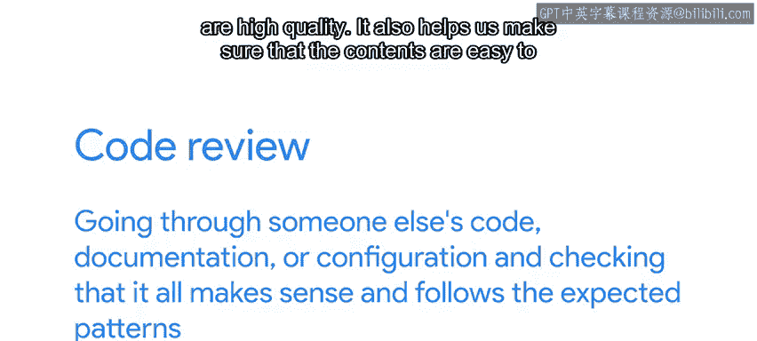
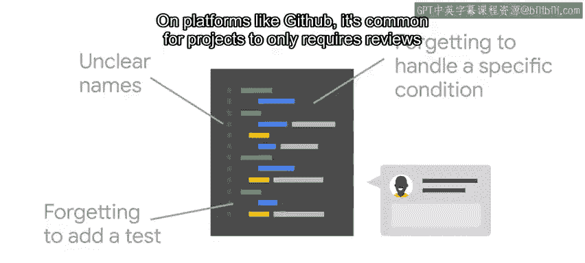

#  049：什么是代码评审 🔍

在本节课中，我们将学习代码评审（Code Review）的基本概念、目的、流程及其在提升项目质量中的重要性。我们将了解代码评审如何帮助团队协作，确保代码、文档和配置文件的清晰性、一致性和正确性。

---

GitHub 及其他代码仓库托管服务提供了在其平台上进行代码评审的工具。虽然这被称为“代码评审”，但实际上我们可以使用相同的工具和流程来评审任何文本文件，包括配置文件和文档。

进行代码评审意味着仔细检查他人的代码、文档或配置，确保其逻辑清晰并符合预期的模式。代码评审的目标是通过确保变更具有高质量来改进项目。

上一节我们介绍了代码评审的基本定义和目标，本节中我们来看看代码评审带来的具体好处。

代码评审有助于确保内容易于理解、风格与整体项目保持一致，并且我们没有遗漏任何重要的用例。评审增加了检查代码的“眼睛”数量，这提升了代码质量并减少了错误数量。这并不意味着代码将完全没有错误，但至少最明显的错误会被发现。此外，这有助于知识传播，因为代码编写者和评审者现在都了解代码的功能。

当我们与团队成员在同一办公室工作时，我们可以通过一起查看变更并讨论内容如何配合来进行面对面的评审。

然而，当我们的合作者位于不同的办公室或时区时，使用代码评审工具是更好的选择。

代码评审工具允许我们对他人编写的代码进行评论。这让我们可以留下关于如何改进代码的反馈。

以下是评审中常见的一些代码问题：
*   变量或函数名称不清晰，导致代码难以理解。
*   忘记添加测试。
*   忘记处理特定的条件。

如果我们在编写文档，评审者可以帮助我们捕捉拼写错误和表述不清的地方。

在 GitHub 等平台上，项目通常只要求对没有提交权限的人员进行评审，而项目维护者可以直接提交。但进行代码评审可以提高代码的整体质量。如今，一些开源项目和许多公司要求每个人都进行代码评审。这不是因为他们不信任成员，而是因为他们希望获得最高质量的代码，而代码评审是实现这一目标的方法。

有一点需要始终牢记：代码评审不是评判我们是好程序员还是坏程序员。评审的目的是让我们的代码变得更好，不仅限于某一次评审，而是整体上。通过获得反馈，我们可以持续改进编码技巧；通过评审他人的代码，我们也可以学习实现目标的新方法和不同方法。

和所有人一样，在为一个问题辛苦工作数小时并最终解决后，我只想提交代码并结束工作。但这很少发生。代码评审通常会因为一些小错误和细节问题让我返工。但这是一件好事。这些代码评审指出了我们可能遗漏的地方，并确保我们的代码对他人来说是有意义的。

我想到一个例子，那是我在编写一个 Android 错误报告解析器脚本的时候。在花了几个小时修改代码并编写测试来验证我的工作后，我终于将其提交进行代码评审，并以为大功告成了。结果，我有一堆小的风格指南错误，我的评审者没有放过它们。更重要的是，在修复风格错误时，我注意到我的脚本中遗漏了一个主要用例，这会导致我的代码无法工作。因此，我修复了风格错误和遗漏的用例，并可以微笑着提交我的更改了。

在 Google，我们深信评审我们所做一切事情的价值。即使是这些课程的内容，也经过了大量人员的评审。这些评审确保了内容清晰易懂、技术上正确无重大遗漏，并遵循既定的指导方针。感谢我的同事们让我们保持警惕，并确保这些视频是一流的。

---

本节课中我们一起学习了代码评审的核心概念。我们了解到，代码评审是一个旨在提升代码、文档和配置质量的协作过程，它通过集体智慧发现错误、确保风格一致并传播知识。评审不是对个人的评判，而是团队共同追求卓越代码质量的必要实践。接下来，我们将讨论典型的评审工作流程以及如何从评审过程中获得最大收益。