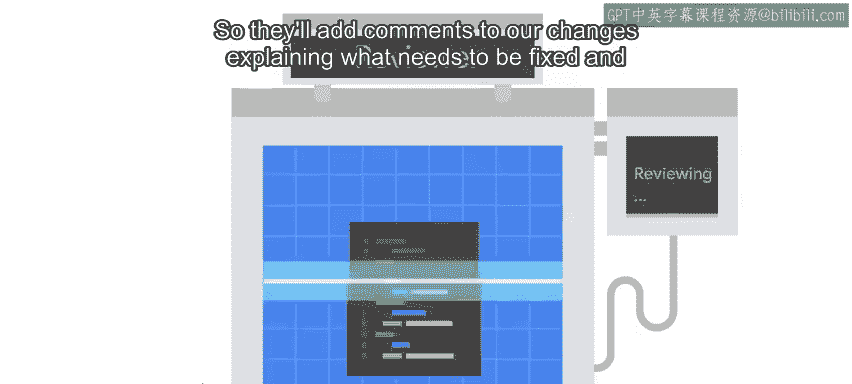
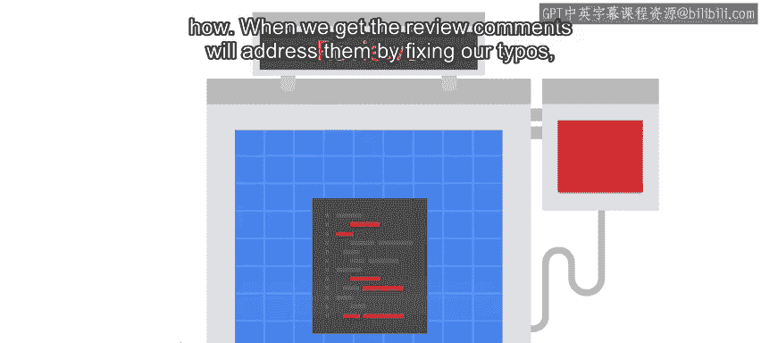
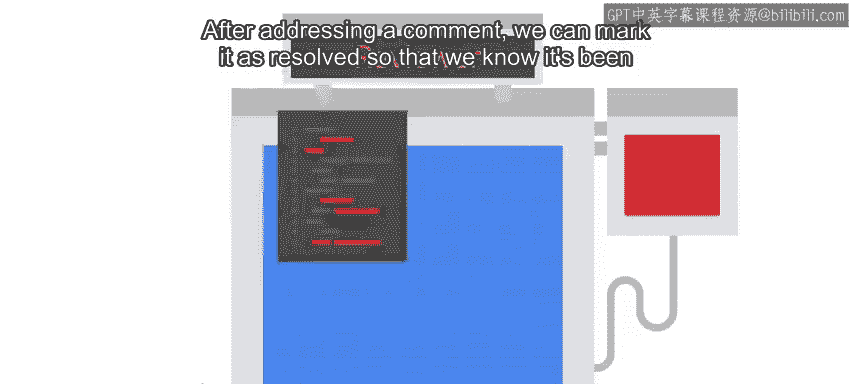
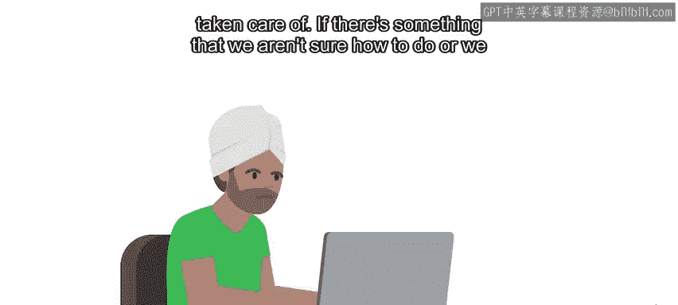
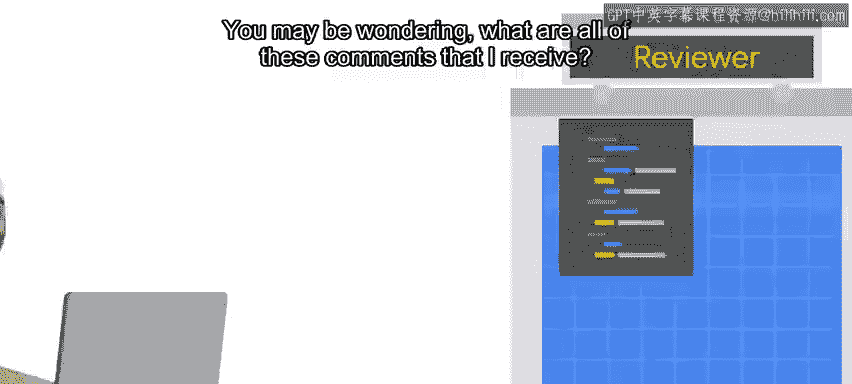
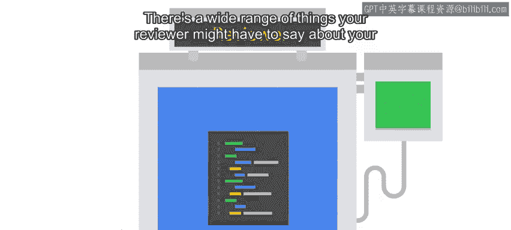

#  050：代码评审工作流 🛠️

在本节课中，我们将学习典型的代码评审工作流。我们将了解从提交代码变更到最终合并的完整过程，包括如何处理评审意见、与评审者互动，以及如何通过评审提升代码质量。

---

在上一节视频中，我们解释了什么是代码评审以及它如何提升代码质量。本节中，我们将通过一个评审工具来了解典型的代码评审流程。

想象一下，我们刚刚完成了一系列代码变更。现在，我们将请求评审者审查我们的代码。

评审者可能会认为一切正常，并批准我们的变更。但通常，他们会发现一些需要改进的地方。

因此，他们会在我们的变更中添加注释，解释需要修复的内容以及方法。当我们收到评审意见时，我们会通过修复拼写错误、添加缺失的测试等方式来处理这些意见。

处理完一条评论后，我们可以将其标记为“已解决”，以便我们知道该问题已得到处理。如果我们不确定如何操作，或者认为可能有更好的方法，我们可以回复评论并向评审者请求更多信息，而不将评论标记为已解决。

一旦所有评论都已解决，并且评审者对结果感到满意，他们将批准变更，我们便能够合并它。

你可能会好奇，我会收到哪些类型的评论？评审者对你的代码可能有各种各样的意见。

有时，你可能忘记考虑某些重要事项，需要进行大量工作来修复。有时，评审者可能指出一些不重要的小问题，这些评论主要是改进代码的建议。这些评论通常以“nit”（无关紧要的小问题）为前缀。无论评论内容如何，重要的是花时间理解评论的含义以及你需要采取的措施。

例如，如果你编写了一段代码，评审者要求你解释代码为何或如何执行某项操作，你可能倾向于仅在评论中回答问题并将其标记为已解决。但这并不是一个好主意，因为只有评审者能看到你的回答。相反，最好将此视为使代码更清晰的机会。例如，你可以通过使用更好的变量名或将大段代码拆分为更小的函数来实现。此外，你还可以为代码添加注释，并为函数编写文档，以确保清楚地解释“如何”和“为何”。

代码评审中通常包含多条关于代码风格的评论。为了避免反复沟通，最好参考项目的编码风格指南。例如，许多Python项目使用PEP8风格指南。如果你参与贡献的项目没有风格指南，请务必要求提供一份。如果需要灵感，我们将在下一篇阅读材料中提供一些常见风格指南的链接。

市面上有许多代码评审系统，虽然它们都遵循相同的模式，但工作方式并不完全相同。在某些代码评审工具中，你需要项目维护者之一批准你的代码才能提交。在其他工具中，你只需要获得项目贡献者的几个“+1”即可提交。目标是确保你的代码已由熟悉项目的人员评审，以便准备提交。

你能想到过去参与过的、代码评审可能有所帮助的项目吗？也许你曾作为团队一员工作，但难以确保每个人都同意工作方式。或者，你可能正在学习使用新工具，而第二双眼睛的审视会对你的工作有益。无论项目简单还是复杂，良好的代码评审总能带来改进。

接下来，我们将深入探讨GitHub上的代码评审流程是如何工作的。

---

本节课中，我们一起学习了典型的代码评审工作流。我们了解了从提交变更到处理评审意见、与评审者互动，直至最终合并代码的完整过程。我们还探讨了如何通过评审提升代码质量，以及不同评审工具的特点。掌握这些知识将帮助你在团队协作中更高效地进行代码评审。