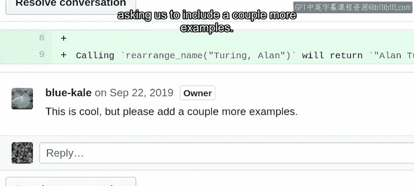
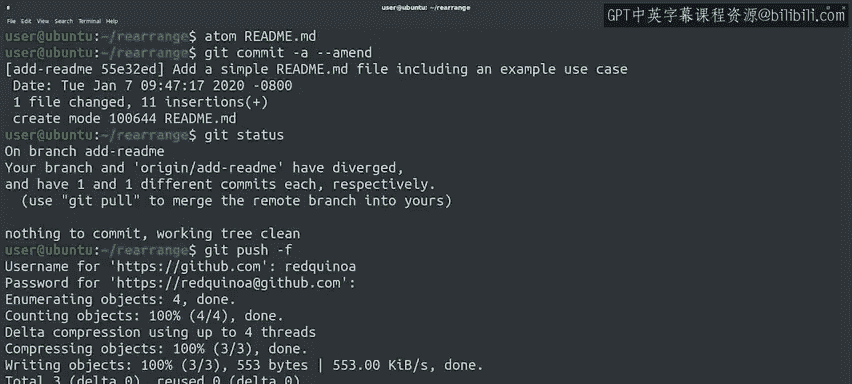
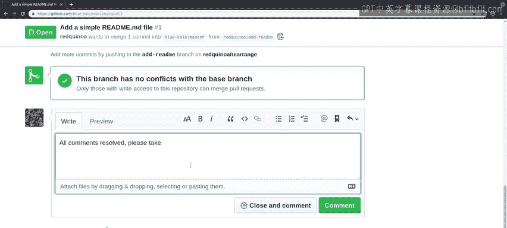

#  051：在GitHub上进行代码评审 📝


在本节课中，我们将学习如何在GitHub平台上进行具体的代码评审操作。我们将跟随一个实际的拉取请求（Pull Request）示例，了解如何查看评审意见、修改代码、提交更改，并最终完成评审流程。

---

之前我们已经讨论了进行代码评审的一般流程。这个流程适用于任何具备代码评审工具的平台。

现在，让我们具体看看这个过程在GitHub上是如何进行的。还记得吗？在本模块早些时候，我们创建了一个添加README文件的拉取请求。

很巧，我们的同事刚刚回复了一些评审意见。让我们来看一下。

## 查看评审意见

代码评审包含一条总体评论，以及逐行高亮显示我们需要完成的事项的评论。

我们可以通过点击“查看更改”按钮，来查看针对我们创建的文件所请求的所有更改。



我们的评审员对我们的文件提出了三条意见：
*   第一条是要求我们在句子末尾添加一个句号。
*   第二条要求我们添加一个额外的井号（`#`），这会使标题以更小的字体显示。
*   最后一条需要我们做更多工作，因为它要求我们添加几个额外的示例。

## 修改代码并提交

我们来修复这些问题。我们将在第二句末尾添加一个句号，然后在示例标题前添加第二个井号，最后再添加几个示例。

为此，我们将使用星号字符（`*`），这是Markdown语言的另一个特性，可以让我们轻松创建项目符号列表。所以，我们将添加几行格式相同的文本，例如“Hopper, Grace M”变成“Grace M Hopper”，以及“Voltaire”保持为“Voltaire”。

好的，我们已经处理了代码评审中的所有意见。

让我们保存文件，然后提交更改。由于我们希望这个更改成为之前提交的一部分，我们将使用 `git commit --amend` 命令，这会编辑原始的提交。

```bash
git commit --amend
```

完成之后，我们运行 `git status` 来查看Git对我们仓库状态的说明。

和之前一样，我们看到我们的更改已经与 `origin/master` 分支产生了分歧。

## 理解强制推送

你可能记得，`git commit --amend` 会修改提交，因此对已经推送到远程仓库的提交进行此操作是不安全的。

使用 `--amend` 与创建一个新提交，然后使用交互式变基（rebase）来修复更改的效果基本相同。所以，原始提交会被一个拥有完全不同提交ID的全新提交所取代。

这意味着要推送它，我们需要再次使用 `-f`（强制）标志。

```bash
git push -f origin branch-name
```



请记住，对拉取请求分支进行强制推送是可以的，因为理论上没有其他人会克隆它。但这并不是我们希望对公共仓库进行的操作。

## 完成评审流程

我们已经完成了同事的要求，现在让我们回到拉取请求页面，解决（resolve）这些评论。

你会看到一条评论显示为“已过时”。这是因为我们做出修改后推送了一个新版本。但由于我们已经处理了评审请求，我们可以忽略“已过时”的提示，直接解决（resolve）这个对话。



很好，我们已经处理了所有评论。我们可以在对话中留言，告知评审员我们已经解决了所有意见，并请他们再次查看。

我们的评审员现在可以查看新的更改，如果满意的话，就可以批准（approve）它们。

## 总结与练习

就像我们讨论过的许多其他主题一样，要充分利用代码评审流程，需要一些实践。掌握一些技巧固然很好，但最终我们需要通过经验来学习。所以，不要害怕去练习、练习、再练习。

接下来，你将找到一些学习更多关于代码评审的资源，以及一个测验来将知识付诸实践。之后，你可以尝试在GitHub上实际进行一次代码评审。