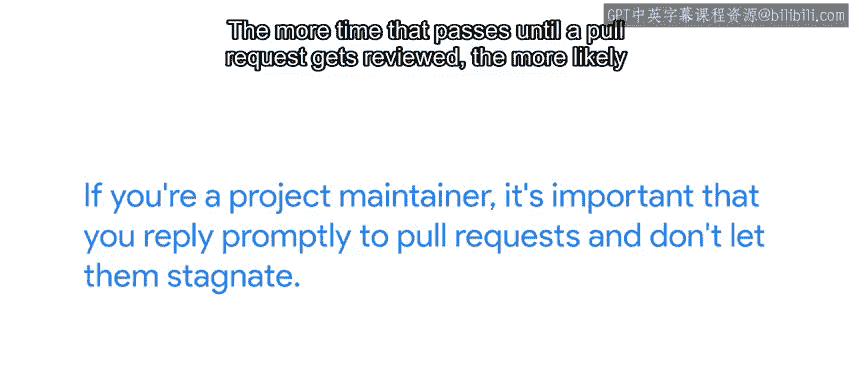
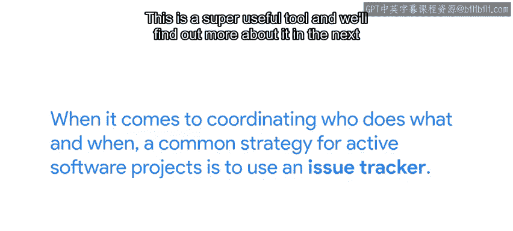
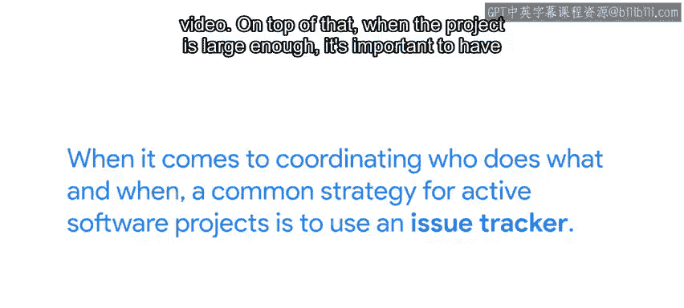

#  052：协作管理指南 🫂

在本节课中，我们将学习如何在团队协作中有效管理项目，包括代码重构、文档编写、拉取请求处理以及沟通协调等关键实践。

## 概述

上一节我们介绍了使用GitHub等平台工具进行协作的基本方法。本节中，我们将探讨在这些工具之外，如何通过有效的协调与管理来提升团队协作效率。

## 代码重构的协调

当项目需要进行中型或大型重构，影响多个文件的多行代码时，提前通知同事非常重要。如果可能，尽量在其他开发者处理项目不同部分时进行重构，这有助于避免大型复杂冲突。

## 文档的重要性

我们多次强调记录工作内容非常重要。与大型团队协作时，记录所做工作及其原因变得更加重要，否则你将花费大量时间回答其他人的问题。此外，当服务在你休假期间出现问题，或代码开发者在世界另一端正在睡觉时，文档需要足够完善，以帮助他人解决问题。

最基本的文档形式是编写清晰的代码，并为代码中的函数提供良好的注释和文档说明。

## 项目文档文件

在此基础上，你需要创建文档文件，让他人了解如何与你的项目交互，例如我们在之前视频中创建的`README.md`文件。

以下是创建有效项目文档的关键步骤：

*   编写清晰的代码注释
*   为函数和方法添加文档字符串
*   创建`README.md`文件说明项目概况
*   提供安装和使用指南
*   记录贡献指南和代码规范

## 拉取请求处理

如果你是项目维护者，及时响应拉取请求非常重要，不要让它们停滞不前。拉取请求等待审核的时间越长，越有可能出现新的提交，导致合并更改时产生冲突。

此外，如果贡献者是试图提供帮助的志愿者，让他们等待反馈时间过长可能会削弱他们为项目工作的动力。

## 变更审核原则

维护项目时需要记住的另一件事是，理解接受的任何变更非常重要，特别是对于志愿者贡献的开源项目。你永远不知道对方在你合并代码后是否会继续维护，因此最好确保你自己能够做到这一点。

你还应该谨慎决定接受或拒绝哪些补丁。接受所有发送给你的内容可能导致项目过度增长而难以管理，或者考虑太多边缘情况，导致代码复杂难以维护。

相反，如果不接受任何拉取请求，你会打击贡献者的积极性，错失保持项目活跃性和相关性的机会。

## 代码风格指南

我们已经多次讨论过风格指南。如果你正在为项目做贡献，需要查看风格指南并确保遵循它。如果你拥有一个项目，创建风格指南很有意义，这样其他人就知道你对他们的期望。

在我们的下一篇阅读材料中，将包含一些最常见风格指南的链接，以及如何在自己项目中包含风格指南的指导。

## 任务协调与问题跟踪

在协调谁做什么以及何时做方面，活跃软件项目的常见策略是使用问题跟踪器。这是一个非常有用的工具，我们将在下一个视频中了解更多相关信息。

## 团队沟通渠道

此外，当项目足够大时，拥有另一种在贡献者之间沟通和协调的方式非常重要。多年来，大多数项目使用邮件列表和IRC频道进行沟通。最近，新的沟通形式变得流行，如Slack频道或Telegram群组。

如果你管理自己的项目，选择最适合你和贡献者需求的沟通媒介。如果你正在与不属于自己的项目协作，需要找出正在使用哪些渠道进行协作。

## 总结

本节课中我们一起学习了团队协作中的关键管理实践。你现在对如何通过互联网与他人协作有了大致了解。接下来，我们将讨论两个可以帮助我们更好协作的重要工具：问题跟踪和持续集成。