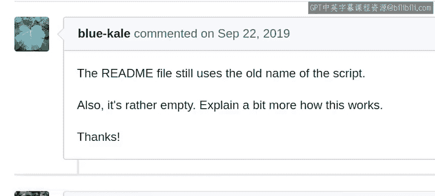
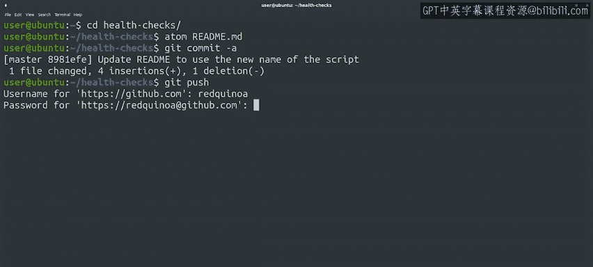
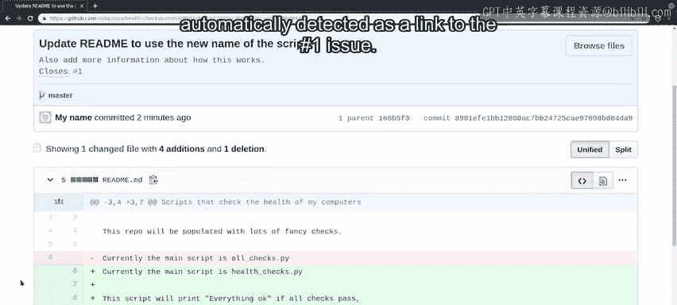

#  053：使用问题跟踪器

在本节课中，我们将学习如何在团队协作中使用问题跟踪器来有效管理任务、报告错误并协调工作。这对于确保项目有序进行至关重要。

## 概述

与他人协作时，决定谁负责什么工作至关重要。缺乏协调会导致多人重复处理项目的同一部分，而其他关键部分却无人问津。想象一下，你和同事决定为网络中的计算机开发自动化更新软件。如果不将任务分解并分配给不同的人，而是随机开始处理基础设施的某些部分，结果很可能是混乱的：软件组件无法协同工作，并且存在许多无人处理的空白。

对于小型团队，通常可以轻松地当面讨论分工。但随着团队规模扩大，讨论职责和后续工作会变得麻烦。这时，问题跟踪器或错误跟踪器这类工具就能帮助我们更好地协调工作。

## 什么是问题跟踪器？

问题跟踪器向我们展示了需要完成的任务、任务的状态以及负责人。该系统还允许我们为问题添加评论。这些评论非常有用，可以提供问题的更多细节、解释解决方法，或详细说明如何测试问题是否已解决。

问题跟踪器不仅对积极参与项目的人有用，还允许用户遇到错误时进行报告，即使他们不知道如何解决问题。有时用户会遇到我们从未想到的问题，让他们通过错误跟踪器报告这些问题有助于改进我们的项目。此外，跟踪器还能帮助想要为项目做出贡献的志愿者。一个清晰可见的待办工作列表让新贡献者知道如何提供帮助以及从哪里入手。

## 常见的跟踪工具

有多种不同的解决方案来跟踪错误或问题。有一个流行的错误跟踪器叫Bugzilla，被许多开源项目使用。另一方面，像GitHub这样的平台内置了问题跟踪器。因此，如果你在那里托管项目，使用它来跟踪项目工作（如待解决的问题、要添加的功能和要包含的用例）会非常方便。

## 实践：在GitHub中创建与处理问题

让我们来实际操作一下。这是我们健康检查项目的问题列表。目前，它只有一个要求我们更新文档的问题。

一位同事建议我们创建一个新的健康检查，用于验证系统日志（如内核日志或系统日志）中是否存在任何关键错误消息。那里出现的错误可能有助于排查一些有趣的问题。因此，这听起来像是一个值得添加的新检查功能。

### 创建新问题

我们通过点击“New issue”按钮为此功能创建一个问题。对于问题标题，我们将说明我们希望检查系统日志中的关键错误。对于问题描述，我们将说明新检查应遍历 `/var/log/kern.log` 和 `/var/log/syslog`，并检查是否存在任何需要关注的关键错误。

在编写问题描述时，最好包含我们掌握的关于问题或缺失功能的所有信息，以及任何解决思路。如果后续出现新信息，可以将其作为同一问题的附加评论添加。

很好，我们现在可以提交这个新问题了。现在，我们的待解决问题列表中有了新条目。列表中的每个问题都有一个唯一的识别编号。

正如我们在之前的视频中提到的，在GitHub中，项目中的每个问题或拉取请求都有一个与之关联的唯一编号。因此，如果存在ID为5的拉取请求，就不会有ID为5的问题。当我们使用 `#编号` 格式提及时，GitHub会自动引用问题、拉取请求和评论。例如，如果我们在评论中使用 `#2`，它将自动引用我们刚刚创建的问题。

### 通过提交自动关闭问题

如果你通过拉取请求修复问题，一旦代码被合并，可以直接自动关闭该问题。为此，你需要在提交信息或拉取请求描述中包含类似 `Closes #4` 的字符串。一旦代码被合并到主分支，GitHub将自动关闭该问题，并将其链接到新的提交。

让我们通过更新文档（如 `#1` 号问题所要求的）来尝试这个功能。这个问题似乎很容易修复。我们需要更新Readme文件以使用新的文件名，并进一步解释我们的脚本如何工作。

### 分配问题

在我们开始处理之前，让我们把这个问题分配给自己。将问题分配给协作者有助于我们跟踪谁在做什么。通过将错误分配给自己，你可以让别人知道你正在处理它，这样他们就不需要重复劳动了。

好的，让我们更新文档。我们还在使用主文件的旧名称 `all_checks.py`。我们之前已经将该文件重命名为 `health_checks.py`。让我们更改我们的Readme文件，使用新的文件名（使用反引号表示等宽文本）。然后，我们将添加说明：如果所有检查通过，此脚本将打印“Everything OK”；如果某些检查失败，它将打印相应的错误消息。

我们已经更新了文档。让我们保存文件并提交这个更改。这次，我们调用 `git commit -a`，以便在文本编辑器中编辑提交信息。我们将说明我们已经更新了Read Me以使用脚本的新名称。在更长的描述中，我们将添加说明，表示我们已经包含了关于脚本工作方式的更多信息。最后，我们将添加字符串 `Closes #1` 来结束提交信息，以便在本次提交被集成到主分支后，问题会自动关闭。

我们的提交信息看起来不错。让我们保存它并将其推送到代码仓库。

现在让我们回到我们正在处理的问题。我们看到，随着我们推送的提交，我们的问题已自动关闭。我们可以点击提交ID来查看完整的提交。这就是我们创建的带有相关更改的提交信息。看，我们作为提交信息一部分包含的 `#1` 被自动检测为指向 `#1` 问题的链接。

## 总结

本节课中，我们一起学习了问题跟踪器在团队协作中的重要性。我们了解了问题跟踪器的基本功能，包括创建问题、分配任务、添加评论以及如何通过特定的提交信息格式自动关闭问题。我们还以GitHub为例，实践了创建新问题、分配问题、修复问题并提交更改的完整流程。虽然关于问题跟踪还有更多内容可以学习，但这足以让你入门。请自由实验，尝试更多与系统交互的方式。