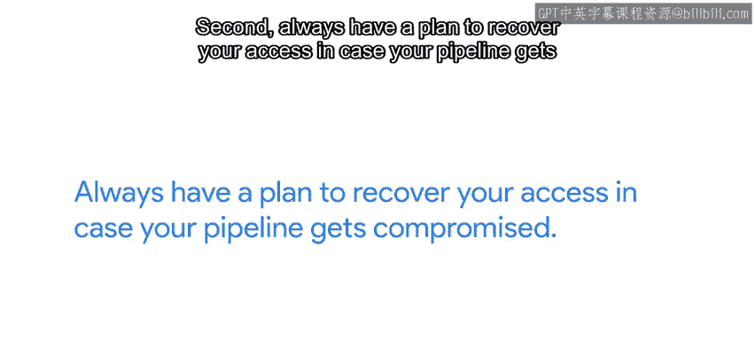

#  054：持续集成与持续部署 🚀

在本节课中，我们将学习如何通过自动化流程来确保代码质量与快速部署。我们将探讨持续集成（CI）和持续部署（CD）的核心概念、工作原理以及如何利用相关工具（如Travis CI）为项目配置自动化流程。

---

## 概述

在软件开发过程中，我们经常修改文件。有时我们会手动运行测试以验证修改后代码是否仍能正常工作，但有时我们会忘记这样做。无论项目规模大小，这种情况都很常见。人类并不擅长记住所有待办事项，因此我们不能依赖任何人（包括我们自己）去记住测试代码。幸运的是，我们无需如此。我们可以编写自动化测试来为我们检查代码，并利用持续集成系统自动运行这些测试。

## 什么是持续集成（CI）？

持续集成系统会在每次代码变更时自动构建和测试我们的代码。这意味着每当代码主分支有新的提交，或通过拉取请求引入变更时，系统都会自动运行。换句话说，如果为项目配置了持续集成，我们就可以使用拉取请求中的代码自动运行测试。这样，我们可以验证新变更合并回代码库后测试是否通过。这意味着我们无需指望协作者记住正确测试代码，而是可以依赖自动化测试系统来完成。

## 从持续集成到持续部署（CD）

一旦代码实现自动构建和测试，下一个自动化步骤就是持续部署，有时也称为持续交付。持续部署意味着新代码会频繁部署。其目标是避免在项目两个版本之间进行包含大量变更的发布，而是每次仅进行少量变更的增量更新。这有助于及早发现并修复错误。典型的配置包括：每当有提交合并到主分支，或每当有分支被标记为发布时，就部署新版本。

## CI/CD工具与平台概览

与CI/CD相关的工具和平台众多，整个系统通常被称为CI/CD。一个流行的选择是Jenkins，它可以用于自动化多种不同类型的项目。一些代码库托管服务（如GitLab）提供了自己的持续集成基础设施。GitHub本身不提供集成解决方案，流行的替代方案是使用Travis CI。Travis CI与GitHub通信，可以访问GitHub项目的信息以确定需要运行哪些集成。

无论使用哪种工具，在创建自己的CI/CD流程时都需要处理一些核心概念。

## 核心概念：流水线与制品

第一个核心概念是流水线。流水线指定了为达到预期结果需要运行的步骤。对于一个简单的Python项目，流水线可能只是运行自动化测试。对于一个用Go编写的Web服务，流水线可能包括：编译程序、运行单元测试和集成测试，最后将代码部署到测试实例。

另一个在CI/CD中出现的概念是制品。这个术语用于描述作为流水线一部分生成的任何文件。这通常包括代码的编译版本，但也可能包括其他生成的文件，如文档的PDF或便于安装的特定操作系统软件包。

此外，您可能希望保留流水线、构建和测试阶段的日志，以便在失败时进行审查。

## 安全注意事项：管理密钥

在设置CI/CD时，我们必须谨慎管理密钥。如果流水线包括将软件新版本部署到测试服务器，我们需要以某种方式让运行流水线的软件能够访问我们的测试服务器。有多种策略可以实现这一点，例如交换SSH密钥或使用特定于应用程序的API令牌。对于某些流水线，使用这些方法之一可能是不可避免的。但请注意，您正在将测试服务的访问权限授予为您运行流水线的服务所有者。这有点像把家门钥匙交给每年检查一次暖气的人。

因此，需要记住两点：
1.  确保测试服务器的授权实体与生产服务器的部署授权实体不同。这样，即使流水线出现任何安全漏洞，您的生产服务器也不会受到影响。
2.  始终制定一个计划，以便在流水线遭到破坏时恢复访问权限。

## 实践：为GitHub项目设置Travis CI

如果您想为GitHub项目设置Travis CI，可以按照以下步骤操作：
1.  使用您的GitHub账户登录Travis CI网站（travis-ci.com）。
2.  启用您希望进行持续集成的项目。
3.  之后，您需要在项目中添加一个用YAML格式编写的配置文件。该文件声明项目使用的语言以及流水线需要执行的步骤。

如果您的项目遵循所用语言的典型配置，这个文件可以非常简单。但如果您想运行一个包含许多阶段和默认步骤之外步骤的复杂流水线，它也可能变得非常复杂。我们在此不深入细节，但接下来的阅读材料中有更多信息。如果您希望对项目进行持续集成和交付，请随时阅读并自行研究。

---

## 总结

本节课我们一起学习了持续集成与持续部署的核心概念。我们了解到，CI系统可以自动构建和测试代码变更，确保质量；而CD则在此基础上实现代码的频繁、自动化部署。我们还探讨了流水线、制品等关键概念，以及设置CI/CD（如使用Travis CI）时的基本步骤和安全注意事项。通过自动化这些流程，团队可以减少人为失误，更快地交付更可靠的软件。