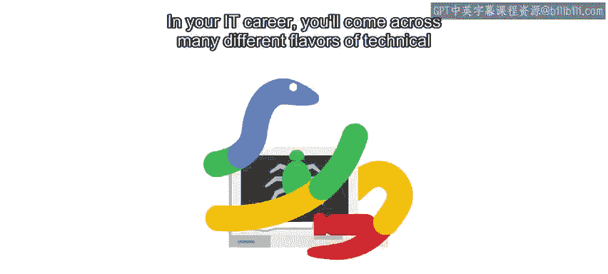

#  058：IT自动化与问题解决 🚀

在本节课中，我们将要学习如何识别和解决IT领域中常见的各类技术问题。无论是程序崩溃、性能瓶颈，还是系统故障，掌握系统化的排查与调试方法都至关重要。我们将从通用策略入手，逐步深入到具体场景的应用，帮助你建立起解决实际问题的能力。

## 问题类型与挑战 🔍

在IT职业生涯中，你会遇到多种多样的技术问题。

有时你需要找出程序未按预期运行的原因。可能是程序意外崩溃，或在应处理信息时卡住。

其他时候，你需要找到方法让脚本运行得更快、占用更少内存或在网络上传输更少数据。

或者，你可能需要找出整个系统未按预期运行的原因及修复方法，即使问题代码并非由你编写。

## 课程内容与方法论 🛠️

在本课程中，我们将探讨一系列解决此类问题的不同策略和方法。

我们将学习一些有助于解决几乎所有技术问题的通用思路，然后看看这些思路如何应用于不同的现实场景。

我们选取的示例包括通用系统问题、他人编写的软件问题以及我们自己编写的程序问题。

我们将讨论可能影响任何操作系统的问题，同时也会研究某些平台特有的问题。

对于脚本问题，我们将重点讨论Python程序，但也会探讨其他语言可能出现的常见问题。

## 讲师介绍与个人分享 👩💻

我叫Themandabels，是谷歌检测与响应运营团队的一名安全系统管理员。在日常工作中，我管理Linux服务器，并特别关注安全领域。我的职责是维护监控内部网络、侦测恶意信号的系统，以确保我们能快速发现恶意行为者。我是团队的技术负责人之一，当我担任这个角色时，我也接手了并非由我自己编写的系统。

这意味着我接管了数千行代码，我必须熟悉它们，以便能够持续添加新功能并维护现有代码。当试图找出问题原因，或更糟的是在处理系统中断时，这可能格外具有挑战性。

## 课程特色与学习环境 💡

如你所知，本课程由谷歌独家设计和开发，每门课程都在不同的园区地点进行，为你带来额外的谷歌特色体验。这是我们的一处谷歌工作空间，当我们需要一起排查问题时可以在这里深入钻研。

关于故障排除和调试，有很多内容需要学习。在本课程中，我们将为你提供解决IT工作中可能遇到的现实问题的工具。我们将讨论的场景基于实际的IT问题。

我们将邀请你与同学分享你自己解决过的其他示例。在本课程中，我们将使用Quicklas，这是一个允许你在运行Linux的虚拟机上测试代码的环境。这将让你体验真实的Linux场景，你需要运用在本课程中学到的技术来理解和解决一些示例问题。

## 学习建议与支持 🤝

请记住，其中一些主题和视频内容较为复杂，第一次可能无法100%理解。这完全正常。如果需要，请慢慢来，并多次重看视频，你会掌握所有内容的。

同时请记住，你可以随时使用讨论论坛与同学联系并提出问题。

## 总结与启程 🎯

本节课中，我们一起了解了IT领域常见的技术问题类型、本课程将采用的方法论、讲师的背景分享，以及课程提供的学习环境和支持。我们明确了学习目标：掌握系统化的排查与调试技能，以应对实际工作中的挑战。

好了，你准备好扩展我们的故障排除和调试能力了吗？太好了，让我们开始吧。