#  060：调试与故障排除 🔍

在本节课中，我们将学习调试与故障排除的核心概念、区别以及在实际工作中如何应用它们。我们将通过定义、工具介绍和一个真实案例，帮助你理解如何系统地分析和解决技术问题。

---

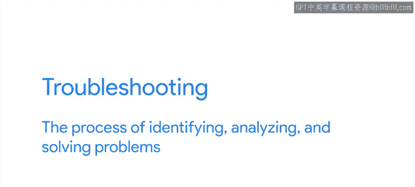

## 概述

调试和故障排除是解决技术问题的两个关键过程。虽然它们有时被混用，但各有侧重。故障排除关注于识别、分析和解决系统层面的问题，而调试则专注于定位和修复应用程序代码中的缺陷。掌握这两者，能帮助我们更高效地应对各种技术挑战。

---

## 故障排除与调试的定义

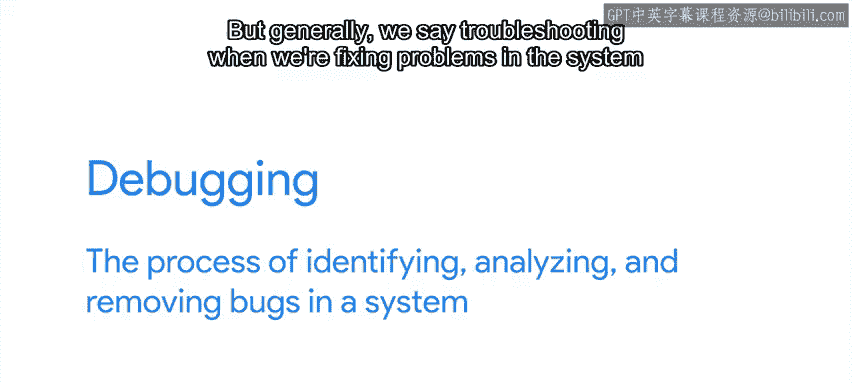

故障排除是指识别、分析和解决问题的过程。这个术语可用于解决任何类型的问题。

在本课程中，我们将专注于解决与IT相关的问题。这些问题可能由硬件、操作系统或计算机上运行的应用程序引起。它们也可能由软件的环境和配置、应用程序交互的服务或一系列其他可能的IT原因导致。

另一方面，调试是指识别、分析和移除系统中缺陷（Bug）的过程。

---

## 两者的区别与联系

我们有时会互换使用“故障排除”和“调试”这两个词，但通常，当我们在修复运行应用程序的系统问题时，我们称之为故障排除。

而当我们在修复应用程序实际代码中的缺陷时，我们称之为调试。

有许多工具可以帮助我们获取更多关于系统及其程序运行状态的信息。

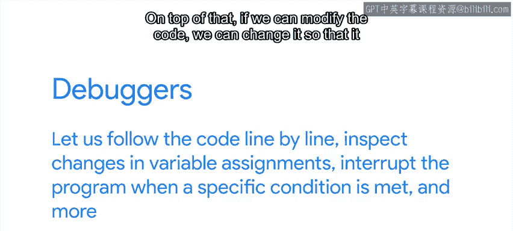

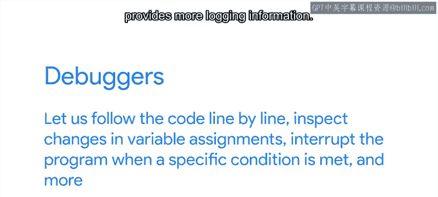

以下是常用工具分类：
*   **网络分析工具**：如 `tcpdump` 和 `Wireshark`，可以显示正在进行的网络连接，并帮助我们分析线缆上的流量。
*   **系统资源监控工具**：如 `ps`、`top` 或 `free`，可以显示系统中使用的资源数量和类型。
*   **程序调用追踪工具**：我们可以使用 `strace` 来查看程序进行的系统调用，或使用 `ltrace` 来查看软件进行的库调用。

不必担心需要记住它们。我们将在实际示例中详细讨论每一个工具。

在调试程序代码时，我们可以将这些工具与为编写应用程序所使用的编程语言开发的特定调试工具结合起来。

调试器让我们能够逐行跟踪代码、检查变量赋值的变化、在满足特定条件时中断程序执行等等。

此外，如果我们能够修改代码，我们可以更改它以提供更多的日志信息。这可以帮助我们理解幕后发生的事情。

故障排除和调试都带有一点艺术性。在那些幸运的情况下，如果你以前见过这个问题，你可能立即知道解决方案是什么。但通常，找出问题及其解决方案需要一些创造力。我们需要想出可能导致故障的新想法以及检查这些想法的方法。一旦我们知道是什么出了问题，我们就需要设想如何解决它。

更进一步，一旦我们解决了问题，我们就可以开始思考如何防止它再次发生。

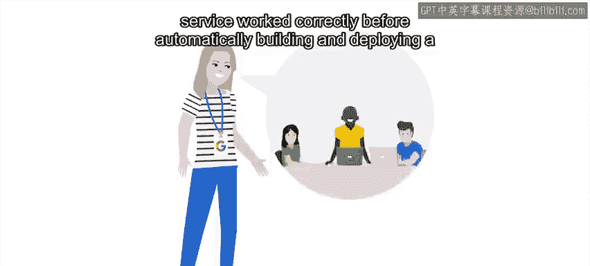

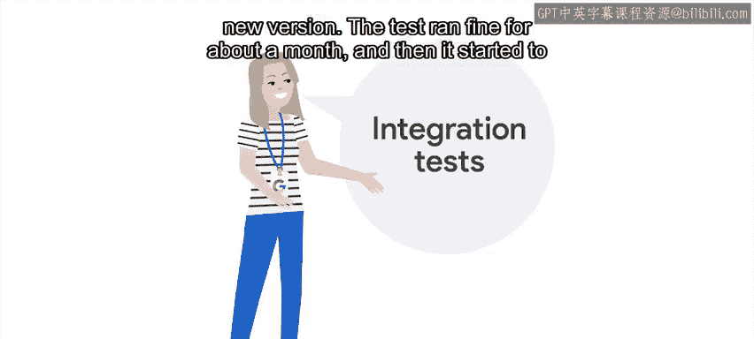

---

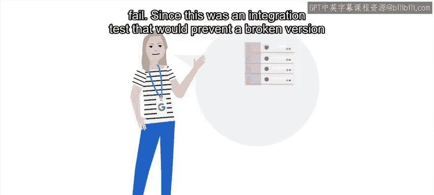

## 一个真实案例：指向生产环境的集成测试

我记得在我的上一个团队中遇到的一次棘手的调试过程。

我们最近在一个流水线中添加了集成测试，以确保在自动构建和部署新版本之前服务能正常工作。

测试顺利运行了大约一个月，然后开始失败。

由于这是一个集成测试，旨在防止有缺陷的版本被发布，我非常惊讶地发现，有缺陷的代码实际上已经运行在生产服务器上了。

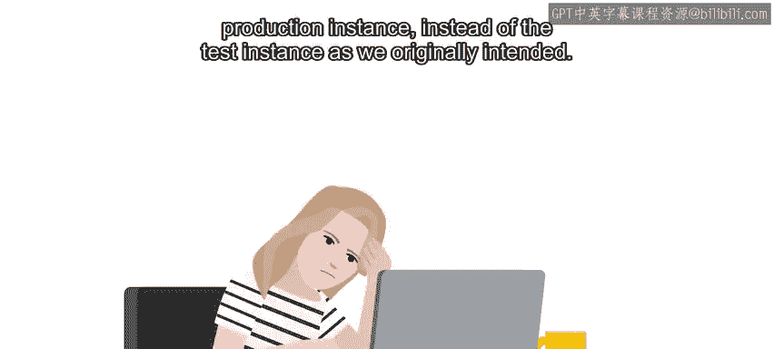

我查看了大量日志，并花了很长时间跟踪代码的执行过程。

最后，我注意到问题在于测试是针对生产实例运行的，而不是我们最初预期的测试实例。换句话说，只要生产实例运行正常，测试就会通过；而当生产实例出现问题时，测试就会失败。

这完全不是我们想要的。为了修复这个问题，我必须弄清楚为什么测试代码没有连接到我们在集成测试内部创建的测试实例。

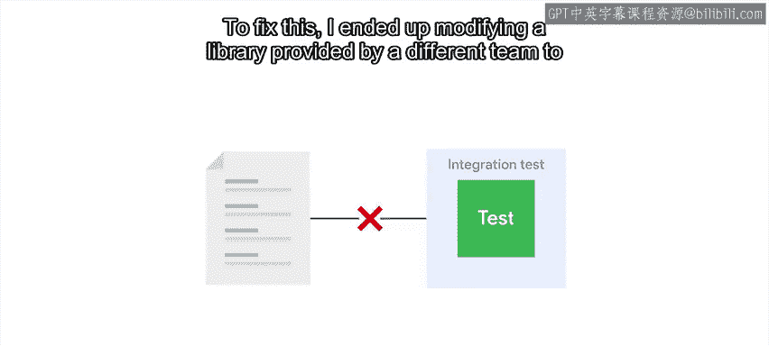

经过更多调查后，我发现测试实例无法启动是因为执行路径不正确。

为了解决这个问题，我最终修改了由另一个团队提供的库，以传递正确的参数。就这样，测试开始针对测试实例中的代码运行，而不再是生产实例。

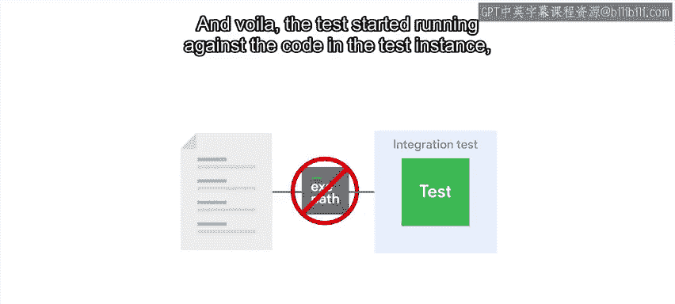

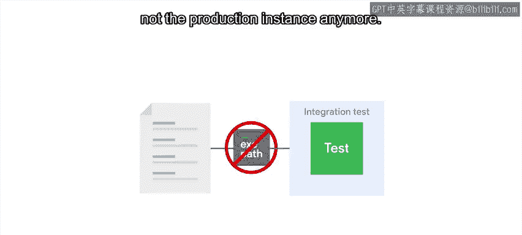

---

## 总结

在故障排除或调试时，我们会遇到各种意外情况。事情没有按预期运行，我们需要理解原因并找出解决方法。

正如我们所指出的，在本课程中，我们将研究一系列不同的技术来理解和解决技术问题。虽然我们有时会关注系统端，有时会关注编码端，但我们所涵盖的大多数技术都可以帮助我们解决任何技术问题。

接下来，我们将讨论解决任何类型技术问题所需采取的步骤。