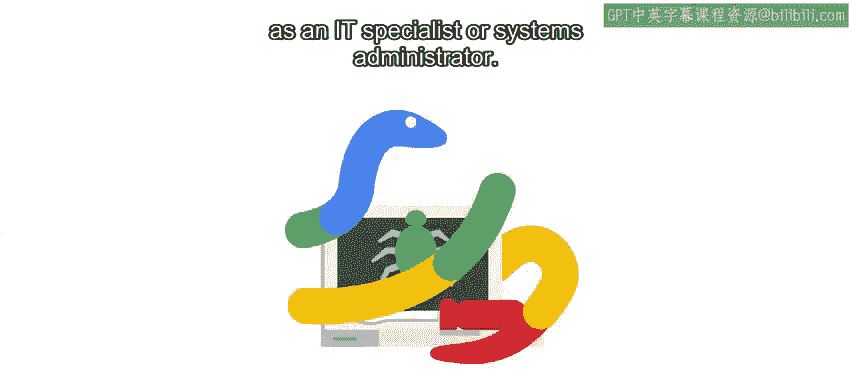
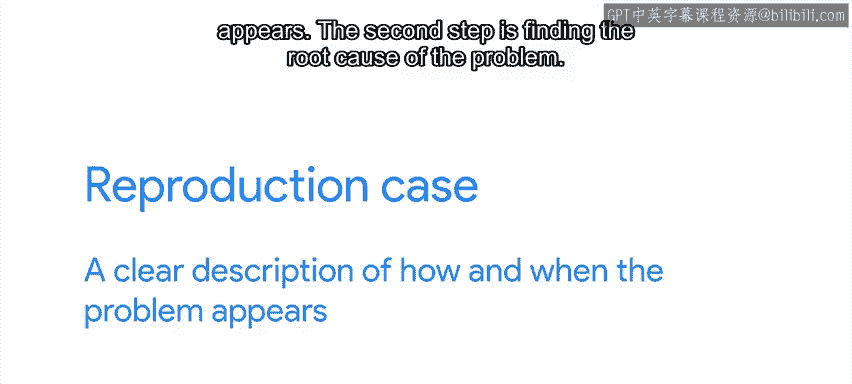
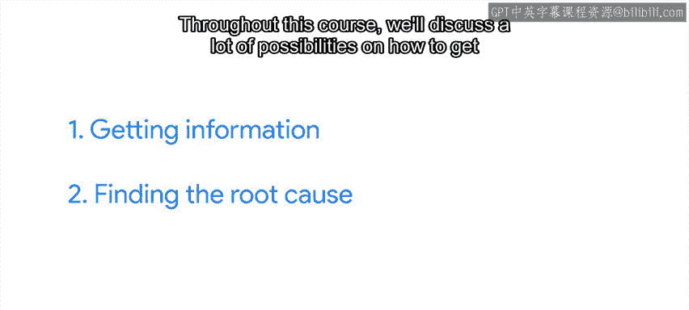
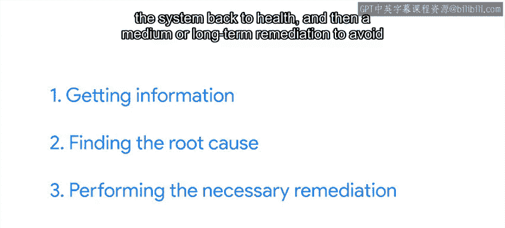

#  061：解决问题的步骤 🛠️

在本节课中，我们将学习一套通用的步骤，用于解决IT领域遇到的各种技术问题。这套方法包括信息收集、根因分析和实施修复，能帮助我们系统性地应对挑战。

---

## 第一步：获取信息 📋

上一节我们介绍了解决问题的整体框架，本节中我们来看看第一步——获取信息。这意味着我们需要尽可能全面地了解问题的当前状态、具体表现、发生时间和影响范围。

以下是获取信息时可以使用的资源：

*   内部文档、操作手册或知识库。
*   系统自带的帮助页面或手册页（man pages）。
*   互联网上的技术问答和论坛。
*   **问题复现步骤**：对问题如何及何时出现的清晰描述，是解决问题的关键资源。

## 第二步：寻找根本原因 🔍

在收集了足够的信息后，下一步是寻找问题的根本原因。这通常是解决问题过程中最具挑战性的一步，本课程后续将深入探讨多种排查方法。

核心在于深入探究问题的本质：是什么触发了问题，以及我们如何改变这一状况。

## 第三步：执行必要的修复 🛡️

找到原因后，最后一步是执行修复。根据问题的性质，修复可能包括以下两部分：

*   **即时修复**：使系统快速恢复正常运行。
*   **中长期修复**：制定方案以防止问题在未来再次发生。

需要指出的是，这三个步骤并非总是严格按顺序进行。在实践中，我们经常需要在步骤间灵活切换。

## 问题解决的动态过程 🔄

虽然我们列出了三个基本步骤，但它们并不总是线性发生的。

例如，在尝试寻找根本原因时，我们可能发现需要更多关于当前状态的信息，于是返回第一步收集更多数据，直到找到答案。

或者，我们可能对问题有初步了解后，先创建一个**临时解决方案**让用户快速恢复工作，但仍需要更多时间来找到根本原因并实施永久性修复。

防止问题再次发生有时看似麻烦，但实际上能为用户和我们自己节省大量宝贵时间，避免反复解决同一个问题。

## 记录的重要性 📝

在整个问题解决过程中，记录我们所做的一切至关重要。

我们应该记下获取的信息、为找出根本原因而尝试的各种测试，以及最终采取的修复步骤。这份文档在下一次类似问题出现时，可能具有不可估量的价值。

## 实践案例：电脑意外关机 💻

让我们通过一个例子来应用这些步骤。假设有用户求助，称其电脑意外自动关机。

电脑不应自行关机，问题可能源于硬件、软件或配置。因此，首先要做的是获取更多信息。

你需要了解以下情况：

*   关机何时发生？
*   发生时用户正在做什么？
*   问题发生的频率如何？

同时，你还需要检查电脑日志，查看是否有任何异常错误。如果遇到不明确的错误信息，可以在互联网上查询其含义。

在本例中，假设你在日志中发现一行记录，显示“超过温度阈值，因此电脑关机”。这很有用，你知道了关机的原因，但还不知道为何会过热，因此需要继续调查。

在日志中没有发现其他线索后，你决定检查是否是硬件问题。打开电脑机箱后，你发现本该为CPU散热的风扇积满了灰尘，导致无法正常转动。

这就是问题的根本原因。

现在，短期修复是清理风扇，使其恢复转动，电脑便不会过热。

但长期修复是什么？在这个案例中，长期修复包括：

*   在电脑上部署监控，确保在过热时能及早收到通知。
*   检查是否可以减少空气中的灰尘量，以降低此类事件再次发生的概率。

---

本节课中，我们一起学习了解决问题的三个核心步骤：**获取信息**、**寻找根因**和**执行修复**。我们了解到这些步骤是动态循环的，并强调了**记录过程**的重要性。最后，通过一个电脑过热的实例，我们看到了如何将这些步骤应用于实际场景。接下来，我们将通过解决一个更实际的例子来测试这些步骤。