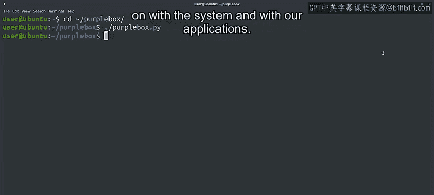

#  062：无声崩溃应用程序的调试 🐛


在本节课中，我们将学习如何诊断一个没有显示任何错误信息就立即退出的“无声崩溃”应用程序。我们将使用系统工具来追踪程序行为，定位问题根源，并实施解决方案。

---



上一节我们介绍了问题报告的基本处理流程。本节中，我们来看看一个具体的案例：一个在启动时无报错却直接崩溃的应用程序。

一位用户联系我们，告知某个应用程序无法打开。
正如之前强调的，第一步是获取更多关于导致故障的条件信息。
我们需要了解用户遇到了什么错误，然后通过询问这些细节来检查我们是否能复现相同的故障。
经过调查，我们发现该软件最近发布了一个新版本。
当我们升级到这个新版本后，我们可以在自己的电脑上复现这个问题。
我们看到，当我们尝试运行该程序时，它完全没有打印任何错误，只是立即退出。
即使没有错误信息，我们也需要弄清楚发生了什么。

---


为了更深入地理解系统和应用程序的运行状况，有一系列工具可以帮助我们。
借助这些工具，我们可以扩展对特定问题的认知，从不同角度查看程序的行为，并获取所需信息。
在这些工具中，**Strace** 让我们能够更深入地查看程序正在做什么。它会追踪程序进行的系统调用，并告诉我们每个调用的结果。
因此，为了弄清楚我们无法打开的程序出了什么问题，我们将对故障应用程序使用 Strace。

以下是使用 Strace 的基本命令格式：
```bash
strace <your_command>
```

哇，输出信息非常多。`strace` 命令显示了程序进行的所有系统调用。
系统调用是运行在我们计算机上的程序向运行中的内核发出的请求。

---

存在大量不同的系统调用，根据我们试图调试的内容，我们可能对其中一些更感兴趣。
如果你想了解这些系统调用是什么，可以在相应的手册页中阅读更多关于每个调用的信息。
但在深入研究之前，让我们先让这个输出更易于管理。
我们可以将输出通过管道传递给 `less` 命令，用它来滚动浏览大量文本。
或者，我们可以使用 `strace` 命令的 `-o` 标志将输出存储到文件中，然后浏览该文件的内容。
`-o` 标志允许我们在需要时稍后查阅该文件，所以让我们选择这个方法。

好的，现在我们可以使用我们偏好的任何程序来读取生成的文件。
让我们用 `less` 打开它，按 `Shift + G` 跳到文件末尾，然后向上滚动查看是否能发现任何可疑之处。
在日志接近结尾的地方，我们可以看到应用程序尝试打开一个名为 `.config/purple_box` 的目录，但这个目录并不存在。

让我们更详细地看一下这一行。
系统调用的名称是 `openat`，这是用于打开文件或目录的调用之一。
调用的内容显示了传递的参数，包括正在打开的路径和一系列标志。
特别是，`O_DIRECTORY` 标志告诉我们程序正试图将此路径作为目录打开。
等号后面的数字向我们显示了此调用的返回码。在本例中，它是 `-1`。
所以程序试图打开这个目录，但结果发现它不存在。
由于这发生在程序结束前不久，它很可能是导致问题的根本原因。


让我们创建这个目录，然后再次尝试启动程序。
```bash
mkdir -p ~/.config/purple_box
```
成功！这次程序正常运行了。

---

让我们回顾一下我们所做的步骤。
首先，我们从用户那里获得了一些信息，告诉我们新版本中的一个变更导致了问题。
为了调查此事，我们在自己的计算机上复现了这个问题。
然后，我们通过使用 **Strace** 工具获得了更多关于正在发生什么的信息，该工具让我们可以看到程序进行的系统调用。
我们发现了一个可疑的错误，指出一个目录不存在。
我们创建了这个目录，以检查当目录存在时会发生什么，结果程序正确运行了。
因此，我们确定了问题的根本原因，即缺失的目录。

现在我们可以着手解决问题。
**立即的补救措施**是告诉用户创建该目录，以便他们能快速恢复工作。
**长期的补救措施**是联系软件开发者，告知他们如果该目录缺失，程序将无法启动。这让他们对问题有所警觉，以便在下一个版本中修复它。

至于**文档**，我们应该注明：如果该目录不存在，此版本的软件将无法启动。
这将帮助其他遇到相同问题的人快速找到解决方案。

在这个例子中，我们能够使用 Strace 快速识别问题所在，但这并不总是这么容易。
在本课程中，我们将继续研究更多工具和思路，以帮助我们在问题不那么明显时弄清楚发生了什么。

---

本节课中我们一起学习了如何调试一个“无声崩溃”的应用程序。我们使用 `strace` 工具追踪系统调用，发现并修复了因缺失目录导致的启动失败问题。这个过程涵盖了从复现问题、深入分析到实施短期和长期解决方案的完整调试流程。记住，清晰的文档记录对于团队协作和未来问题排查至关重要。