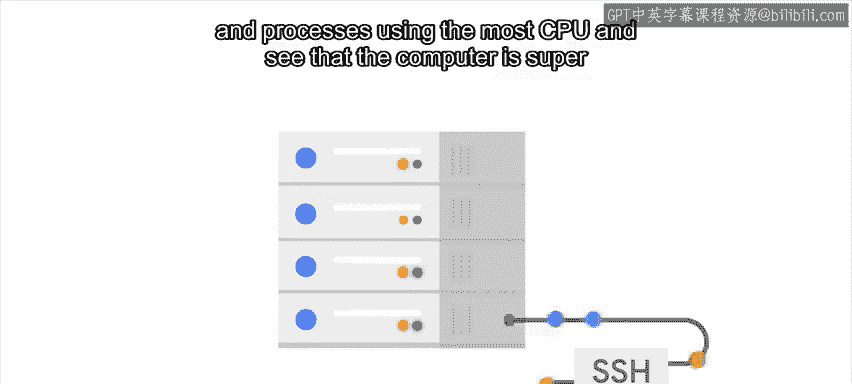
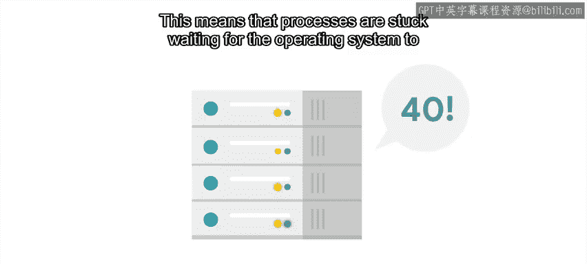
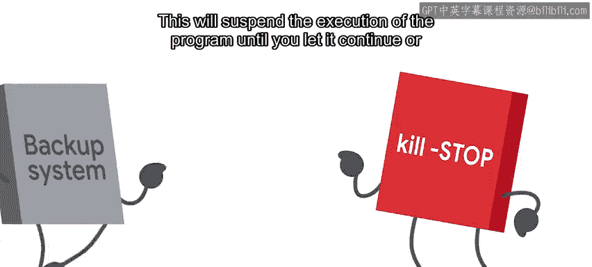
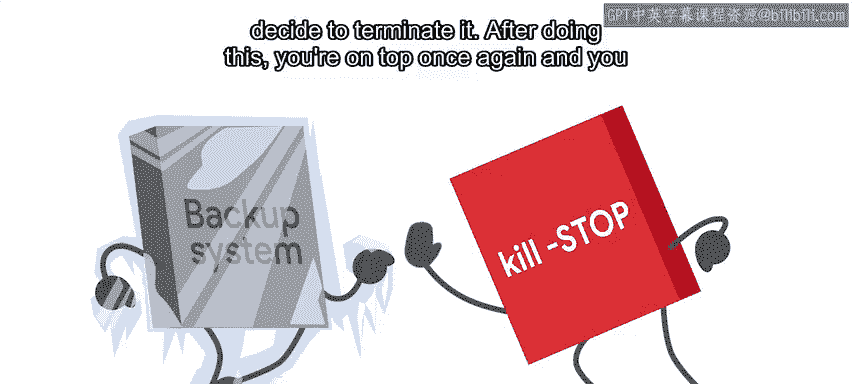

#  063：问题诊断与解决 🐛

在本节课中，我们将学习如何系统地诊断和解决技术问题。我们将从一个简单的“它不工作”报告开始，逐步深入，直到找到问题的根本原因并实施解决方案。

---

## 概述：从“它不工作”开始

正如我们指出的，解决问题的第一步是获取足够的信息，以便理解当前的事态。

为此，我们需要知道我们正在解决的实际问题是什么。

这通常始于我们第一次遇到问题，可能是通过工单系统的报告，也可能是我们在与用户一起工作时自己遇到了问题。

收到仅仅归结为“它不工作”的故障报告是很常见的。

这些报告通常不包含很多有用的信息。

但问题被报告并得到解决仍然很重要。

哪些信息有用可能取决于具体问题。

但对于那些只是报告“某物不工作”的用户，我们可以提出一些常见的问题。

---

## 关键提问：获取有效信息

以下是我们可以向用户提出的几个关键问题：

*   **用户试图做什么？**
*   **他们遵循了哪些步骤？**
*   **预期的结果是什么？**
*   **实际的结果是什么？**

如果贵公司使用的工单系统允许，最好将这些问包含在用户报告问题时必须填写的表格中。

这样，我们可以节省时间，并可以立即开始询问更具体的问题。否则，这些问题几乎总是你首先要问的。

---

## 简化原则：从最简单的解释开始

需要记住的另一件事是，在调试问题时，我们希望首先考虑最简单的解释，并避免跳入复杂或耗时的解决方案，除非我们真的必须这样做。

这就是为什么当设备无法开机时，我们首先检查它是否正确插入电源，以及插座是否有电，然后再将其拆开或更换为新设备。

假设你接到一个用户的电话，告诉你销售团队用于跟踪客户互动的内部网站无法工作。

用户非常紧张，因为他们需要在几分钟内举行的会议上访问网站上的信息。

所以你告诉他们你会立即调查这个问题，但你需要更多信息。

*   **用户试图做什么？** 用户告诉你他们正试图访问网站。
*   **他们遵循了哪些步骤？** 他们告诉你他们打开了网站URL并输入了凭据。
*   **预期的结果是什么？** 他们期望看到销售系统的登录页面。
*   **实际的结果是什么？** 网页只是不停地加载。它永远保持空白。

---

## 问题定义：从模糊到具体

现在，你已经从“它不工作”转变为“当我尝试登录时，页面持续加载，从不显示登录页面”。这很好。

既然你对问题有了基本的了解，是时候开始找出根本原因了。

为此，你将应用一个排除过程，从最简单的解释开始，并测试这些解释，直到你能隔离出根本原因。

---

## 实践排除：逐步缩小范围

例如，你检查是否可以在自己的计算机上重现该问题。

所以你导航到网站，输入你的凭据，果然，页面只是不停地加载，从不显示登录页面。

这个信息足以让你告诉用户你将着手处理并在自己这边进行调查。通过在你的计算机上重现问题，你采取了一个简单而快速的行动，排除了用户或用户计算机是问题原因的可能性。

这使故障排除过程减少了一半，因为你现在知道服务本身存在问题。

在跳转到托管应用程序的服务器之前，你运行一些快速检查，以验证问题是仅限于该特定网站还是更广泛。

你通过访问一个外部网站来检查你的互联网访问是否正常工作，该网站加载正常。

然后你检查其他内部网站，如库存网站或工单系统，是否工作正常。

这样做，你发现虽然工单系统加载没有问题，但库存网站也从未完成加载。

事实证明，这两个网站都托管在同一台服务器上。

---

## 深入调查：检查服务器状态

再次强调，进行这些快速检查以验证互联网工作正常以及哪些站点受问题影响，通过首先查看可能的简单解释，帮助你隔离根本原因，避免浪费时间追逐错误的问题。

此时，你知道运行在特定服务器上的网站无法加载，而其他系统和互联网工作正常。

接下来，你需要检查该服务器上发生了什么。

运行网站的服务器是一台Linux机器，因此你将使用SSH连接到它。

你运行 `top` 命令，该命令显示计算机状态和占用最多CPU的进程，你看到计算机严重超载。第一行中的平均负载显示为 `40`。

Linux上的平均负载显示处理器在给定一分钟内的繁忙程度，`1` 表示它在一整分钟内都处于繁忙状态。

所以通常，这个数字不应高于计算机中的处理器数量。

高于处理器数量的数字意味着计算机超载。

你知道这台计算机有四个核心，所以 `40` 是一个非常高的数字。

你还看到大部分CPU时间都花在等待上。这意味着进程被卡住，等待操作系统从系统调用返回。

当进程从硬盘驱动器或网络收集数据时被卡住时，通常会发生这种情况。通过查看进程列表，你意识到备份系统当前正在服务器上运行，并且它似乎使用了大量的处理时间。

备份系统上的数据非常重要，但目前整个系统无法使用，所以你决定通过调用 `kill -STOP` 来停止备份系统。

这将暂停程序的执行，直到你让它继续或决定终止它。

---

## 实施解决方案与验证

这样做之后，你再次运行 `top`，看到负载正在下降，进程也不再因等待IO而卡住。

然后你尝试登录网站，这次登录页面成功加载。

你通知你的用户他们可以再次使用该网站。

此时，你已经应用了即时补救措施。我们将在后面的视频中讨论长期补救措施。

---

## 重要教训：避免假设

在进入下一个主题之前，想象一下下周，另一个用户打电话告诉你销售网站无法工作。

想起之前的事件，你告诉他们你会立即修复，你通过SSH登录服务器，试图找到备份进程来停止它。但它没有运行。糟糕，你忘了问用户他们说“它不工作”时具体是什么意思。

当你回电询问他们时，他们告诉你他们正试图生成月度销售报告，并收到一个错误，说产品类别列不存在。

完全不同的问题，需要采取完全不同的行动。

所以请记住，在开始解决问题之前，一定要对问题是什么有一个清晰的了解。

---

## 总结

本节课中，我们一起学习了如何从模糊的问题报告入手，通过**关键提问**（做什么、步骤、预期结果、实际结果）来准确定义问题。我们强调了**从最简单的解释开始**进行排除的重要性，并通过一个实例演示了如何**逐步缩小问题范围**，从用户端检查到服务器端，最终使用 `top` 命令和 `kill -STOP` 命令定位并暂时解决了因备份进程导致服务器过载的问题。最后，我们认识到**避免假设、清晰定义问题**是有效诊断的第一步。下一节，我们将讨论什么是**复现案例**以及如何构建它。