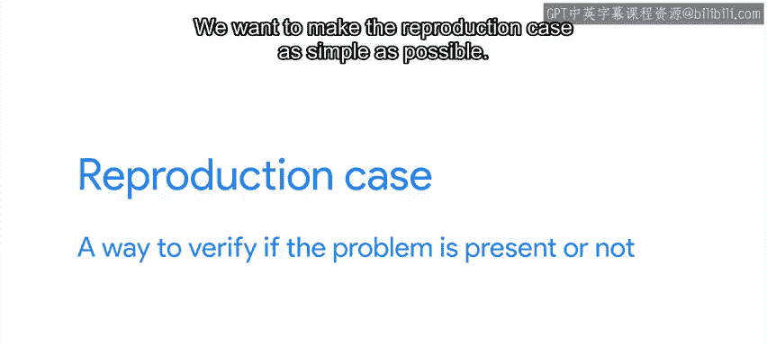
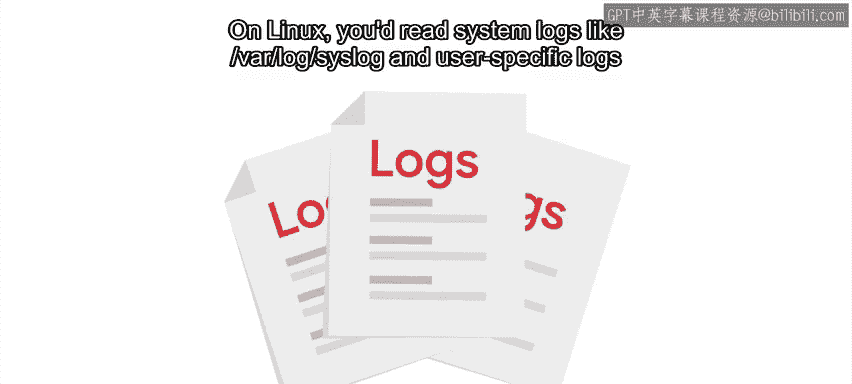
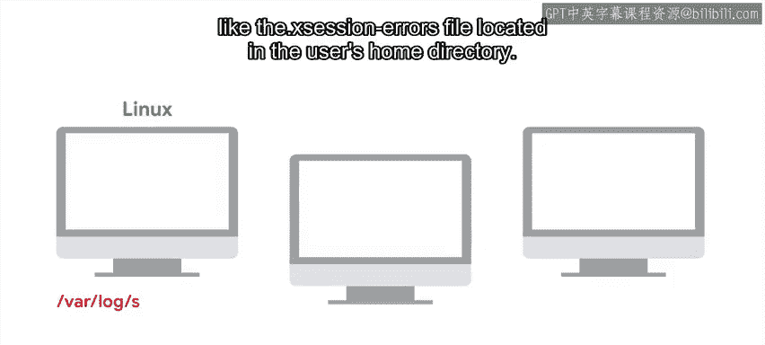
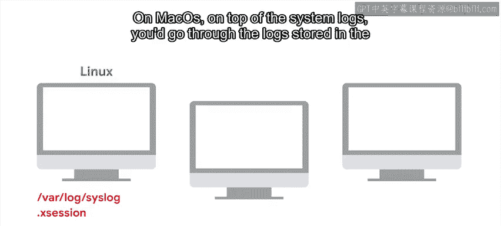
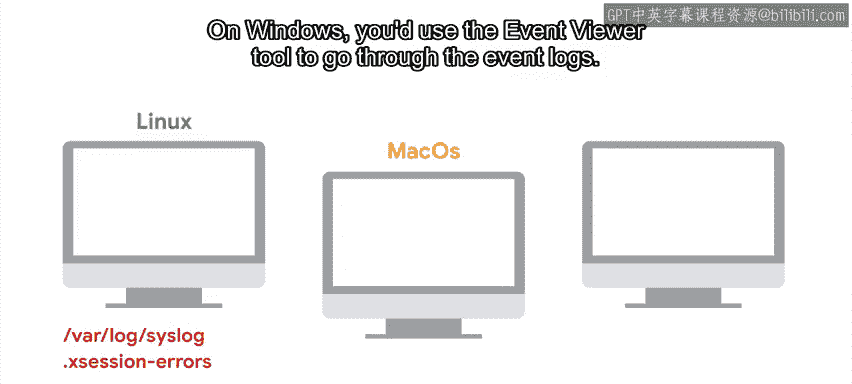
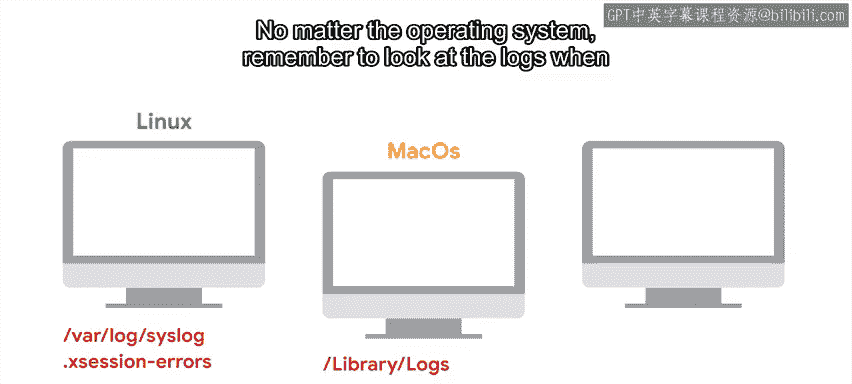

#  064：创建复现案例 🐛

在本节课中，我们将学习如何为难以调试的问题创建一个清晰的**复现案例**。这是诊断和解决问题的关键第一步。

## 什么是复现案例？

当我们处理一个棘手的调试问题时，需要为这个问题准备一个清晰的复现案例。复现案例是一种验证问题是否存在的方法。

我们希望复现案例尽可能简单。这样，我们可以清楚地理解问题何时发生，并且在尝试解决问题时，能非常容易地检查问题是否已被修复。

## 复现案例的复杂性

有时，复现案例非常明显。在我们之前提到的因缺少目录而导致程序启动失败的例子中，复现案例就是在计算机上打开一个没有该目录的程序。在我们提到的服务器过载的例子中，故障的复现案例就是尝试登录网站并看到加载页面。

但有时，发现复现案例可能复杂得多。想象一下，你正在帮助一个用户解决应用程序无法启动的问题。

## 处理复杂情况

这一次，当你在自己的计算机上运行相同版本的应用程序时，应用程序启动正常。因此，你怀疑问题与用户的环境或配置有关。

以下是可能导致此问题发生的一系列原因：
*   网络路由问题。
*   旧的配置文件干扰了新版本的程序。
*   权限问题阻止用户访问某些必需的资源。
*   甚至是一些有故障的硬件在作祟。

那么，你如何找出问题的根源呢？

## 第一步：查阅日志

第一步是查阅你可用的日志。需要查阅哪些日志取决于操作系统和你试图调试的应用程序类型。

以下是不同操作系统的日志位置：
*   **Linux**：你会查阅系统日志，如 `/var/log` 下的日志、`syslog`，以及用户特定的日志，如位于用户主目录下的 `.xsession-errors` 文件。
*   **Mac OS**：除了系统日志，你还需要查阅存储在 `~/Library/Logs` 目录中的日志。
*   **Windows**：你会使用“事件查看器”工具来查阅事件日志。

无论是什么操作系统，请记住，当某些东西行为异常时，要查看日志。很多时候，你会发现一条错误信息，帮助你理解发生了什么，例如“无法连接到服务器”、“无效的文件格式”或“权限被拒绝”。

## 如果没有明确的错误信息怎么办？

但如果你运气不好，没有错误信息，或者错误信息毫无帮助（例如“内部系统错误”），下一步就是尝试**隔离触发问题的条件**。

以下是你可以尝试询问或测试的问题：
*   同一办公室的其他用户是否也遇到此问题？
*   如果同一用户登录到另一台计算机，会发生同样的情况吗？
*   如果移动应用程序的配置目录，问题还会发生吗？

## 构建复现案例

假设是配置目录的问题。你让用户将其移走（而不是删除）。现在应用程序可以正确启动了。于是你让用户将该目录的内容发送给你。你将这些内容复制到自己的计算机上，程序又无法启动了。

**太好了！** 你得到了你的复现案例：**在存在该配置的情况下启动程序**。

拥有一个清晰的复现案例可以让你调查问题，并快速看到什么改变了它。例如：
*   如果将应用程序恢复到以前的版本，问题会消失吗？
*   在使用错误配置和不使用错误配置运行应用程序时，`strace` 日志或 `ltrace` 日志中有什么不同吗？

此外，拥有清晰的复现案例，让你在寻求帮助时可以与他人分享。当然，前提是你不分享任何机密信息。你可以用它来向应用程序开发人员报告错误、向同事寻求帮助，甚至可以在关于该应用程序的互联网论坛上（如果它是公开的）寻求帮助。

## 创建复现案例的原则

因此，在尝试创建复现案例时，我们希望找到能重现问题的操作，并且我们希望这些操作尽可能简单。环境的变化越小，需要遵循的步骤列表越短，就越好。

为了达到这个目的，我们可能需要更深入地挖掘问题，直到我们得到一组足够小的操作指令。一旦你有了复现案例，就可以准备进入下一步：**寻找根本原因**。我们将在下一个视频中讨论这一点。

## 总结

本节课中，我们一起学习了如何为调试问题创建**复现案例**。我们了解到复现案例是验证和隔离问题的关键工具，它应该尽可能简单明了。我们还探讨了如何通过查阅系统日志和逐步隔离环境条件来构建有效的复现案例，为最终找到问题的根本原因打下坚实基础。