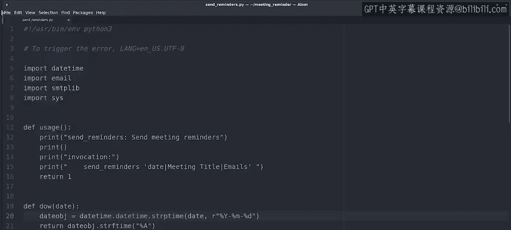

#  067：调试间歇性失败的脚本 🐛

在本节课中，我们将学习如何诊断和修复一个间歇性失败的脚本。我们将通过一个同事开发的会议提醒应用案例，演示从问题复现到根本原因定位，再到最终修复的完整调试流程。

---

## 问题复现

上一节我们介绍了调试的基本思路。本节中，我们来看看如何具体复现一个间歇性问题。

一位同事开发了一个向公司员工发送会议提醒的小应用。上周销售团队首次测试时，应用运行正常。但本周另一名用户尝试发送会议提醒时，程序却不断报错终止。

由于应用开发者在大西洋的另一端，用户请求我们帮助查明原因。首先，我们尝试自己运行程序，看是否能复现问题。

程序窗口允许我们输入会议日期、标题和收件人。用户尝试发送的提醒日期是1月13日，标题是“生产评审”。为了避免测试邮件打扰他人，我们将收件人设为自己。

程序提示“发送邮件失败”，这意味着我们成功复现了问题。

接着，我们尝试发送上周销售团队成功发送的提醒。那次会议的日期是1月7日，标题是“销售全员会议”。同样，我们将其发送给自己以避免打扰。

这次，程序成功发送了提醒。

那么，是哪个参数出了问题，标题还是日期？可能是任何一个。但我猜测是日期。让我们再用1月13日的日期和“销售全员会议”的标题试一次。

再次失败。至此，我们有了一个可复现的案例：尝试发送1月13日的会议提醒会失败，但发送1月7日的相同提醒则正常。

---

## 定位根本原因

现在，下一步是找到问题的根本原因。

为什么我们的应用在1月7日工作正常，却在1月13日失败？可能的原因有很多。但通常，当故障与日期相关时，问题往往出在不同国家的日期格式差异上：有些国家先写月份后写日期，而另一些国家则相反。

为了查明情况，我们需要为程序添加更多调试信息。我们打开名为 `meeting_reminder.sh` 的脚本，这是一个用 Bash 编写的脚本。

我们看到该脚本调用了一个名为 `Zenity` 的程序。Zenity 是显示窗口以选择日期、标题和邮件的应用程序。Zenity 生成的输出存储在一个名为 `meeting_info` 的变量中，然后作为参数传递给 `send_reminders.py` 这个 Python3 脚本，由后者发送邮件。

为了获取更多关于 Zenity 输出的信息，我们希望在调用 Python 脚本之前查看 `meeting_info` 变量的值。让我们添加一个 `echo` 语句来查看它。

保存脚本后再次尝试。这次，我们只使用“测试”作为会议标题，因为我们知道问题出在日期上。

我们看到 Zenity 生成的信息由竖线 `|` 分隔，并且日期的格式是“月-日-年”。这已经是很有价值的信息了。

---

## 获取更详细的错误信息

接下来，我们需要获取更具信息量的错误信息。

为此，我们打开发送提醒的 Python 脚本，看看是否能让它打印出更好的错误信息。文件较长，因此从查看包含程序核心功能的 `main` 函数开始是合理的。

我们看到它将接收到的参数分割成三部分，然后准备要发送的消息，最后发送它。如果一切正常，它会打印“发送成功”的消息。但如果出现任何故障，它会打印我们已经看到的错误信息。

但这个错误信息并不十分有用，因为它隐藏了失败的原因。让我们通过同时打印引发故障的异常来使这个错误更有帮助。

保存并再次尝试。这次我们看到，问题在于我们使用的日期格式将月份放在首位，但程序期望月份在第二位。由于没有第13个月，因此这是一个无效日期。

---

## 修复问题

至此，我们找到了问题的根本原因：程序试图按照一种特定的日期格式来转换日期，但我们使用的是另一种格式。

一旦知道了根本原因，下一步就是修复问题。在这种情况下，我们可以做什么来补救？我们可以更改程序以使用我们的日期格式，但这样应用在其他地区运行时就会崩溃。我们需要做的是确保无论在哪里运行脚本，Zenity 生成的日期格式都与 Python 期望的格式匹配。

幸运的是，Zenity 包含一个参数来指定我们想要的任何格式。因此，我们将更改 Shell 脚本，使用 `--forms-date-format` 参数，并将格式设置为 `%Y-%m-%d`，这是国际标准日期格式。

这样，Zenity 将以国际格式返回日期。

现在我们需要更改 Python 脚本以使用相同的格式。我们找到指定格式的函数，并将其更改为相同的格式。

现在，Zenity 生成的日期格式应该始终与 Python 读取的格式匹配，这个脚本应该在我们国家和其他任何地方都能正常工作。让我们测试一下，看看是否真的修复了。

太好了，我们成功修复了问题。

---

## 总结

本节课中我们一起学习了调试间歇性失败脚本的完整过程。

我们首先自己复现了问题，然后找到了触发问题的输入和未触发问题的输入。接着，我们为脚本添加了更多调试信息，这帮助我们找到了问题的根本原因：Zenity 调用和 Python 脚本使用的日期格式不匹配。最后，我们通过确保两者使用相同的日期格式修复了问题。

接下来，我们将进行另一个测验，以检查我们在最近几个视频中涵盖的概念是否都已理解。