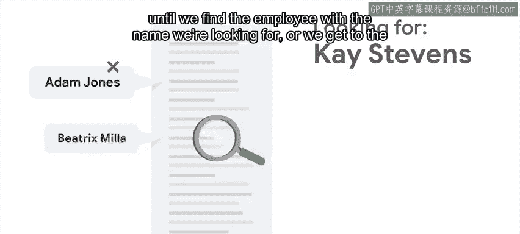
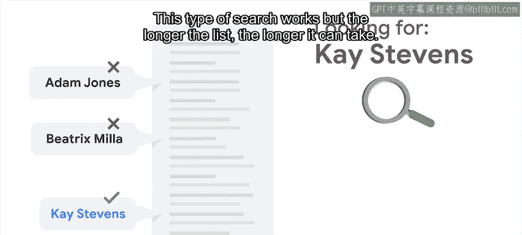
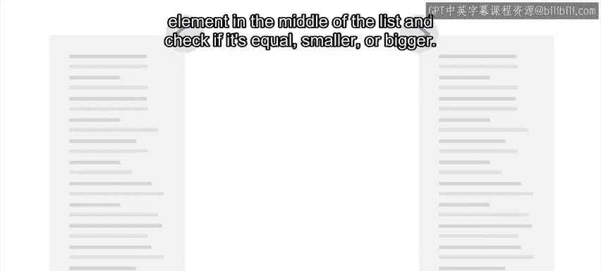
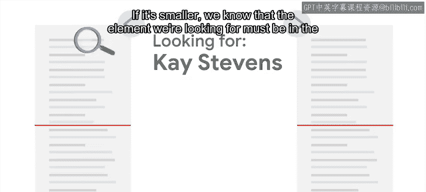
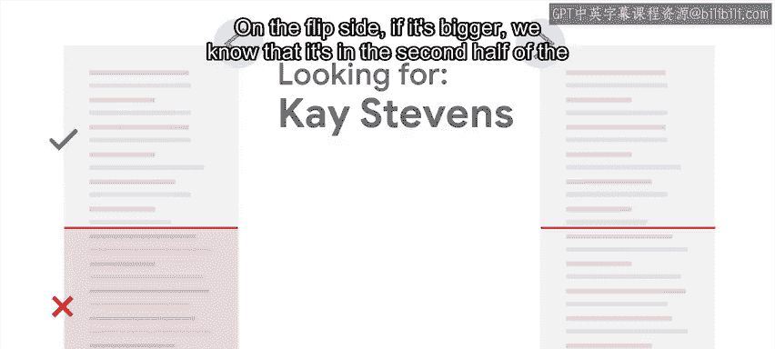
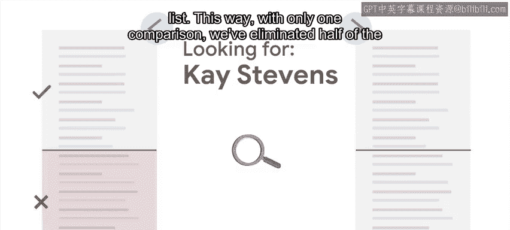
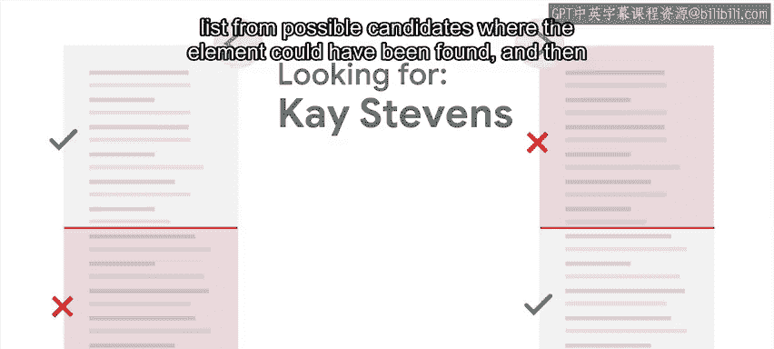
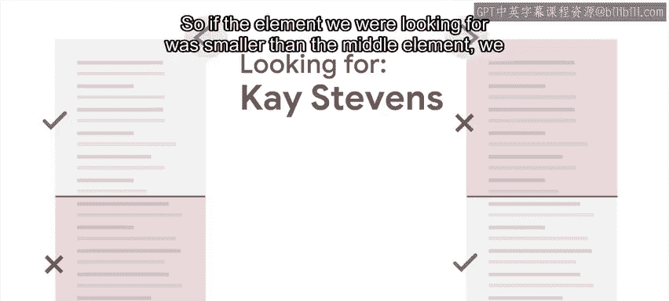
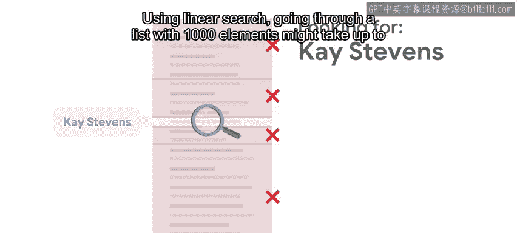

#  068：🔍 什么是二分查找法

在本节课中，我们将要学习两种在列表中查找元素的基本算法：线性查找和二分查找。我们将重点理解二分查找法的工作原理、其效率优势以及适用的前提条件。

通常，在尝试找出问题的根本原因时，我们常常需要从众多可能性中寻找一个答案。在计算领域，在列表中搜索特定元素是一个常见问题。有多种不同的算法可以帮助我们找到目标元素。

例如，假设你有一个包含公司所有员工数据的列表，你需要找到其中一位特定的员工。

## 线性查找法

一种可能的方法是：从列表的第一项开始，检查其姓名是否与我们要找的姓名匹配。

如果不匹配，则移动到第二个元素并再次检查。

如此继续，直到找到目标员工，或者查找到列表末尾。这种方法被称为**线性查找**。

这种查找方法有效，但列表越长，所需时间也可能越长。换句话说，查找所需的时间与列表的长度成正比。

## 二分查找法

如果列表是**已排序**的，我们可以使用另一种名为**二分查找**的搜索算法。因为列表有序，我们可以根据元素在列表中的位置做出决策。

以下是二分查找的核心步骤：

1.  首先，将目标元素与列表中间的元素进行比较，判断其是相等、更小还是更大。
    

2.  如果目标元素更小，我们知道它必定位于列表的前半部分。
    

3.  反之，如果目标元素更大，则它位于列表的后半部分。
    

通过这样一次比较，我们就排除了半数的候选元素。

然后，我们在剩下的半区中重复这个过程：取该半区的中间元素，再次与目标比较，并据此继续缩小搜索范围。

每次我们都处理当前区间的中间元素，直到找到目标元素。

## 效率对比

使用线性查找，在一个包含1000个元素的列表中查找，最多可能需要1000次比较（如果目标元素是最后一个或根本不存在）。

而使用二分查找处理同样的1000元素列表，最坏情况也只需要大约10次比较。这个数字可以通过计算列表长度的以2为底的对数得到，公式表示为：

**比较次数 ≈ log₂(n)**，其中 n 是列表长度。

列表越长，二分查找的效率优势越显著。对于一个包含100,000个元素的列表，二分查找最多需要约17次比较，而线性查找则可能需要100,000次。

## 重要前提与权衡

但请记住，二分查找生效的前提是：**列表必须已排序**。

如果列表未排序，我们需要先对其进行排序，而这本身需要消耗时间。如果我们需要在同一个列表上进行多次查找，先排序再使用二分查找仍然是合算的。但是，如果只是为了查找一个元素而先排序列表，这通常并不划算，因为排序的开销可能超过一次线性查找的成本。在这种情况下，使用更简单的线性查找反而更快。

---

本节课中，我们一起学习了线性查找和二分查找两种算法。我们了解到二分查找通过每次比较排除一半数据，极大地提升了在**已排序列表**中的查找效率，其时间复杂度为 **O(log n)**。同时，我们也明确了选择算法时需要根据数据是否有序以及查找次数进行权衡。在接下来的阅读材料中，你将看到这两种算法在Python中的实现示例。之后，我们将探讨如何将二分查找的原理应用于问题排查。