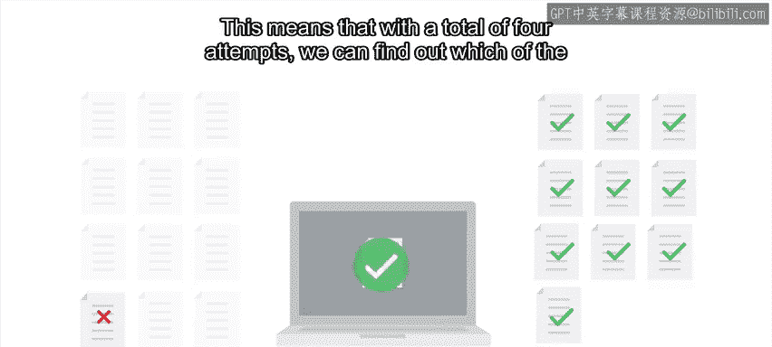
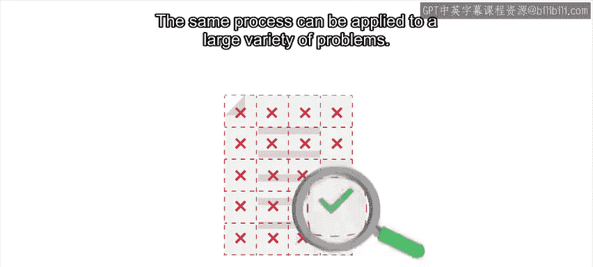

#  069：在故障排查中应用二分查找法 🔍

在本节课中，我们将学习如何将二分查找法的核心思想应用于复杂的故障排查场景。通过将问题空间不断对半分割，我们可以高效地定位导致故障的根本原因，无论是错误的配置文件、有问题的代码提交，还是故障的浏览器扩展。

---

我们之前提到，二分查找算法在**有序列表**中查找元素时非常高效。在故障排查中，当我们需要测试一长串可能的假设时，就可以应用这一思想。此时，列表中的元素包含了所有可能导致问题的原因。我们通过不断将问题范围减半，直到只剩下一个选项。

这个元素列表可以是文件中的条目、已启用的扩展程序、连接到服务器的设备，甚至是导致故障版本出错的代码行。每一次迭代，问题规模都被削减一半。这种方法有时被称为**二分法**，即分成两部分。

在之前的视频中，我们举过一个例子：当旧的配置目录存在时，程序的新版本无法启动。

---

如果该目录中包含许多不同的文件，我们可以通过二分文件列表来找出导致故障的那一个。

假设旧目录包含12个不同的配置文件。我们想找出这12个文件中是哪一个导致了故障。

以下是具体步骤：

1.  我们创建目录的一个副本，但只放入12个文件中的6个，然后尝试再次启动程序。
2.  如果程序崩溃，则问题文件在这6个之中。如果程序没有崩溃，则问题文件在另外6个之中。
3.  在下一步中，我们从有问题的6个文件组中选出3个进行测试。
4.  如果程序再次崩溃，则问题文件在这3个之中；如果没有，则在另外3个之中。

对于最后剩下的3个文件，我们可以先同时检查两个，或者逐个检查。无论哪种方式，最多只需要两次检查就能定位到故障文件。

这意味着，总共只需**4次尝试**，我们就能从12个文件中找出导致问题的那个。由于IT系统中的问题有时复杂且相互关联，在宣布胜利之前，我们还需要进行验证：确认当该单个文件存在时程序会崩溃，而当其不存在时程序运行正常。

一旦确认，我们就将问题的复现条件从一个完整的目录缩小到了单个文件，这大大简化了理解和分析问题的过程。

---

之后，我们可以对那个单个文件的内容采用同样的方法，反复将其对半分割，直到找到文件中导致问题的具体部分。

同样的流程可以应用于各种各样的问题。例如，这种方法常用于找出导致浏览器崩溃的浏览器扩展：禁用一半扩展，检查浏览器在该子集下是否崩溃，如此反复，直到找到有问题的扩展。

我们也可以使用这种技术来发现桌面环境中哪个插件导致计算机内存耗尽，或者数据库中哪个条目导致程序引发异常。

在尝试查找最近版本中引入的Bug时，我们也可以将此方法应用于代码。如果我们知道从一个版本到下一个版本之间所做的更改列表，我们可以不断将该列表对半分割，直到找到导致故障的那一项。

当使用Git进行版本控制时，我们可以使用一个名为 `git bisect` 的命令。`bisect` 接收Git历史中的两个时间点，并反复让我们尝试它们中间点的代码，直到找到导致故障的提交。

这甚至不需要是你自己的Git仓库。如果你使用的开源软件使用Git进行跟踪，你也可以使用 `git bisect` 命令来找出是哪个提交导致该软件在你的计算机上停止工作。

例如，如果Linux内核的最新版本导致你计算机上的声卡停止工作，你可以使用 `git bisect` 来找到破坏它的提交，并将其作为需要修复的Bug进行报告。

---

正如我们在讨论二分查找时指出的，需要检查的项目列表越长，通过每次迭代将问题对半分割所获得的效率提升就越大。如果只有5个选项需要检查，我们可以简单地逐个尝试，这不会有太大区别，而且可能更容易跟踪我们的尝试过程。

但是，如果是100个选项，我们肯定希望使用二分法来定位问题，这样我们可以在大约7步内找到答案，而不是100步。

当我们需要测试一系列不同的选项以找出导致故障的那一个时，我们希望有一种快速简便的方法来进行检查。即使我们通过二分法减少了尝试次数，我们也不希望每次检查都花费很长时间。有时这很直接，程序要么启动要么失败。但其他时候，可能需要一系列手动步骤来检查我们想要检查的内容。

因此，根据我们试图查找的问题类型，花一些时间创建一个用于检查该问题的脚本可能是值得的。接下来，我们将在一个实际例子中看到这一点。

---

本节课中，我们一起学习了如何将二分查找的逻辑应用于故障排查。核心在于将可能的故障原因列表视为一个有序集合，并通过不断测试中间点来高效缩小范围，最终精确定位问题根源。无论是处理文件、扩展程序、代码提交还是其他复杂系统，掌握这一方法都能显著提升我们解决复杂问题的效率。