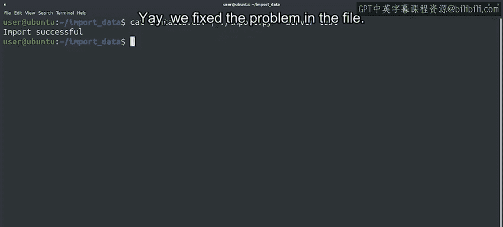

#  070：使用二分法定位无效数据 🔍


在本节课中，我们将学习如何运用二分法，快速定位并修复数据文件中的错误。我们将通过一个具体的例子，演示如何从100行的CSV文件中，高效地找到导致导入失败的那一行无效数据。

## 概述：二分法排查问题

上一节我们介绍了通过将问题一分为二来快速定位故障原因的思路。本节中，我们来看看如何将这个理论应用于实际的数据处理任务。

我们有一个程序，其功能是读取CSV文件，处理数据，然后将其导入数据库。一位系统用户报告，他尝试导入的文件失败，并返回了一个含义模糊的“导入错误”。用户已将问题文件发送给我们。

## 第一步：在测试环境中复现问题

在运行任何命令之前，需要牢记：不应在生产环境中进行测试。由于此脚本会尝试向数据库导入数据，我们应该针对测试数据库运行它，而不是生产数据库。

以下是使用测试数据库运行导入命令的方法：
```bash
cat context.csv | import.py --server test
```
我们看到文件导入失败，但错误信息并未明确指出失败原因。

## 第二步：评估问题规模

我们需要知道这个文件有多大。无需用编辑器打开查看，使用 `wc` 命令即可统计文件的行数。
```bash
wc -l context.csv
```
输出显示文件有100行。手动逐行检查以找出问题非常耗时，尤其是我们根本不知道问题出在哪里。

## 第三步：应用二分法定位错误

我们可以尝试只将文件的一半传递给脚本，检查是否成功。如果失败，则问题就在这一半中；如果成功，则问题在另一半。然后对有问题的那一半再次进行二分，如此反复。

我们可以利用 `head` 和 `tail` 命令来获取文件的前半部分或后半部分，并通过管道将其传递给导入脚本。

以下是相关命令的用法：
*   `head -n 50 context.csv`：输出文件的前50行。
*   `tail -n 50 context.csv`：输出文件的后50行。

由于我们的导入命令从标准输入读取，因此可以使用管道连接：
```bash
head -n 50 context.csv | import.py --server test
```
测试发现前半部分文件导入失败。接下来，我们对这失败的50行再次进行二分检查。

## 第四步：逐步缩小范围

通过持续地将失败的数据块一分为二，我们逐步缩小了可疑范围。以下是排查过程的一个示例步骤：
```bash
head -n 25 context.csv | import.py --server test
```
经过几次二分，我们将范围缩小到仅剩6行数据，并且知道其中一行是坏的。再次二分后，我们得到了最后3行需要检查的数据。

## 第五步：检查并修复数据

现在，让我们查看这最后三行数据：
```
...
John, A, Smith, 25000
Jane, B, Doe, 30000
Robert, C, Johnson, 42000, 1000
```
你能发现问题吗？这是一个逗号分隔值文件，这意味着每个逗号都是字段之间的分隔符。如果一个字段内包含逗号，该字段应该用引号括起来。

在第三行中，“42000, 1000”之间有一个逗号，但整个字段没有被引号包围。这导致导入脚本困惑，因为该行的字段数量超出了预期。

找到问题后，我们编辑文件，为包含逗号的字段加上引号（例如，改为 `"42000, 1000"`），然后重新运行导入命令。这次，导入成功了！



## 总结与后续措施

本节课中，我们一起学习了如何利用二分法，从100行数据中快速定位到包含损坏数据的那一行，并成功修复了它。

*   **短期措施**：告知用户我们发现的问题及修复方法，以便他们能将数据成功导入生产数据库。
*   **长期措施**：调查文件最初为何会生成无效字段，并确保此类问题不再发生。

通过这种方法，我们能够系统、高效地解决复杂数据文件中的错误，而不是进行盲目、耗时的手动检查。