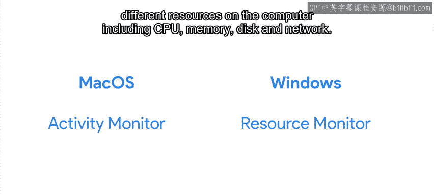
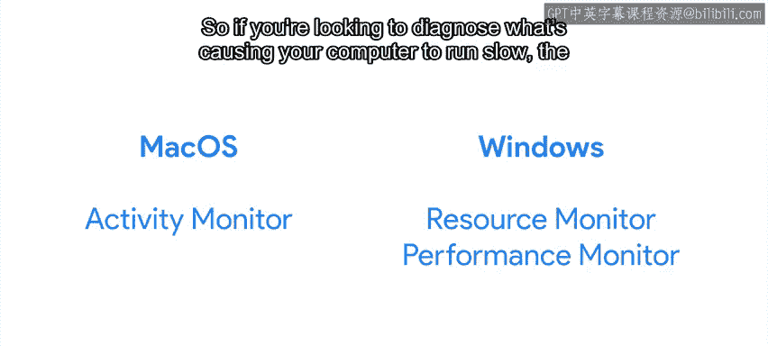
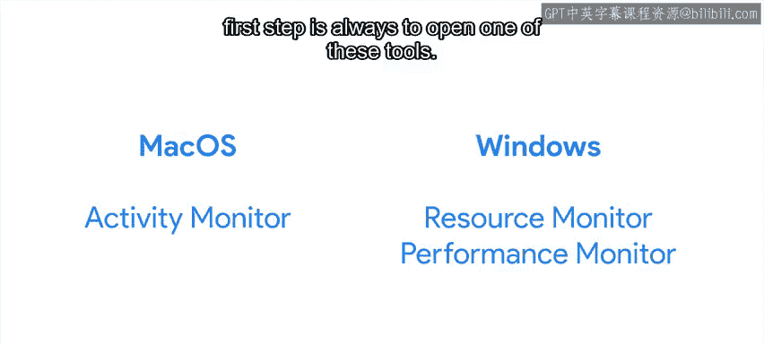

#  073：为什么我的计算机运行缓慢？🐢

在本节课中，我们将探讨计算机运行缓慢的常见原因，并学习如何诊断和解决性能瓶颈问题。我们将了解计算机如何同时处理多个任务，以及当资源不足时，系统性能如何受到影响。

---

我们的计算机每秒执行数十亿条指令。每条指令完成一件小事，例如增加一个值、比较两个值或将一个值从一个地方移动到另一个地方。尽管如此，凭借每秒数十亿条指令，计算机在一秒钟内也能完成大量工作。

这使得我们的计算机似乎能够同时执行许多不同的事情。例如，你可以在浏览网页的同时，运行一个在后台播放你最喜欢的音乐的程序。即使你的计算机只有一个核心来执行这些应用程序，看起来也像是计算机在同时运行这两个程序。

那么，这背后是如何实现的呢？

## 多任务处理的原理

上一节我们提到了计算机强大的处理能力。本节中我们来看看，当运行多个程序时，计算机内部是如何工作的。

实际上，每个应用程序都获得一小部分CPU时间，然后轮到下一个应用程序。这种快速切换使得所有程序看起来都在同时运行。

大多数情况下，这种机制运行良好。但是，如果我们运行了太多应用程序，或者某个正在运行的应用程序需要的CPU时间超过了它获得的那一小部分，事情就可能变得异常缓慢。

## 识别性能瓶颈

既然我们了解了多任务处理的原理，那么当计算机变慢时，我们该如何应对呢？以下是解决速度缓慢问题的通用策略。

解决速度缓慢问题的通用策略是，识别导致我们的设备、脚本或系统运行缓慢的瓶颈。这个瓶颈可能是我们刚刚提到的CPU时间，也可能是从磁盘读取数据、等待网络传输数据、将数据从磁盘移动到RAM所花费的时间，或者是其他一些限制整体性能的资源。

通常，我们可以通过关闭同一台计算机上任何其他正在使用资源的程序来加快速度。

*   **如果问题是你的程序需要更多CPU时间**：你可以关闭当时不需要的其他正在运行的程序。
*   **如果问题是磁盘空间不足**：你可以卸载不使用的应用程序，或者删除、移动不需要保留在该磁盘上的数据。
*   **如果问题是应用程序需要更多网络带宽**：你可以尝试停止任何其他也在使用网络的进程，依此类推。

这种方法仅在问题源于太多进程试图使用同一资源时有效。如果我们已经关闭了所有不需要的程序，但计算机仍然很慢，我们就需要寻找其他可能的原因。

## 硬件限制与监控

如果关闭多余程序后问题依旧，那么问题可能出在哪里呢？本节我们来看看硬件本身是否已成为瓶颈。

如果我们正在使用的硬件根本不足以运行我们试图在其上运行的应用程序，那么在这些情况下，我们将不得不升级底层硬件。但为了真正提升性能，我们需要确保我们实际上是在改进瓶颈，而不是把钱浪费在不会被使用的新硬件上。

那么，我们如何判断需要更换哪一块硬件呢？

我们需要监控资源的使用情况，以了解哪一种资源正在被耗尽。这意味着该资源已被完全使用，程序因无法获得更多资源而被阻塞。是CPU、内存、磁盘I/O、网络连接还是显卡？

为了找出答案，我们将使用操作系统中的可用工具来监控每种资源的使用情况，然后找出哪个资源正在阻止我们的程序运行得更快。

我们已经讨论过在Linux系统上使用 `top` 工具。这个工具让我们可以看到当前哪些正在运行的进程占用了最多的CPU时间，如果按内存排序，可以看到哪些进程占用了最多的内存。它还显示了许多与计算机当前状态相关的负载信息，例如有多少进程正在运行，以及CPU时间或内存是如何被使用的。

在之前的视频中，我们还提到了其他几个程序，如 `iotop` 和 `iftop`，它们可以帮助我们查看当前哪些进程占用了最多的磁盘I/O或网络带宽。

在Mac OS上，系统自带一个名为“活动监视器”的工具，它让我们可以看到是什么占用了最多的CPU、内存、能源、磁盘或网络。

在Windows上，有几个名为“资源监视器”和“性能监视器”的系统工具，它们也让我们可以分析计算机上不同资源（包括CPU、内存、磁盘和网络）的使用情况。

因此，如果你想诊断是什么导致你的计算机运行缓慢，第一步总是打开这些工具之一，查看正在发生的情况，并尝试理解哪个资源是瓶颈以及原因，然后规划如何解决问题。

## 软件层面的优化

当然，并非所有的性能问题都能通过关闭应用程序或获得更好的硬件来解决。有时，我们需要弄清楚软件做错了什么，以及它把大部分时间花在哪里，以便理解如何让它运行得更快。

我们需要深入研究每个问题，以找到速度缓慢的根本原因。

---

在本节课中，我们一起学习了计算机运行缓慢的常见原因。我们了解了多任务处理的基本原理，学习了如何通过监控工具（如 `top`、活动监视器、资源监视器等）来识别CPU、内存、磁盘I/O或网络带宽等资源瓶颈。我们还讨论了通过关闭不必要的程序或升级硬件来解决瓶颈问题，并认识到有时需要深入分析软件本身来优化性能。下一节，我们将讨论一些帮助我们更好地理解底层运行情况的方法。