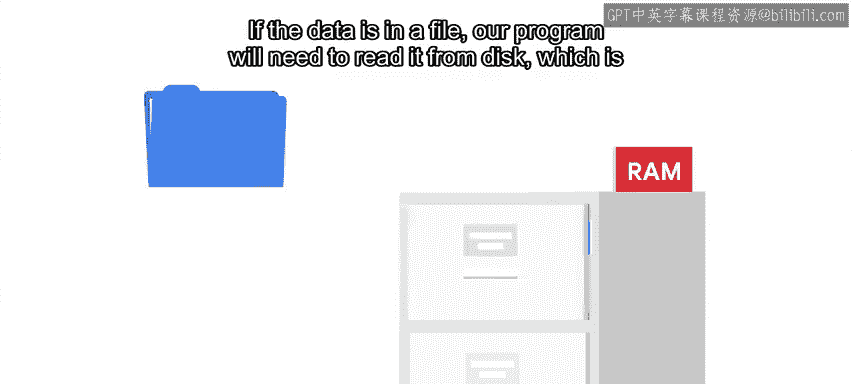
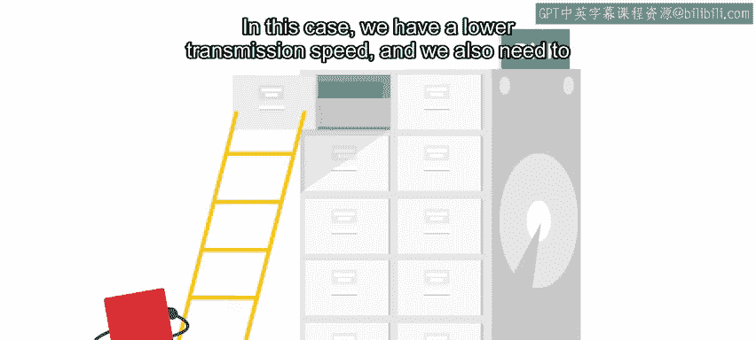

#  074：计算机如何使用资源 💻

在本节课中，我们将学习计算机如何管理其核心资源，如CPU、磁盘、内存和网络。我们将探讨这些资源如何相互作用，以及它们的速度差异如何影响系统性能。理解这些概念是优化计算机性能、消除瓶颈的关键。

---

在上一节视频中，我们指出了计算机如何受到不同资源（如CPU、磁盘、内存或网络）的限制。我们讨论了需要如何消除瓶颈，让计算机更好地利用其资源，从而提升系统性能。要做到这一点，我们需要理解每个组件如何与其他组件交互，以及各自的限制是什么。

具体来说，在考虑如何让事情运行得更快时，理解各个部件的不同速度至关重要。当一个应用程序访问某些数据时，检索这些数据所花费的时间将取决于数据所在的位置。

*   如果数据是当前正在函数中使用的变量，那么它将位于CPU的内部存储器中，我们的程序可以非常快速地检索到它。
*   如果数据与一个正在运行的程序相关，但可能不是当前正在执行的函数，那么它很可能在RAM（内存）中，我们的程序访问它仍然相当快。
*   如果数据在文件中，我们的程序需要从磁盘读取，这比从RAM读取要慢得多。
*   比从磁盘读取更糟的是从网络读取信息。在这种情况下，传输速度较低，并且我们还需要建立到另一端的连接才能使传输成为可能，这增加了获取数据所需的总时间。

因此，如果你有一个需要反复从网络读取数据的进程，你可能需要想办法看是否能只读取一次，将其存储在磁盘上，然后后续从磁盘读取。

类似地，如果你反复从磁盘读取文件，你可以看看是否可以将相同的信息直接放入进程内存中，避免每次都从磁盘加载。换句话说，你需要考虑是否可以创建一个**缓存**。

**缓存**以比原始形式更快的访问速度存储数据。在IT领域有大量的缓存示例。网络代理就是一种缓存形式，它存储代理后用户经常访问的网站、图片或视频，这样就不需要每次都从互联网下载。DNS服务通常为其解析的网站实现本地缓存，这样就不需要在每次有人询问其IP地址时都从互联网查询。

操作系统也为我们处理一些缓存工作。它试图在RAM中保留尽可能多的信息，以便我们可以快速访问。这包括经常被访问的文件或库的内容，即使它们当前并未被使用。我们说这些内容被**缓存在内存中**。

我们提到过，如果数据是当前正在运行的程序的一部分，它将在RAM中。但RAM是有限的。如果你同时运行足够多的程序，就会填满RAM并耗尽空间。

当RAM耗尽时会发生什么？首先，操作系统会从RAM中移除任何被缓存但并非严格必要的内容。如果在此之后仍然没有足够的RAM，操作系统会将当前未使用的内存部分放到硬盘上一个称为**交换空间**的区域。

从磁盘读写比从RAM读写要慢得多。因此，当应用程序请求被换出的内存时，将其加载回来需要一段时间。不同操作系统的交换实现方式各不相同，但概念始终相同：当前不需要的信息从RAM中移除并放到磁盘上，而当前需要的信息则放入RAM。

这是正常操作，大多数时候我们不会注意到它。但是，如果可用内存显著少于正在运行的应用程序所需，操作系统将不得不持续换出当前未使用的数据，以便将当前正在使用的数据移入RAM。

正如我们指出的，计算机可以在应用程序之间非常快速地切换，这意味着当前正在使用的数据也可能变化得非常快。

计算机将开始花费大量时间向磁盘写入以在RAM中腾出空间，然后又从磁盘读取以将其他内容放入RAM。这可能非常缓慢。

那么，如果你发现你的机器因为花费大量时间进行交换而变慢，你该怎么办？基本上有三个可能的原因，我们已经讨论了其中两个：

1.  如果打开的应用程序太多，并且有些可以关闭，请关闭那些不需要的应用程序。
2.  如果可用内存对于计算机的使用量来说太小，请为计算机添加更多RAM。
3.  第三个原因是，某个正在运行的程序可能存在**内存泄漏**，导致它占用了所有可用内存。内存泄漏意味着不再需要的内存没有被释放。

我们将在课程后面详细讨论内存泄漏。现在，我们只需说，如果一个程序使用了大量内存，并且在我们重启该程序后这种情况停止，那很可能是因为内存泄漏。

接下来，我们将讨论更多导致计算机运行缓慢的不同原因，以及我们可以采取哪些措施来修复它们。

---

在本节课中，我们一起学习了计算机资源（CPU、内存、磁盘、网络）的层次结构及其访问速度的差异。我们了解了缓存的概念及其如何通过将数据存储在更快的介质中来提升性能。我们还探讨了当物理内存（RAM）不足时，操作系统如何使用交换空间来管理内存，以及这可能导致性能下降。最后，我们简要介绍了内存泄漏的概念及其对系统的影响。理解这些基本原理是诊断和解决系统性能问题的重要第一步。