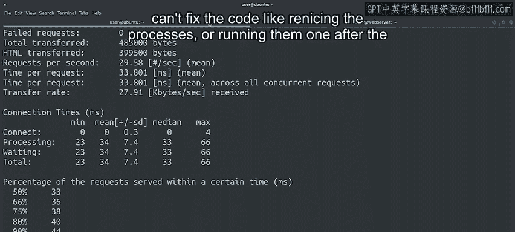

#  076：诊断与修复网站服务器运行缓慢问题 🐌


在本节课中，我们将学习如何诊断和修复一个运行缓慢的网站服务器。我们将从一个用户报告出发，使用工具量化问题，分析系统资源，并最终通过调整进程优先级和优化任务执行顺序来解决问题。

---


## 概述


用户报告我们公司的一台网站服务器响应缓慢，我们需要找出原因并解决它。


---

## 第一步：确认问题

首先，我们导航到网站并加载页面以确认问题。


页面可以加载，但速度似乎有些慢。然而，仅凭主观感受难以准确衡量。

---

## 第二步：使用工具量化性能

为了准确测量网站速度，我们使用一个名为 `AB`（Apache Benchmark）的工具。这个工具可以发送大量请求并汇总结果，帮助我们判断网站性能是否符合预期。

我们将运行以下命令，对网站 `example.com` 发起500次请求以获取平均响应时间：

```bash
ab -n 500 http://example.com/
```

这个命令会发起500次请求。`ab` 工具还有很多其他选项，例如可以设置并发请求数或超时时间。我们选择500次请求是为了获得一个可靠的平均时间。

测试完成后，我们可以查看数据来判断服务器是否真的缓慢。

测试结果显示，每个请求的平均时间为155毫秒。虽然这不是一个巨大的数字，但对于一个简单的网站来说，这显然超出了预期。这表明网络服务器确实存在问题，需要进一步调查。

---

## 第三步：连接到服务器并检查系统状态

现在，我们连接到网络服务器，查看系统内部情况。

我们首先使用 `top` 命令查看是否有可疑进程。

```bash
top
```

在 `top` 的输出中，我们看到许多 `FFmpeg` 进程正在运行，并且几乎占用了所有可用的CPU资源。系统负载平均值显示为30，这绝对不正常。

在Linux系统中，负载平均值表示在一分钟内处理器繁忙的程度。数值1表示处理器在整个一分钟内都处于繁忙状态。这台计算机有两个处理器，因此任何高于2的数值都意味着系统过载。在每分钟内，等待处理器时间的进程数量超过了处理器能够处理的数量。

`FFmpeg` 程序用于视频转码，即将文件从一种视频格式转换为另一种。这是一个CPU密集型进程，很可能是导致我们服务器过载的元凶。

---

## 第四步：尝试调整进程优先级

既然找到了可能的元凶，我们可以尝试调整这些进程的优先级，让Web服务器获得更高的处理权。

在Linux中，进程优先级数值越低，优先级越高。通常的优先级范围是0到19。默认情况下，进程以优先级0启动，但我们可以使用 `nice` 和 `renice` 命令来改变它。`nice` 用于以不同优先级启动新进程，`renice` 用于更改已运行进程的优先级。

我们退出 `top`（按 `q` 键），然后尝试降低所有 `FFmpeg` 进程的优先级。

我们可以手动为每个进程ID运行 `renice`，但这既容易出错又非常枯燥。相反，我们可以使用一行简单的Shell脚本来完成这个任务。

以下是具体步骤：
1.  使用 `pidof` 命令获取所有名为 `ffmpeg` 的进程ID。
2.  使用 `for` 循环遍历这些进程ID。
3.  对每个进程ID执行 `renice 19` 命令，将其优先级设置为最低（19）。

对应的Shell命令如下：

```bash
for p in $(pidof ffmpeg); do renice 19 $p; done
```

执行后，我们看到这些进程的优先级已被更新。

---

## 第五步：验证调整优先级的效果

我们再次运行基准测试工具，检查调整优先级是否带来了改善。

```bash
ab -n 500 http://example.com/
```

等待500次请求完成，查看新的平均请求时间。

这次的平均时间是153毫秒，与之前的155毫秒相比几乎没有变化。显然，操作系统仍然给了这些 `FFmpeg` 进程过多的处理器时间，我们的网站依然缓慢。

---

## 第六步：深入调查并修改任务执行方式

既然调整优先级没有帮助，我们需要采取其他措施。这些转码进程是CPU密集型的，并行运行它们会使计算机过载。因此，我们可以尝试修改触发这些进程的机制，让它们顺序执行（一个接一个），而不是同时运行。

为此，我们首先需要找出这些进程是如何启动的。

1.  使用 `ps ax` 命令查看计算机上所有正在运行的进程，并通过 `less` 进行滚动查看。

    ```bash
    ps ax | less
    ```

2.  在 `less` 中使用 `/` 键搜索 `ffmpeg` 进程。我们看到有一批 `ffmpeg` 进程正在将视频从WebM格式转换为MP4格式。

我们不知道这些视频在硬盘上的具体位置。可以尝试使用 `locate` 命令查找它们。

1.  退出 `less`（按 `q` 键）。
2.  运行 `locate static/001.webm`。我们发现 `static` 目录位于 `/server/deploy/v` 目录下。

我们切换到该目录并查看其中的文件。

```bash
cd /server/deploy/v/static
```

目录里有很多文件。我们可以逐个检查是否有文件包含调用 `ffmpeg` 的命令，但这听起来工作量很大。相反，我们使用 `grep` 来快速检查。

```bash
grep -r “ffmpeg” .
```

我们看到在 `deploy.sh` 文件中提到了 `ffmpeg`。让我们查看这个文件。

由于我们是远程连接到服务器，无法使用图形化编辑器。我们需要使用命令行编辑器，这里我们使用 `vim`。

```bash
vim deploy.sh
```

我们看到，这个脚本使用一个名为 `daemonize` 的工具并行启动了 `ffmpeg` 进程，使每个程序都像守护进程一样单独运行。如果只需要转换少量视频，这可能没问题。但为 `static` 目录中的每个视频都启动一个单独的进程，这导致我们的服务器过载。

因此，我们希望修改脚本，使其一次只运行一个视频转换进程。我们只需删除 `daemonize` 部分，保留调用 `ffmpeg` 的核心命令。然后保存并退出 `vim`。

---

## 第七步：停止现有进程并顺序重启

我们已经修改了文件，但这不会影响已经运行的进程。我们希望停止这些进程，但不是完全终止它们，因为这样做会导致当前正在转换的视频不完整。

我们使用 `killall` 命令配合 `--stop` 标志，这会发送一个停止信号，但不会完全杀死进程。

```bash
killall --stop ffmpeg
```

现在，我们希望让这些进程一个接一个地运行。如何自动化这个过程呢？

我们可以使用之前用过的 `for` 循环和 `pidof` 命令来遍历进程列表。在循环内部，我们想向一个进程发送继续（`CONT`）信号，然后等待该进程完成。

遗憾的是，没有直接等待进程结束的命令。但我们可以创建一个 `while` 循环，只要进程存在，就不断向其发送 `CONT` 信号（这通常会失败，因为进程已停止，但我们可以用其他方式检查）。更简单的方法是，在循环内检查进程是否存在，如果存在则等待一秒再检查。

一个可行的方案是：先向一个进程发送 `CONT` 信号让其继续，然后使用 `wait` 命令或循环检查该进程ID是否还存在，直到它完成后再处理下一个进程。但请注意，在交互式Shell中直接等待后台进程需要一些技巧。一种更直接的方法可能是按顺序手动或通过脚本重新启动任务，但原课程中展示的自动化方法较为复杂，其核心思路是控制任务执行流。

假设我们采取更简单的策略：确保修改后的 `deploy.sh` 脚本不会并行启动新进程，然后逐个恢复被停止的旧进程，并确保它们不会同时运行。

---

## 第八步：验证最终效果

在采取了上述措施（修改脚本、停止并行进程、改为顺序处理）之后，我们的服务器现在一次只运行一个 `FFmpeg` 进程。

让我们再次运行基准测试。

```bash
ab -n 500 http://example.com/
```

现在的平均响应时间是33毫秒，这比之前的155毫秒低得多。我们成功让Web服务器再次能够及时响应请求了。




---

## 总结

在本节课中，我们一起学习了诊断和修复网站服务器速度缓慢的完整流程。

1.  **确认与量化**：首先使用 `ab` 工具确认并量化性能问题。
2.  **系统诊断**：使用 `top` 命令发现导致CPU过载的元凶进程（`FFmpeg`）。
3.  **初步尝试**：尝试使用 `renice` 调整进程优先级，但效果不佳。
4.  **深入根因**：通过 `ps`、`locate`、`grep` 和 `vim` 找到触发并行任务的脚本文件。
5.  **根本解决**：修改脚本，将并行执行改为顺序执行，并使用 `killall --stop` 和进程管理技巧控制现有任务，最终成功将平均响应时间从155毫秒降低到33毫秒。

我们提到了几种当无法直接修改代码时可以采取的应对方法，例如重新调整进程优先级或让它们顺序执行。在接下来的视频中，我们将讨论如何通过修复代码来进一步提升性能。但在那之前，有一份阅读材料将汇总我们提到的所有资源，随后还有一个快速测验来检查大家是否理解了所有内容。