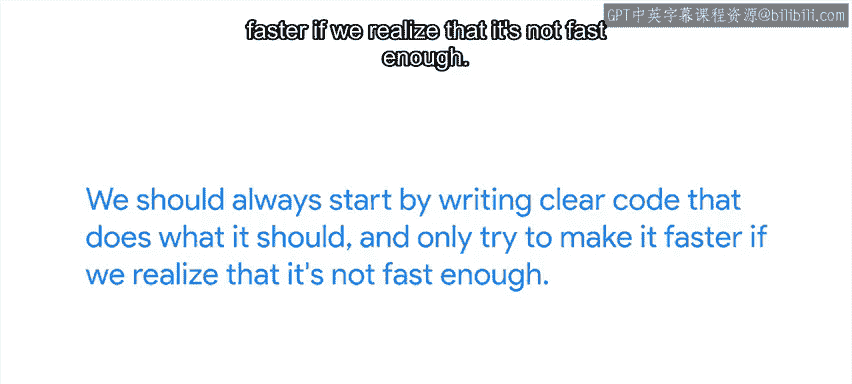
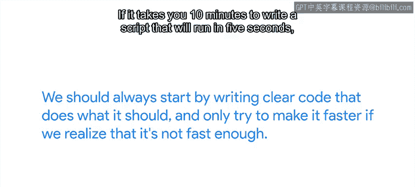
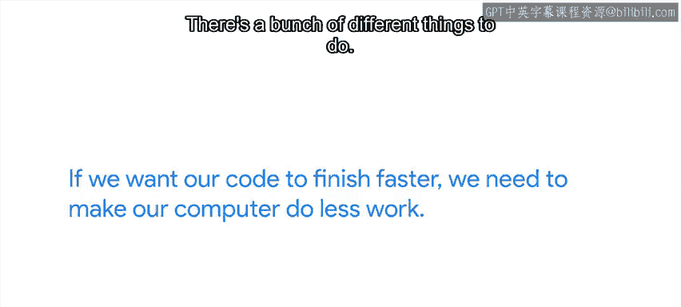
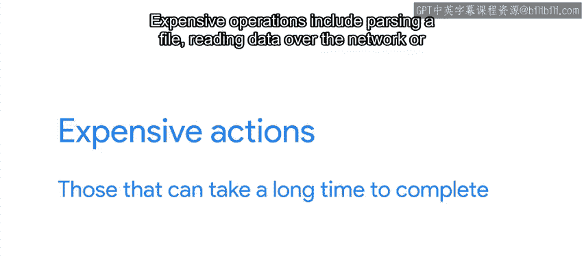

#  077：编写高效代码 🚀

在本节课中，我们将学习如何编写高效的代码。作为IT专家或系统管理员，您可能需要编写脚本来自动化任务。一段代码可能最初只是一个执行单一任务的简单脚本，但最终可能发展成一个处理多种不同任务的复杂程序。无论代码的规模和复杂性如何，我们通常都希望其性能良好。在本节及后续视频中，我们将讨论一些使代码更高效以及如何找出导致其运行缓慢的问题的方法。

## 概述：效率与可读性的平衡 ⚖️

需要牢记的一个重要原则是，我们应始终从编写清晰、功能正确的代码开始。只有在意识到代码速度不够快时，才尝试对其进行优化。

如果花费10分钟编写一个运行时间为5秒的脚本，与花费20分钟编写一个功能相同但只需3秒的脚本，这有区别吗？这完全取决于您运行脚本的频率。如果每天运行一次，那2秒的差异肯定不值得额外10分钟的工作量。但是，如果您要在网络中的500台计算机上运行同一个脚本，这微小的差异意味着整个脚本的运行时间将减少15分钟。因此，总体上您是节省了时间。

当然，很难预先知道脚本的运行速度以及优化它需要多长时间。但作为一般规则，我们的首要目标是编写可读、易于维护和易于理解的代码，因为这有助于我们编写错误更少的代码。如果确实存在运行极其缓慢的部分，那么修复它是有意义的，特别是当脚本执行频率足够高，优化所节省的时间将超过您优化所花费的时间时。但请记住，试图从脚本中榨取每一秒可能并不值得您投入时间。

## 高效代码的核心原则 🎯

明确了上述原则后，让我们深入探讨如何使代码更高效。第一步是要明白，我们无法真正让计算机运行得更快。如果我们希望代码更快完成，我们需要让计算机做更少的工作。

为了实现这一点，我们必须避免执行不必要的工作。有多种方法可以实现，最常见的包括：
*   **缓存计算结果**：存储已计算的数据，避免重复计算。
*   **选择合适的数据结构**：针对问题选择最有效的数据结构。
*   **优化代码结构**：重组代码，使计算机在等待磁盘或网络等慢速源的信息时能保持忙碌状态。

## 识别性能瓶颈：使用性能分析器 🔍

为了确定需要解决哪些导致缓慢的根源，我们必须找出代码大部分时间花在哪里。有一类称为“性能分析器”的工具可以帮助我们做到这一点。

性能分析器是一种测量代码资源使用情况的工具，它能让我们更好地理解代码的运行状况。具体来说，它们帮助我们了解内存是如何分配的以及时间是如何消耗的。由于性能分析器的工作原理，它们是针对每种编程语言特定的。例如，我们会使用`GProf`来分析C程序，但使用`cProfile`模块来分析Python程序。

使用这类工具，我们可以看到程序调用了哪些函数、每个函数被调用了多少次，以及程序在每个函数上花费了多少时间。通过这种方式，我们可以发现，例如，程序调用某个函数的次数超出了我们的预期，或者我们认为很快的函数实际上很慢。

## 修复代码：避免“昂贵”操作 💡

为了修复代码，我们可能需要重构它，以避免重复执行“昂贵”的操作。这里的“昂贵”指的是什么？昂贵操作是指那些需要很长时间才能完成的操作。

昂贵的操作包括：
*   解析文件
*   通过网络读取数据
*   遍历整个列表

那么，我们如何修改代码以避免这些昂贵的操作呢？我们将在接下来的视频中讨论几种策略。

## 总结 📝

本节课中，我们一起学习了编写高效代码的基本理念。我们首先强调了在代码可读性和运行效率之间取得平衡的重要性，优化应建立在代码功能正确且清晰的基础上。接着，我们探讨了高效代码的核心是让计算机做更少的工作，并介绍了缓存、选择合适数据结构和优化代码流程等通用方法。最后，我们了解了如何使用性能分析器来精确识别代码中的性能瓶颈，特别是那些“昂贵”的操作，为后续的具体优化策略奠定了基础。记住，优化是一个有目的的过程，应针对实际瓶颈进行，而非盲目追求极致的速度。