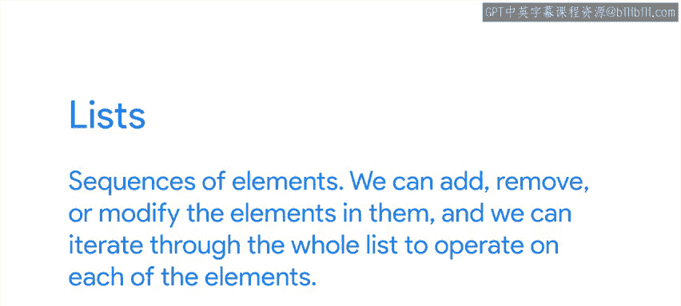
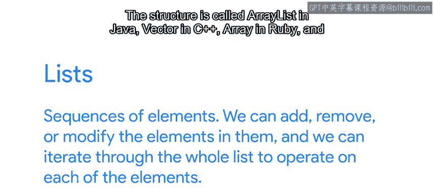
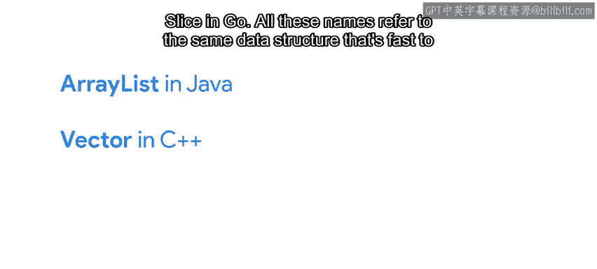
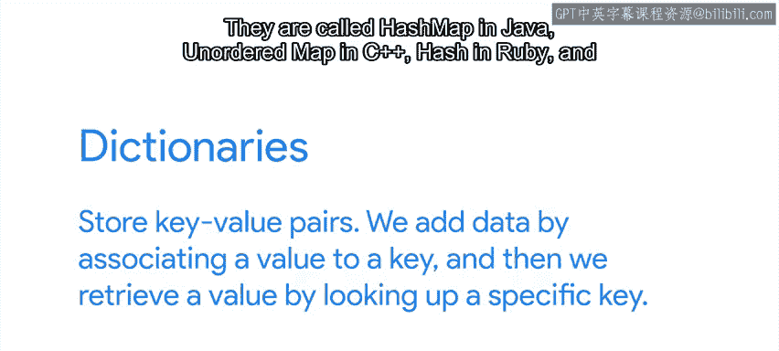
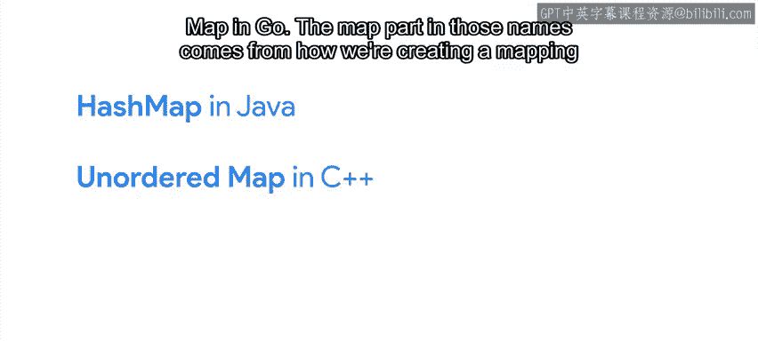
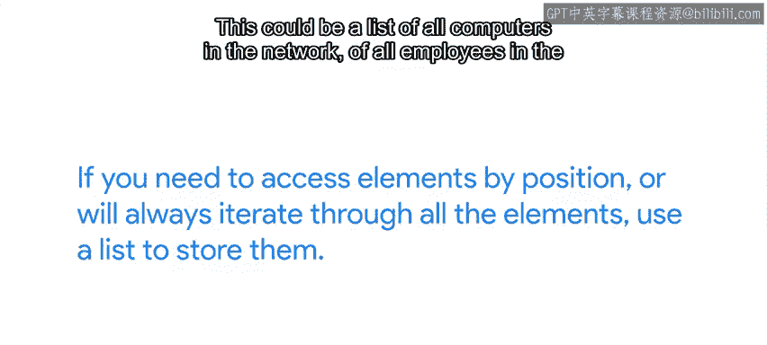
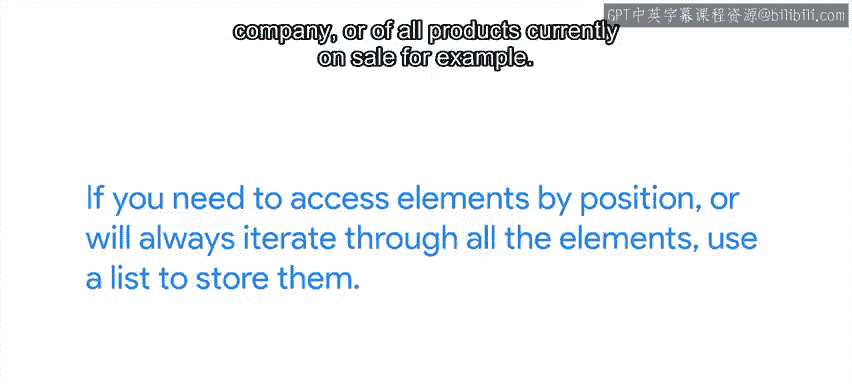
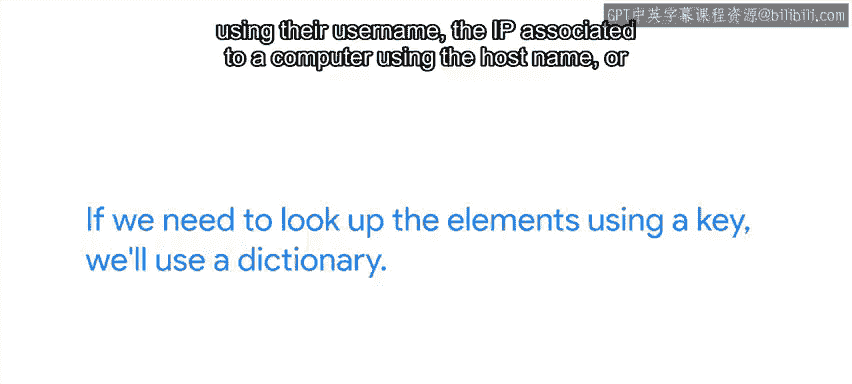

#  078：使用合适的数据结构 🧱


在本节课中，我们将学习如何通过选择合适的数据结构来编写高效的Python脚本。理解不同数据结构的性能特点，可以帮助我们避免不必要的、代价高昂的操作。

## 概述

理解我们可用的数据结构有助于避免不必要的昂贵操作，并创建高效的脚本。特别是，我们需要理解这些结构在不同条件下的性能。在Python入门课程中，你已经了解了Python中一系列不同的数据结构，如列表、元组、字典和集合。它们各有其用途、优点和缺点。

## 列表与字典快速回顾

让我们快速回顾一下列表和字典。





### 列表



列表是元素的序列。我们可以添加、删除或修改其中的元素，并且可以遍历整个列表来对每个元素进行操作。

```python
my_list = [1, 2, 3]
my_list.append(4)  # 在末尾添加元素
```

不同的编程语言对它们的称呼不同。这种结构在Java中称为`ArrayList`，在C++中称为`Vector`，在Ruby中称为`Array`，在Go中称为`Slice`。

所有这些名称都指代同一种数据结构：在末尾添加或删除元素很快，但在中间添加或删除元素可能很慢，因为所有后续元素都需要重新定位。访问列表中特定位置的元素很快，但在未知位置查找元素需要遍历整个列表。如果列表很长，这可能非常慢。



### 字典



字典存储键值对。我们通过将值与键关联来添加数据，然后通过查找特定键来检索值。


```python
my_dict = {'key1': 'value1', 'key2': 'value2'}
value = my_dict['key1']  # 通过键查找值
```

它们在Java中称为`HashMap`，在C++中称为`unordered_map`，在Ruby中称为`Hash`，在Go中称为`Map`。

名称中的“Map”部分源于我们如何在键和值之间创建映射关系。“Hash”部分则是因为为了使结构高效，内部使用了哈希函数来决定元素的存储方式。

这种结构的主要特点是查找键的速度非常快。一旦我们将数据存储在字典中，只需一次操作就能找到与键关联的值。如果存储在列表中，则需要遍历列表。



## 如何选择数据结构



因此，作为一个经验法则：

*   **如果需要按位置访问元素，或者总是要遍历所有元素，请使用列表存储它们。**
    例如，这可以是网络中的所有计算机列表、公司中的所有员工列表或当前销售的所有产品列表。



*   **如果需要使用键来查找元素，请使用字典。**
    例如，这可以是与用户关联的数据（我们使用其用户名查找）、与计算机关联的IP（使用主机名）或与产品关联的数据（使用内部产品代码）。

当我们需要进行大量此类查找操作时，创建字典并使用它来获取数据将比遍历列表以找到所需内容花费的时间少得多。

但是，如果我们只打算在字典中查找一个值，那么创建字典并用数据填充它就没有意义。在这种情况下，我们浪费了创建结构的时间，而本可以直接遍历列表来获取我们寻找的元素。

## 其他注意事项

我们可能需要三思的另一件事是在内存中创建已有结构的副本。如果这些结构很大，创建这些副本的代价可能相当高。因此，我们应该仔细检查副本是否真的必要。

## 总结

在本节课中，我们一起学习了如何根据需求选择合适的数据结构。我们回顾了列表和字典的特性、性能差异以及适用场景。记住，选择正确的数据结构是编写高效脚本的关键一步。列表适合顺序访问和遍历，而字典则擅长基于键的快速查找。同时，要避免不必要的大数据结构复制操作。

现在我们对何时使用每种数据结构以及应避免哪些操作有了更好的理解，接下来可以研究如何处理代价高昂的循环。这将在我们的下一个视频中介绍。