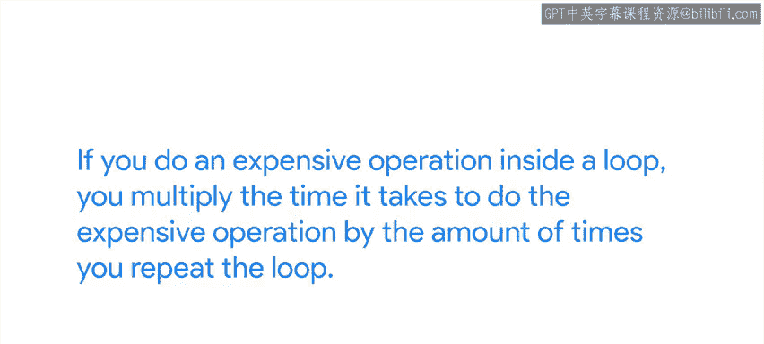
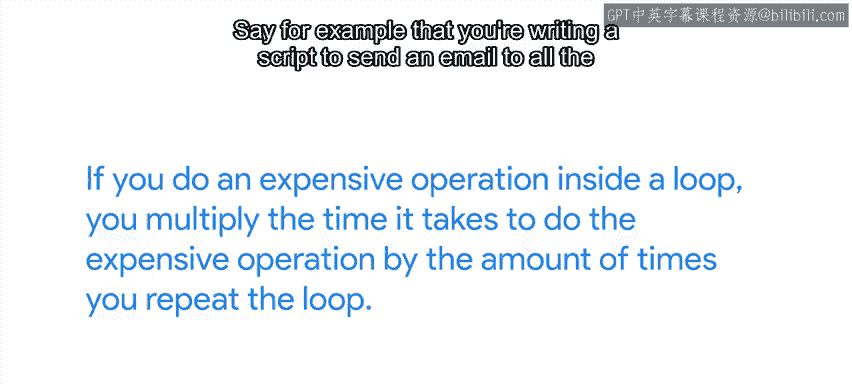
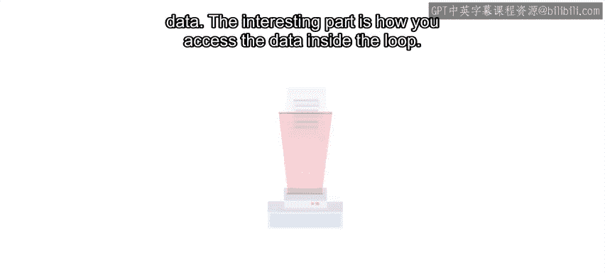
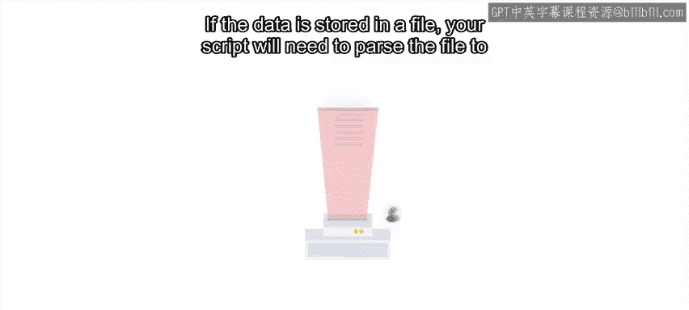
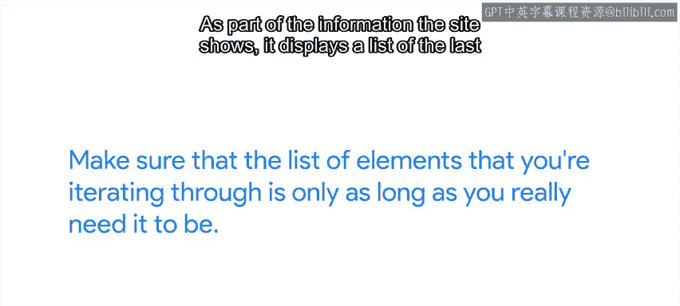
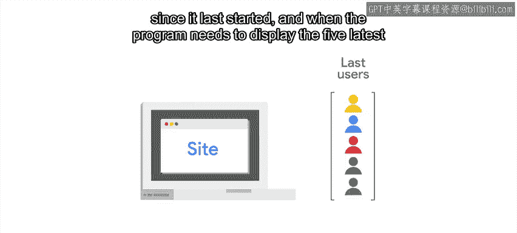
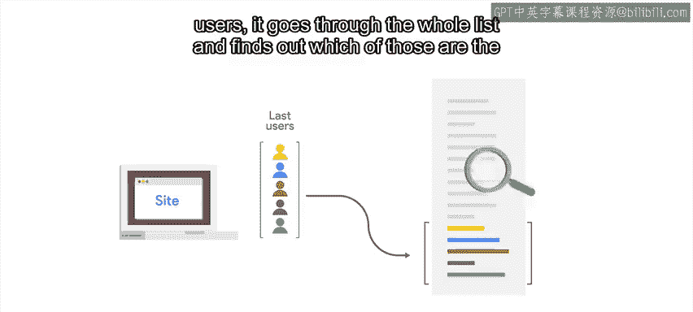
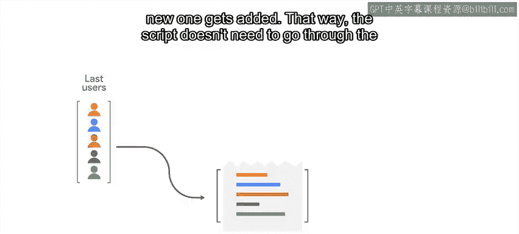

#  079：避免低效循环 🚫

在本节课中，我们将学习如何识别和避免编写低效的循环。循环是编程中强大的工具，但使用不当会显著降低程序性能。我们将通过具体示例，探讨如何优化循环内的操作，使代码运行得更快、更高效。

---

循环让计算机能够重复执行任务。这是一个非常有用的工具，能帮助我们避免重复性工作。

但我们需要谨慎使用循环。特别是，我们需要仔细考虑在循环内部执行哪些操作，并尽可能避免执行代价高昂的操作。如果在循环内执行代价高昂的操作，那么执行该操作所需的时间将乘以循环重复的次数。

## 优化循环内的数据访问 📂

上一节我们提到了循环内的高成本操作，本节中我们来看看一个具体的例子。

假设你正在编写一个脚本，向公司所有员工发送电子邮件，要求他们验证其紧急联系人信息是否仍然有效。

为了发送这些邮件，你会使用一个循环，为每位员工发送一封邮件。在邮件正文中，你将包含当前的紧急联系人数据。

关键在于如何在循环内访问这些数据。如果数据存储在文件中，你的脚本需要解析文件来获取数据。

如果脚本为每个用户都读取整个文件，你将不必要地浪费大量时间反复解析文件。相反，你可以在循环外解析文件。

将信息放入字典中，然后在循环内使用该字典来检索数据。

## 优化循环的通用原则 🔧

因此，每当代码中有循环时，务必检查正在执行的操作，看看是否有操作可以移出循环，只执行一次。

以下是优化循环时可以遵循的几个原则：
*   避免为每个元素都进行网络调用，改为在循环前进行一次调用。
*   避免为每个元素都从磁盘读取，改为在循环前读取全部内容。
*   即使循环内执行的操作成本不高，但如果我们要遍历一个包含1000个元素的列表，而只需要其中的5个，那么我们就在不需要的元素上浪费了时间。因此，请确保你迭代的元素列表仅包含真正需要的部分。

## 一个具体的优化案例：显示最近登录用户 💻

让我们看另一个例子。假设你正在运行一个内部网站。作为网站显示信息的一部分，它会显示最近登录的五个用户列表。

在代码中，程序会保存一个自上次启动以来所有登录用户的列表。

当程序需要显示最近的五个用户时，它会遍历整个列表，找出其中最近的五个。

这会浪费大量时间。如果服务已经运行了一段时间，遍历整个列表可能需要很长时间。

相反，你可以修改服务，将用户访问信息存储在日志文件中（必要时可读取），并且只在内存中保留最近五次登录。这样，每当有新用户登录时，列表中最旧的条目就会被丢弃，并添加一个新条目。

通过这种方式，脚本在每次需要显示最近五个用户时，就无需遍历整个列表。

## 及时跳出循环 🛑

关于循环，另一件要记住的事情是：一旦找到你要找的内容，就跳出循环。

在Python中，我们使用关键字 `break` 来实现这一点。跳出循环意味着一旦找到我们要找的数据，脚本就可以继续执行后续代码。

当然，如果数据在列表末尾，那么我们无论如何都需要遍历整个循环。但当数据在列表开头而非末尾时，让代码提前跳出循环以加快脚本速度是有意义的。

假设你正在编写一个脚本，检查给定的用户名是否在授权实体列表中，如果在，则授予其对特定资源的某些访问权限。你可以使用 `for` 循环遍历实体列表，当找到用户名时，跳出循环并继续执行脚本的其余部分。

## 根据问题规模选择方案 ⚖️

最后要记住的一点是，一个问题的正确解决方案可能不适用于另一个问题。

假设你的服务总共有20个用户。在这种情况下，每当你想检查某些内容时，遍历这个列表是可以接受的。它足够短，不需要进行任何特殊的优化。

但如果你的服务有超过1000个用户，你会希望避免遍历该列表，除非绝对必要。

而如果服务有数十万用户，遍历该列表甚至是不可能的。

---

**总结**

本节课中，我们一起学习了如何避免编写低效的循环。关键点包括：将高成本操作移出循环、仅遍历必要的元素、在找到目标后及时使用 `break` 跳出循环，以及根据数据规模选择合适的解决方案。记住这些原则，可以帮助你编写出运行更快、资源利用更高效的Python代码。