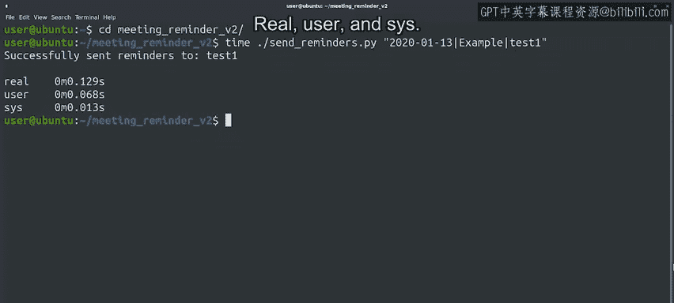
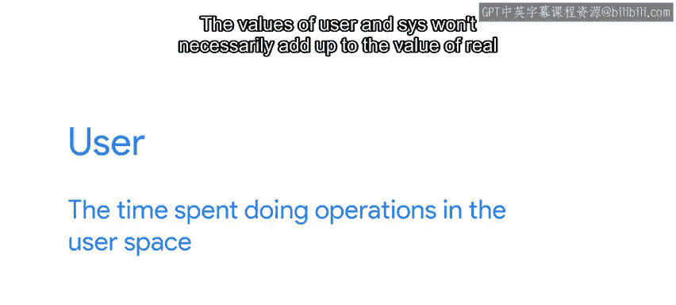
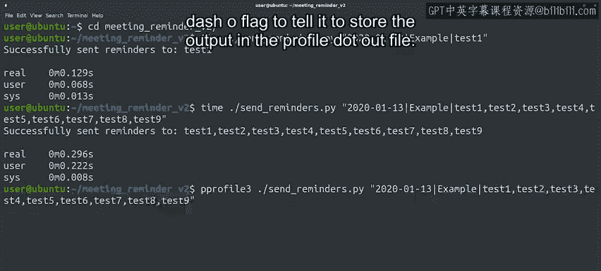
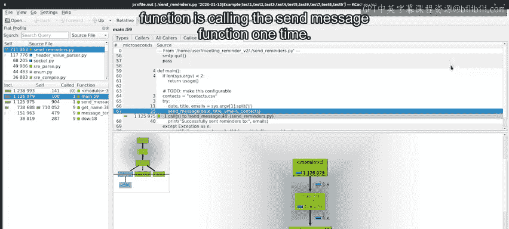
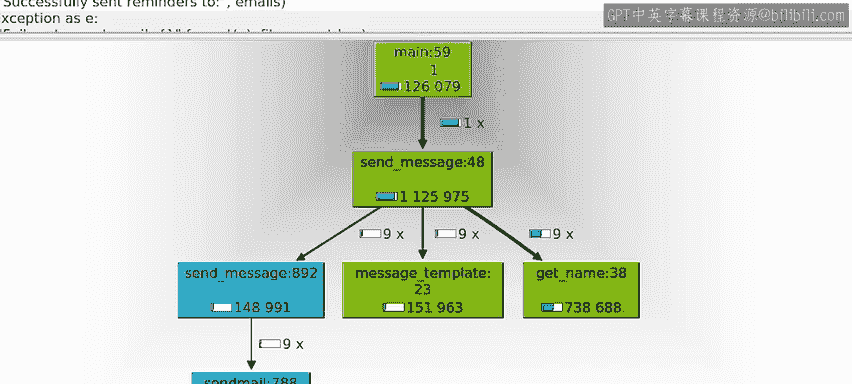
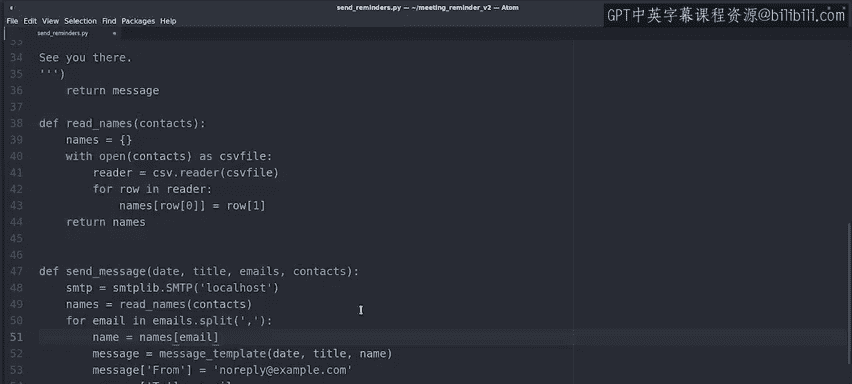
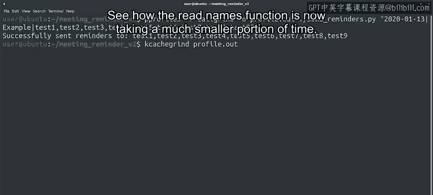

#  081：识别并优化低效循环 🐌


在本节课中，我们将学习如何诊断一个运行缓慢的脚本，并使用性能分析工具找出瓶颈。我们将重点关注一个因循环效率低下而导致速度变慢的邮件发送脚本，并学习如何通过重构代码来优化其性能。

---

还记得那个在处理日期时遇到问题的会议提醒脚本吗？开发人员一直在改进它，现在它可以在问候语中插入收件人姓名，发送个性化的电子邮件。

这很酷，但不幸的是，这似乎让应用程序变得相当慢。开发人员正在请求我们帮助找出如何让程序运行得更快。

所以让我们开始工作。首先，我们需要复现问题，并弄清楚在这种情况下“慢”意味着什么。一位用户告诉我们，当收件人列表很长时，问题就会显现。

为了避免在测试此问题时打扰我们的同事，我们将把提醒邮件发送到我们在邮件服务器中创建的一批测试用户。

你可能还记得，该应用程序有两个部分：一个弹出窗口用于输入提醒数据的Shell脚本，以及一个准备并发送电子邮件的Python脚本。速度慢的部分是发送电子邮件。因此，我们完全不会与弹出窗口交互，而是直接将所需的参数传递给Python脚本。

我们将使用 `time` 命令来测量脚本速度。首先，我们只用一个测试用户调用它，看看需要多长时间。



当我们调用 `time` 时，它会运行我们传递给它的命令，并打印执行该命令所花费的时间。




有三个不同的值：`real`、`user` 和 `sys`。
*   `real` 是执行命令所花费的实际时间。这个值有时被称为“挂钟时间”，因为它是挂在墙上的时钟所测量的时间，无论计算机在做什么。
*   `user` 是在用户空间执行操作所花费的时间。
*   `sys` 是执行系统级操作所花费的时间。


`user` 和 `sys` 的值加起来不一定等于 `real` 的值，因为计算机可能正忙于其他进程。

好的，我们在这里看到了什么？我们的脚本发送电子邮件花了 **0.129秒**。这不算多，但我们只向一个用户发送了消息。让我们用九个测试用户再试一次。

这次发送电子邮件花了 **0.296秒**。这仍然不算多，但看起来随着电子邮件列表变长，花费的时间确实更长了。

---

好的，是时候尝试改进它了。我们如何找出代码的问题所在？



我们总是可以查看代码，看看是否能找到任何可以改进的昂贵操作。但在这种情况下，我们希望使用性能分析器来获取一些关于正在发生什么的数据。

让我们试试看。Python有许多不同的性能分析器，适用于不同的用例。这里我们将使用一个叫做 `cProfile` 的分析器。

我们将使用 `-f` 标志告诉它使用 `callgrind` 文件格式，并使用 `-o` 标志告诉它将输出存储在 `profile.out` 文件中。

```bash
python -m cProfile -f callgrind -o profile.out ./send_reminders.py
```




好的，这生成了一个我们可以用任何支持 `callgrind` 格式的工具打开的文件。我们将使用 `KCacheGrind` 来查看内容，这是一个用于查看这些文件的图形界面。

这个程序有很多信息，所以如果你需要一段时间才能理解，请不要害怕。就像许多其他事情一样，自己动手练习和摸索将帮助你熟悉这里所有不同事物的含义。




让我们看看现在需要的信息。在右下角，我们看到了一个调用图，它告诉我们 `main` 函数调用了 `send_message` 函数一次。这个函数又分别调用了 `message_template` 函数、`get_name` 函数和 `send_message` 函数各9次。该图还告诉我们每次调用花费了多少微秒。

我们可以看到，大部分时间都花在了 `get_name` 函数上。这很可能就是我们应该优化的那个函数。让我们用编辑器看看这个函数在做什么。


我们看到 `get_name` 函数打开一个CSV文件，然后遍历整个文件，检查行中的第一个字段是否与电子邮件名称匹配。当匹配时，它设置 `name` 变量的值。

这个函数有几个问题：
1.  首先，一旦它在列表中找到元素，就应该立即跳出循环。目前，即使电子邮件在第一行就被找到，它仍然会遍历整个文件。
2.  但即使我们修复了这个问题，它仍然会为每个电子邮件地址打开并读取文件。如果文件有很多行，这会变得非常慢。

那么，我们怎样才能让它变得更好呢？我们可以读取文件一次，将我们关心的值存储在一个字典中，然后使用该字典进行查找。

让我们开始做吧。我们将更改 `get_name` 函数，将其转换为 `read_names` 函数，该函数将处理CSV文件并将我们想要的值存储在 `names` 字典中。

对于每一行，我们将电子邮件存储为键，姓名存储为值。并且，我们不再返回一个姓名，而是返回整个字典。

好的，我们有了一个将所需数据存储在字典中的 `read_names` 函数。我们现在需要更改在 `send_message` 函数中调用它的方式。

我们看到 `get_name` 函数每个电子邮件被调用一次。为了应用我们的更改，我们应该在 `for` 循环之前调用 `read_names` 函数，这样我们只做一次。然后，我们不再调用 `get_name`，而是直接从字典中获取值。





好的，我们已经做了更改。让我们保存文件并再次分析我们的脚本，看看我们是否设法让它变得更快。

😊


现在图表看起来不同了，因为我们已经改变了代码的行为。看看 `read_names` 函数现在只占用了少得多的时间。另一方面，我们看到 `message_template` 现在是占用时间最多的部分。所以，如果我们想继续让脚本更快，那就是我们下一步要看的地方。

---

在本节课中，我们一起学习了如何使用 `time` 命令来检查程序执行所需的时间。然后，我们看到了如何结合使用性能分析器和分析结果可视化工具来找出代码大部分时间花在哪里。最后，我们通过将信息存储在字典中然后访问字典，而不是反复执行昂贵的循环，来更改了我们的代码。接下来，有一篇阅读材料提供了关于性能分析的更多信息，之后还有一个练习测验来检查你是否理解了所有这些内容。