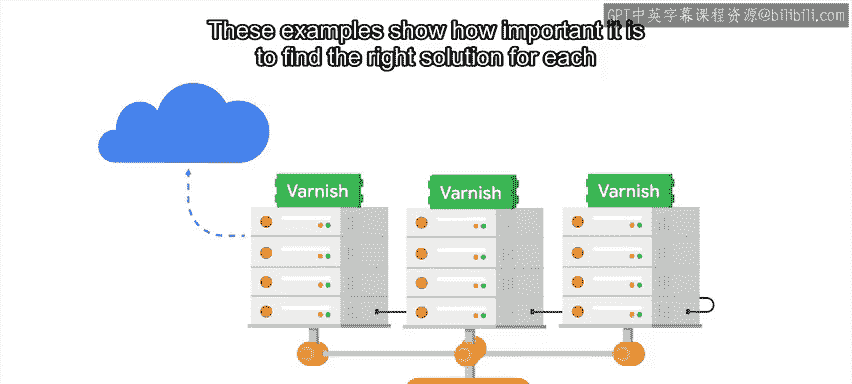

#  083：系统复杂度增长与架构演进 🚀

在本节课中，我们将探讨一个核心概念：随着系统规模和复杂度的增长，其架构和解决方案也需要相应演进。我们将通过一个“秘密圣诞老人”服务的发展历程，来理解为何适用于小规模问题的方案，在大规模场景下可能不再适用，以及如何逐步调整技术栈以应对挑战。

---

正如我们在之前的视频中指出，一个对某个问题有效的解决方案，可能并不适合另一个不同的问题。随着系统变得更加复杂且使用量增长，曾经运行良好的方案可能不再适用。

假设你正在编写一个“秘密圣诞老人”脚本，每个人会随机分配给另一人赠送秘密礼物。该脚本随机选择配对，然后向礼物赠送者发送电子邮件，告知他们需要为谁购买礼物。如果仅为同一楼层的同事运行此服务，你可能只需将姓名和电子邮件列表存储在CSV文件中。文件将足够小，解析它所花费的时间可以忽略不计。

然而，如果这个脚本发展成一个处理整个公司员工的大型项目，并且公司持续招聘更多人员，那么在某些时候，解析文件将开始耗费大量时间。此时，你可能需要考虑使用不同的技术。

例如，你可以决定将数据存储在SQLite文件中。这是一个轻量级数据库系统，允许你查询文件中存储的信息，而无需运行数据库服务器。使用SQLite处理数据对于在公司内分配秘密圣诞老人可能完全可行。

但是，想象一下你不断为该服务添加功能：它现在包含了创建愿望清单的方式、一个推荐可能礼物的机器学习算法，以及一个记录每次赠送礼物历史的追踪器。由于公司员工非常喜爱这个程序，你已将其做成一个可供任何人使用的外部服务。

将所有数据保存在一个文件中会变得太慢。因此，你需要转向不同的解决方案。你将不得不使用一个功能齐全的数据库服务器，甚至可能需要在运行秘密圣诞老人服务的机器之外的另一台独立机器上运行。

在此之后，甚至还有更进一步的发展。如果服务变得非常、非常受欢迎，你可能会发现数据库的速度不足以处理所有查询请求。在这种情况下，你可以添加一个缓存服务，如Memcached，它将最常用的结果保存在内存中，以避免不必要的数据库查询。

因此，我们经历了从在CSV文件中托管数据，到存入SQLite文件，然后迁移到数据库服务器，最后在数据库服务器前使用动态缓存以使其运行更快的整个过程。

类似的发展进程也可能发生在同一项目的用户界面侧。最初，我们说该服务只是向列表中的人发送电子邮件。如果是一个小组且由一人负责脚本，这没有问题。

但随着项目变得更加复杂，你会希望为该服务建立一个网站，让人们能够执行诸如查看分配给谁以及创建愿望清单等操作。最初，这可能只是在与数据相同的机器上的Web服务器上运行。

如果网站被大量使用，你可能需要添加像Varnish这样的缓存服务。这将加速动态生成页面的加载。最终，这可能仍然不够，因此你需要将服务分布到许多不同的计算机上，并使用负载均衡器来分发请求。

你可以在公司内部使用托管在公司内的独立计算机来实现这一点，但这意味着随着应用程序不断增长，你需要添加越来越多的服务器。使用在云中运行的虚拟机可能更容易，这些虚拟机可以根据服务承受的负载变化而添加或移除。

这些例子表明，为每个问题找到正确的解决方案是多么重要。当你只有几十个用户时，部署一个用于存储的、带有分布式数据库的多服务器Web服务是毫无意义的。你只需要关注服务是如何增长的，以了解何时需要采取下一步措施，使其在当前用例下发挥最佳性能。

接下来，我们将讨论在处理复杂系统时可能遇到的一些问题。

---

## 总结

本节课中，我们一起学习了系统如何随着规模和复杂度的增长而演进。我们通过一个具体的例子，看到了技术栈从简单的CSV文件，到SQLite，再到独立的数据库服务器和缓存层，以及从发送邮件到构建网站、使用缓存和负载均衡的完整发展路径。关键在于理解，没有一劳永逸的解决方案，我们需要根据当前的实际需求和规模，选择并适时调整最合适的技术架构。