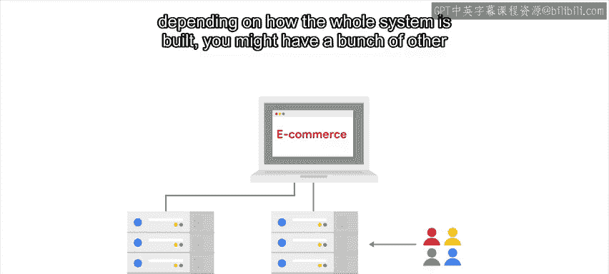
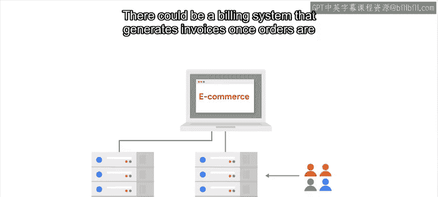
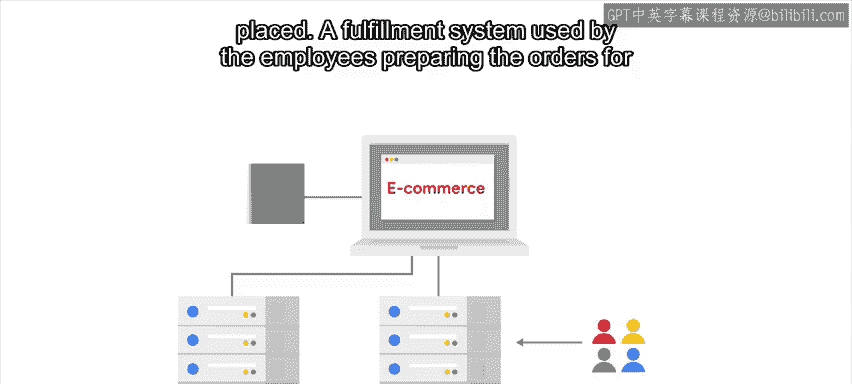
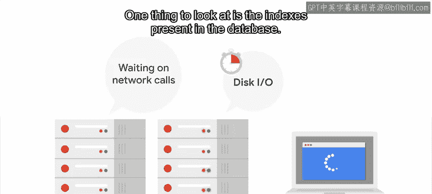
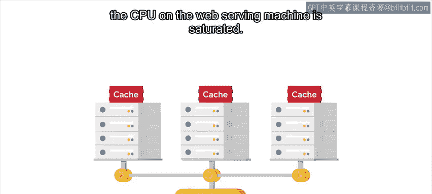

#  084：处理复杂的缓慢系统 🐌

在本节课中，我们将学习如何诊断和优化一个复杂且运行缓慢的系统。我们将探讨如何识别性能瓶颈，并介绍几种常见的解决方案，例如数据库索引、查询缓存和负载均衡。

---

在上一个视频中，我们讨论了随着使用量增长，系统复杂性也会增加。在大型复杂系统中，会涉及许多不同的计算机，每台计算机负责一部分工作，并通过网络与其他计算机交互。

例如，考虑你公司的一个电子商务网站。Web服务器是直接与外部用户交互的系统部分。另一个组件是数据库服务器，由处理网站生成请求的代码进行访问。根据整个系统的构建方式，可能还涉及许多其他服务，负责处理不同的工作部分。

以下是一个复杂系统可能包含的组件示例：
*   一个在订单下达后生成发票的计费系统。
*   一个供员工为客户准备订单的履约系统。
*   一个每天生成所有销售报告的报告系统，可能还有更多。

除此之外，你可能还需要备份、监控、测试基础设施等等。

---

调试和理解这样的系统可能很棘手。如果你的复杂系统运行缓慢，通常你需要做的是找到导致基础设施性能不佳的瓶颈。

是Web服务器上动态页面的生成速度慢吗？是数据库查询慢吗？还是履约流程的计算慢？找出原因可能很困难。

因此，一个关键点是拥有一个良好的监控基础设施，它能让你知道系统在哪些环节花费了最多时间。

假设你注意到获取网页的速度相当慢。但当你检查Web服务器时，发现它并没有过载。相反，大部分时间都花在了等待网络调用上。而当查看数据库服务器时，你发现它花费了大量时间在磁盘I/O上。

这表明数据库中的数据访问方式存在问题。需要关注的一点是数据库中是否存在索引。当数据库服务器需要查找数据时，如果你查询的字段上有索引，查找速度会快得多。

另一方面，如果数据库索引过多，添加或修改条目可能会变得非常慢，因为所有索引都需要更新。

因此，我们需要寻找一个良好的平衡点，只为实际会被使用的字段建立索引。如果索引无法解决问题，并且服务器需要处理的查询太多，无法及时响应所有请求，你可能需要研究缓存查询或将数据分布到不同的数据库服务器上。

---

现在，如果你在尝试找出服务缓慢的原因时，发现Web服务器的CPU使用率已经饱和，该怎么办？

第一步是检查是否可以使用我们之前解释的技术来改进服务代码。如果是一个动态网站，我们可以尝试在其之上添加缓存。

但如果代码本身没问题，并且缓存也无济于事，因为问题仅仅在于单台机器无法处理涌入的大量请求，那么你就需要将负载分布到更多计算机上。

为了实现这一点，你可能需要重组代码，使其能够在分布式系统而非单台计算机上运行。这可能需要一些工作，但一旦完成，你就可以通过向系统添加更多计算机，轻松地将应用程序扩展到处理所需的任意数量的请求。

最后，确保你确实需要执行正在做的所有操作。很多时候，随着项目的发展，我们留下了一个由层层复杂代码构成的可怕怪物。如果我们花几分钟思考一下系统正在做什么，最终可能会发现有一整个部分根本不需要，它一直在让我们的服务器做不必要的工作。

如果所有这些开始听起来太困难和可怕，请不要担心。请记住，如果你需要处理如此复杂的系统，最好的工具之一就是向你的同事寻求帮助。

接下来，我们将尝试动手解决一个现实生活中的复杂问题。

---

在本节课中，我们一起学习了如何诊断复杂系统的性能瓶颈。我们探讨了通过监控定位问题、优化数据库索引、实施缓存策略以及通过负载均衡扩展系统等方法。处理复杂系统需要耐心和系统性的方法，但掌握这些技能将帮助你有效地维护和优化大型基础设施。