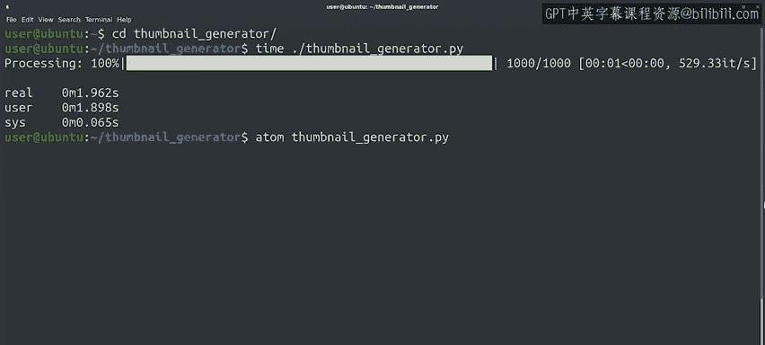
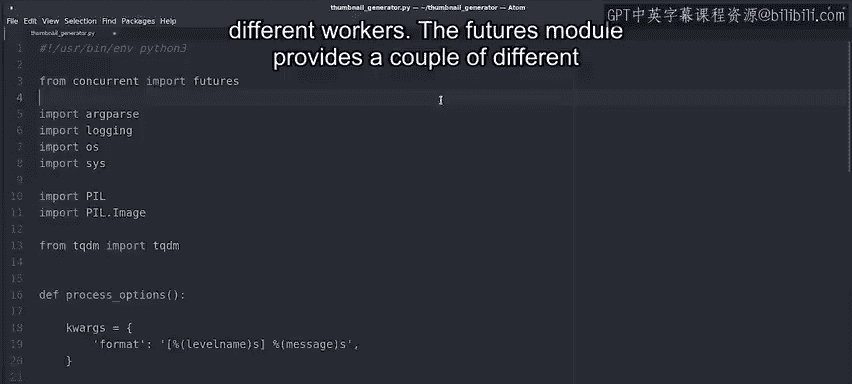
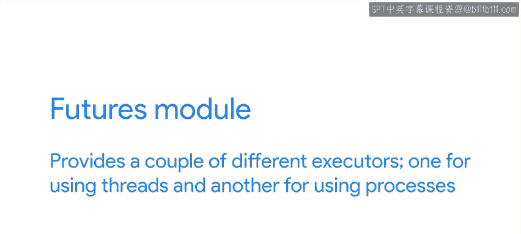
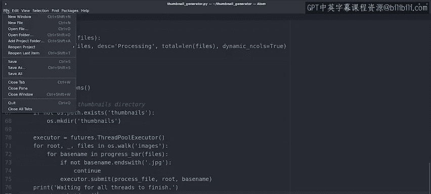
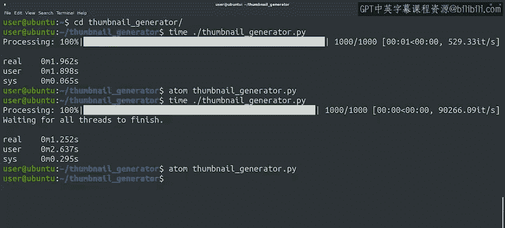
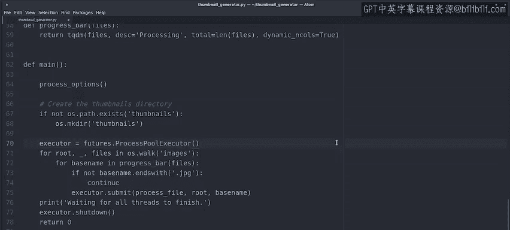
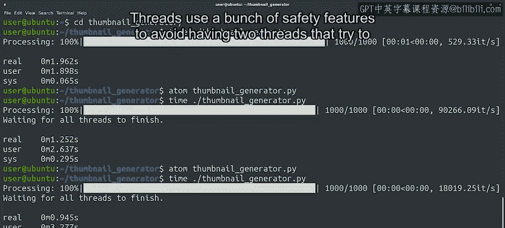

#  085：使用线程加速 🚀


在本节课中，我们将学习如何通过并行处理来加速一个Python脚本。具体来说，我们将处理一个为大量产品图片生成缩略图的任务，并探索使用线程（Threads）和进程（Processes）来提升执行效率。

---

我们的公司有一个电子商务网站，网站上包含了许多待售产品的图片。

即将进行一次品牌重塑，这意味着所有这些图片都需要被新图片替换。

这包括全尺寸图片和缩略图。我们有一个脚本，可以根据全尺寸图片生成缩略图。

但是需要处理的文件数量很多，我们的脚本需要很长时间才能完成。

看来是时候提升一个档次，使用更好的方法来进行图片缩放。我们将首先使用一组1000张测试图片来运行当前的脚本。

实际需要转换的图片更多，但使用较小的批次测试脚本速度会更方便。

我们将使用 `time` 命令来执行程序，以查看其运行时间。

处理1000张图片大约花费了2秒。这看起来不算太慢。

但实际有数万张图片需要转换。

我们希望确保处理过程尽可能快。



让我们尝试通过并行处理图片来加速。我们将从导入 `concurrent.futures` 模块开始，这为我们提供了一种使用Python线程的简单方法。



```python
import concurrent.futures
```

为了能够并行运行任务，我们需要创建一个执行器（executor）。



```python
executor = concurrent.futures.ThreadPoolExecutor()
```

执行器负责在不同的工作单元（workers）之间分配任务。

`futures` 模块提供了几种不同的执行器，一种用于使用线程，另一种用于使用进程。

```python
# 使用线程池执行器
executor = concurrent.futures.ThreadPoolExecutor()
# 或使用进程池执行器
# executor = concurrent.futures.ProcessPoolExecutor()
```

我们现在选择使用 `ThreadPoolExecutor`。现在，在这个循环中完成大部分工作的函数是 `process_file`。

我们不再在循环中直接调用它，而是向执行器提交一个新任务，指定函数名及其参数。

```python
executor.submit(process_file, image)
```

我们的 `for` 循环现在创建了一系列任务，这些任务都被安排在执行器中。

执行器将使用线程并行运行它们。



使用线程时发生的一个有趣现象是，循环在所有任务被安排好后就会立即结束。

但任务完成仍需一段时间。

因此，我们将添加一条消息，说明我们正在等待所有线程完成，然后在执行器上调用 `shutdown` 函数。

```python
print("等待所有线程完成...")
executor.shutdown()
```

这个函数会等待池中的所有工作单元完成，然后才关闭执行器。



好的，我们已经完成了修改，让我们保存脚本并测试它。

现在我们的脚本耗时1.2秒。这比之前看到的2秒有了不错的改进。



请注意用户时间（user time）高于实际时间（real time）。通过使用多线程，我们的脚本利用了计算机中可用的不同处理器，这个值显示了所有处理器上使用时间的总和。

你认为如果我们尝试使用进程而不是线程会发生什么？让我们通过更改我们使用的执行器来尝试一下。



```python
executor = concurrent.futures.ProcessPoolExecutor()
```

通过将执行器更改为 `ProcessPoolExecutor`，我们告诉 `futures` 模块，我们希望使用进程而不是线程来进行并行操作。让我们保存并现在尝试这个版本。

哇，现在完成时间不到一秒，并且用户时间进一步上升了。

这是因为通过使用进程，我们更充分地利用了CPU。

这种差异是由Python中线程和进程的工作方式造成的。线程使用一系列安全特性来避免两个线程尝试写入同一个变量。这意味着，在使用线程时，它们可能最终需要等待几毫秒才能轮到它们写入变量，这导致了两种方法之间的微小差异。

在本视频中，我们研究了如何为Python脚本添加线程支持，以更好地利用我们的处理器能力。我们的脚本仍有更多可以改进的地方，例如在转换前检查缩略图是否存在且是最新的，或者在等待任务完成时添加第二个进度条以明确显示脚本正在工作。我们不会在这里深入探讨这些，但如果你感兴趣，可以自行探索这些可能性。

接下来，是另一个包含更多信息指引的阅读材料，随后是本模块的最后一次练习测验。

---

**总结**

本节课中，我们一起学习了如何利用Python的 `concurrent.futures` 模块实现并行处理。我们通过将串行的图片处理任务改造为使用 `ThreadPoolExecutor` 和 `ProcessPoolExecutor`，显著提升了脚本的执行速度。关键点在于理解执行器如何管理工作单元，以及线程与进程在利用CPU资源上的不同特性。