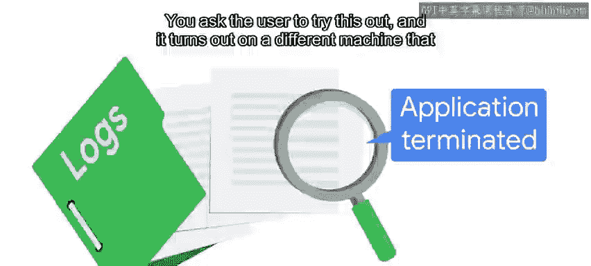
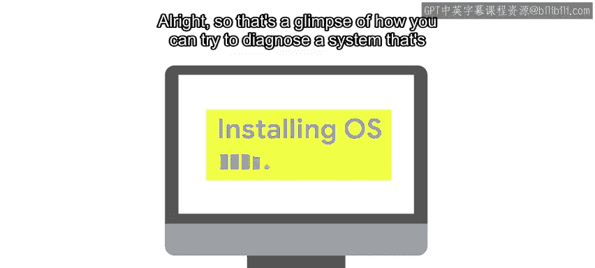

#  088：系统崩溃诊断与处理 🖥️💥

在本节课中，我们将学习如何诊断和处理系统崩溃问题。系统崩溃可能由多种原因引起，我们将通过一个具体的案例，学习如何逐步缩小问题范围，从应用程序层面排查到硬件层面，最终找到并解决问题的根本原因。

## 概述：从用户报告开始

上一节我们介绍了问题诊断的一般思路。本节中，我们来看看当用户报告一个具体的系统崩溃问题时，我们应该如何着手处理。

假设一位用户向你求助，称其内部计费应用程序在尝试为客户生成发票时崩溃了。这个问题可能由多种原因导致，因此你需要缩小问题范围。请记住，你应该从那些更简单、更快速的检查步骤开始。

## 第一步：检查日志与重现问题

首先，尝试查看日志，寻找可能指向问题根源的错误信息。但你可能只找到一个写着“应用程序终止”的错误，没有更多有用信息。

因此，你需要检查用户是否能在另一台计算机上通过执行相同操作来重现该问题。你请用户尝试一下，结果发现在另一台机器上，他们可以正常生成发票。这意味着问题很可能只与那台特定计算机的安装或配置有关。

好消息是，你已经将问题范围缩小到了与特定机器相关的问题上。

## 第二步：确认问题的可靠性与范围

接下来，你可能需要确认这个问题是否稳定出现。例如，是所有发票生成都失败，还是仅限于某个特定产品或客户？

对于本例，假设你请用户尝试生成其他发票，结果一切正常，即使是对同一客户也是如此。那么，你可能会想：问题是否只出现在那台特定计算机上，针对那个特定客户的特定订单？这相当可疑。

但别急，用户告诉你，在生成了当天所有发票后，他们尝试生成报告时，应用程序再次崩溃。但之后又恢复正常了。你与其他用户核实，发现他们使用该应用程序时并未崩溃。

这意味着什么？应用程序似乎在那台计算机上随机崩溃。为了进一步缩小范围，你需要知道是只有那个应用程序有问题，还是整个系统都有问题。

## 第三步：排查应用程序与系统问题

为了检查这一点，你可以尝试移除程序的本地配置，改用默认配置，或者甚至重新安装应用程序。你也可以询问用户是否在其他应用程序上遇到过崩溃。

对于本例，假设重新安装应用程序并使用默认配置运行后，仍然会出现随机崩溃。当被追问时，用户告诉你，上周他们在使用内部网络邮件时，网页浏览器也崩溃过。

此时，信息指向了整个系统的问题，可能是硬件或操作系统安装的问题。如果你有备用计算机，此时给用户一台可能是个好主意，这样他们可以恢复工作，而你则可以继续寻找问题的根本原因。

## 第四步：硬件问题诊断

现在，问题很可能是硬件相关的。你可以尝试将硬盘从那台计算机中取出，放入另一台计算机中测试。这种方法在你已经有一台确认工作正常的备用机时效果最好，可以用于此类测试。

这样，你可以快速检查问题是出在硬盘数据上，还是计算机的其他部分。假设将硬盘放入另一台计算机后，应用程序运行正常，没有意外崩溃。这意味着某个硬件组件出现了故障。

下一步是找出是哪个组件。鉴于随机崩溃的特性，需要检查的一个方面是内存（RAM）。内存芯片会随着时间老化，当它们老化时，计算机可能将数据写入内存的某个部分，但在尝试读取时却得到完全不同的值。

为了检查内存的健康状况，我们可以使用 **MemTest86** 工具来查找错误。我们在启动时运行此工具，而不是正常的操作系统，以便它可以访问所有可用内存，并验证写入内存的数据在尝试读取时是否相同。

如果内存正常，你可以通过查看操作系统提供的传感器数据来检查计算机是否过热。如果也不是这个问题，则检查外部设备（如显卡或声卡）是否存在问题。你可以通过断开连接或更换计算机中存在的设备，并检查崩溃是否仍然发生来进行排查。

## 第五步：硬盘与操作系统问题

那么，如果将硬盘放入另一台计算机后，仍然出现奇怪的崩溃，该怎么办？这意味着问题出在硬盘本身或操作系统安装上。

和内存一样，我们的硬盘也会老化。在某些时候，计算机读取的数据会与最初存储的数据不匹配。每个操作系统都自带一套硬盘检查工具，你应该熟悉你所使用操作系统的这些工具。

你需要查看检查磁盘坏道的工具输出，并且使用 **SMART** 工具，这些工具有助于检测错误，甚至可以在问题影响计算机性能之前尝试预测问题。

如果硬盘检查结果正常呢？那么你需要研究可能的操作系统问题。但在这样做之前，问问自己：这值得吗？查找安装过程中的问题可能会花费大量宝贵时间。如果安装过程易于复制，那么重新安装操作系统可能比查找其损坏原因更快、更简单。

## 总结与下节预告

本节课中，我们一起学习了如何诊断不稳定的、行为异常的系统。我们通过一个案例，从检查日志、重现问题开始，逐步排查应用程序配置、系统范围问题，最终深入到硬件（如内存、硬盘）的诊断，并讨论了在必要时重新安装操作系统的策略。

但通常，你需要处理的是某个特定的行为异常的应用程序。在这种情况下，几乎可以肯定是应用程序代码中存在一个未考虑到某些（虽然罕见但可能发生的）情况的错误。接下来，我们将探讨当这种情况发生时，你可以做些什么。