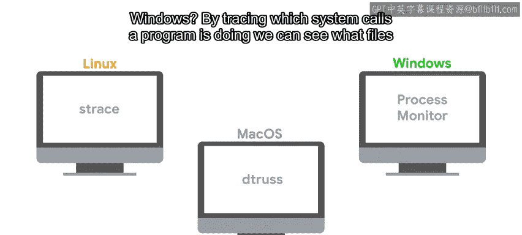

#  089：理解崩溃应用程序 🔍


在本节课中，我们将学习当应用程序崩溃时，如何系统地查找原因。我们将探讨如何查看日志、追踪程序行为、分析环境变化，并创建一个可复现的故障案例。

---

当应用程序崩溃且原因不明时，我们需要查找可能与故障相关的日志。在Linux系统上，我们会查看位于 `/var/log/` 的系统日志文件，或用户日志文件。在macOS上，通常使用“控制台”应用来查看日志。在Windows上，则使用“事件查看器”。

那么，在这些日志中应该寻找哪些数据呢？

大多数日志的每一行都包含日期和时间。知道了应用程序崩溃的时间，你就可以查找该时间点附近的日志条目，并尝试找到与崩溃应用程序相关的错误信息。

有时错误信息是自解释的，例如“权限被拒绝”、“没有这样的文件或目录”或“连接被拒绝”。有时它可能是一条晦涩的信息，让人完全不明白其含义。

无论错误信息看起来多么奇怪，我们都可以在线搜索以试图理解其含义。如果幸运的话，我们可能会找到关于该错误的官方文档，说明其含义以及我们可以采取的措施。即使没有官方文档，通常也能找到其他人处理类似错误的帖子，这些额外信息可以帮助我们理解情况。

如果没有错误信息，或者错误信息没有帮助，我们可以尝试通过启用调试日志来获取更多信息。


许多应用程序在启用调试日志时会生成更多的输出。我们可能需要通过应用程序配置文件中的设置，或在手动运行应用程序时传递命令行参数来启用它。


通过启用这些额外的日志信息，我们可以更好地了解导致问题的实际原因。



那么，如果根本没有日志或错误信息，我们该怎么办？在这种情况下，我们需要使用能让我们看到程序内部运行情况的工具。我们之前提到过一些：在Linux上，我们使用 `strace` 来查看程序正在执行哪些系统调用。

```bash
strace <your_program>
```

在macOS上，等效的工具是 `dtruss`。在Windows上，“进程监视器”是一个可以窥探进程内部情况的工具。

通过追踪程序执行的系统调用，我们可以看到它试图打开哪些文件和目录，尝试建立哪些网络连接，以及试图读取或写入哪些信息。这可以让我们更好地了解导致实际问题的原因。

我们可能会发现问题是由于程序期望存在的某个资源不存在而引起的，就像我们在早期模块中看到的目录缺失示例。或者，我们可能发现程序试图与图形界面交互，但由于它是在服务器上运行的服务，所以没有任何图形界面。又或者，程序试图打开一个文件，但运行软件的用户没有必要的权限。

如果应用程序以前运行良好，但最近开始崩溃，那么调查这期间发生了什么变化是很有用的。

首先要检查问题是否由应用程序本身的新版本引起。也许新版本中存在导致崩溃的错误，或者我们使用应用程序的方式不再受支持。


但这并不是唯一可能引发崩溃的变化。也可能是应用程序使用的库或服务发生了变化，导致它们不再能很好地协同工作。或者，可能是整体环境发生了配置更改，例如用户不再属于某个特定组，或者应用程序使用的文件位于不同的位置。

在试图找出变化时，日志也是一个有用的信息来源。


在系统日志中，我们可以检查最近更新了哪些程序和库。检查配置更改可能更困难，这取决于你如何管理这些配置。如果设置是通过配置管理系统管理的，并且值存储在版本控制系统中，那么你可能能够查看更改历史记录，并找出是哪一个更改触发了故障。

我们之前已经多次强调，为我们试图解决的问题建立一个可复现的案例是多么重要。当我们试图调试一个崩溃的应用程序时，找到一个可复现的案例可以帮助我们理解导致崩溃的原因，并找出我们可以采取的修复措施。

因此，花一些时间弄清楚触发崩溃的状态是很有价值的。这包括整体系统环境、特定的应用程序配置、应用程序的输入、应用程序生成的输出、它使用的资源以及它与之通信的服务。

在尝试创建复现案例时，从一个干净的状态开始，然后慢慢添加各个部分，直到触发崩溃，这可能是有用的。这可能包括尝试使用默认配置而不是本地配置来运行应用程序，或者在一台新安装的计算机上而不是在它崩溃的计算机上运行。

请记住，我们希望使复现案例尽可能小。这让我们能更好地理解问题，并在我们尝试修复时快速检查问题是否仍然存在。

即使我们最终无法修复问题，拥有一个简单小巧的复现案例对于向程序开发者报告错误也极其有帮助。

---

**总结**

本节课中，我们一起学习了如何查找崩溃应用程序的根本原因。我们需要查看所有可用的日志，弄清楚发生了什么变化，追踪程序进行的系统或库调用，并创建尽可能小的复现案例。完成所有这些步骤后，我们应该对问题的根本原因有所了解，甚至可能知道如何修复它。

修复问题的策略将取决于我们是否能修复代码。在下一个视频中，我们将看看当你无法修复程序并需要设法绕过问题时可以做什么。在后面的视频中，我们将深入探讨修复错误代码的策略。