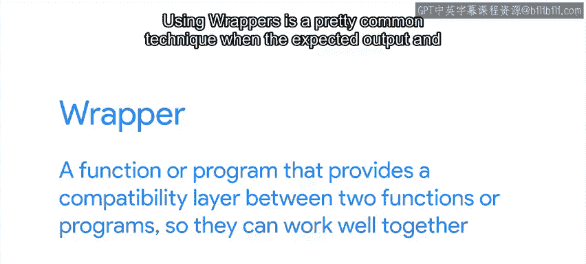
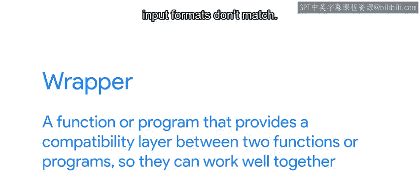
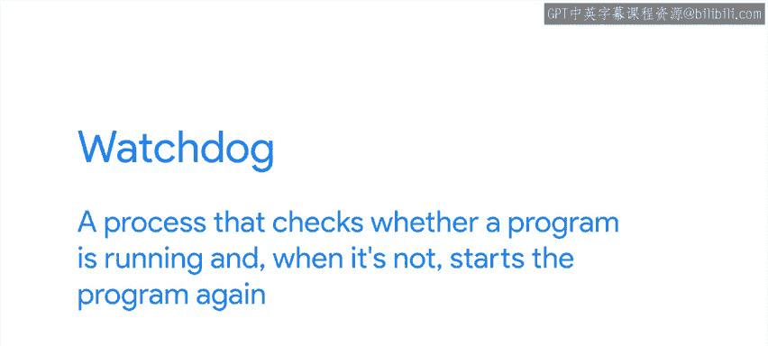
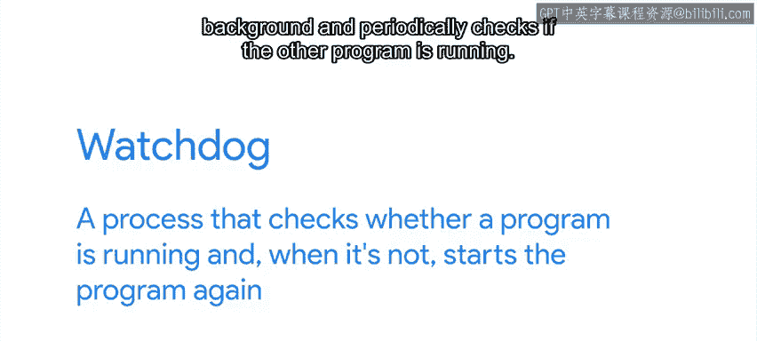

#  090：谷歌《用Python进行IT自动化办公》第32课 - 无法修复程序时该怎么办 🛠️

## 概述

在本节课中，我们将学习当遇到无法直接修改源代码的程序崩溃问题时，可以采取哪些策略来解决问题。我们将探讨几种实用的“变通”方法，确保服务或应用的可用性。

---

## 无法修改代码时的应对策略

在IT领域工作的一大优势是我们可以指令计算机执行任务。然而，当处理由他人编写的软件出现的意外行为时，我们可能就没那么幸运了。这可能是因为我们面对的是专有软件，根本无法获取源代码；或者我们虽然能访问源代码，但它使用的语言我们并不理解，因此无法修改。

无论原因如何，当你需要修复一个崩溃的应用程序却又无法修改其代码时，你能做什么呢？你需要找到一种方法来规避问题，避免崩溃。具体的解决方案取决于你试图解决的问题。

上一节我们介绍了问题的背景，本节中我们来看看一些可用的选项。

---

## 策略一：预处理数据或使用包装器

假设你发现问题是某个特定的数据输入导致应用程序崩溃。崩溃只发生在输入数据不符合代码预期的格式时。

例如，你的某些系统生成XML格式的数据，这在旧版软件中运行良好。但新版软件现在要求所有数据必须是YAML格式。

在这种情况下，你可以编写一个脚本对数据进行预处理，确保其格式符合程序预期。

类似地，如果问题是由应用程序使用的某个不再兼容的外部服务引起的，我们可以编写一个服务作为代理，确保双方都能看到它们预期的请求和响应。

这种兼容性层被称为**包装器**。

**包装器**是一个函数或程序，它在两个函数或程序之间提供一个兼容层，使它们能够良好协作。

使用包装器是当预期输出和输入格式不匹配时一种非常常见的技术。

所以，如果你面临某种兼容性问题，不要害怕编写一个包装器来绕过它。

---

## 策略二：调整系统环境

另一个可能需要考虑的可能性是，整体系统环境与应用程序不兼容。

在这种情况下，你可能需要检查应用程序开发者推荐的环境，然后修改你的系统以匹配它。这可能意味着运行相同版本的操作系统、使用相同版本的动态库或与相同的后端服务交互。

例如，如果应用程序是在Windows 7上开发和测试的，而你在Windows 10下运行时遇到问题，你可能需要改用Windows 7。或者，如果应用程序是为Ubuntu开发和测试的，而你在Fedora下运行遇到麻烦，你可能需要尝试在Ubuntu上运行。

如果你无法使环境匹配怎么办？例如，这可能发生在另一个应用程序需要同一库的不同版本时，或者你无法更改某个配置设置，因为该设置是访问另一项服务所必需的。

在这种情况下，你可能需要考虑在虚拟机或容器中运行该应用程序。这是两种不同的技术，但我们不在此详述它们的区别。目前你只需要知道，它们都允许你在自己的环境中运行受影响的应用程序，而不会干扰系统的其余部分。当我们需要环境与同一台计算机上其他应用程序使用的环境不同时，这正是我们所需要的。

---

## 策略三：部署看门狗进程

有时我们无法找到阻止应用程序崩溃的方法，但我们可以确保如果它崩溃了，能够重新启动。

为此，我们可以部署一个**看门狗**。这是一个检查程序是否正在运行的进程，当程序未运行时，它会重新启动该程序。

要实现这一点，我们需要编写一个脚本，使其在后台持续运行，并定期检查另一个程序是否在运行。每当检查失败时，看门狗就会触发程序重启。

这样做并不能避免崩溃本身，但至少能确保服务可用。这对于可用性比持续运行更重要的服务来说效果很好。

---

## 策略四：报告错误

无论你如何解决问题，请记住始终向应用程序开发者报告错误。

正如我们之前提到的，如果你能为你的问题提供一个良好的复现案例，这将使开发者更容易找出问题所在以及如何修复它。

因此，当你报告错误时，请确保包含尽可能多的信息。提供一个良好的复现案例，并回答我们之前提到的问题：

以下是报告错误时应包含的关键信息：
*   你试图做什么？
*   你遵循了哪些步骤？
*   你期望发生什么？
*   实际结果是什么？

---

## 总结

本节课中我们一起学习了当无法直接修改程序代码时，应对软件崩溃的几种策略。我们探讨了通过**预处理数据**或使用**包装器**解决兼容性问题，通过**调整系统环境**或在**虚拟机/容器**中运行为程序创造合适的环境，以及通过部署**看门狗进程**来保证服务的可用性。最后，我们强调了向开发者**详细报告错误**的重要性，这有助于从根本上解决问题。掌握这些“变通”方法，能让你在无法触及源代码时，依然有效地维持IT系统的稳定运行。

接下来，我们将学习如何应用这些技能来对一个崩溃的应用程序进行故障排除。