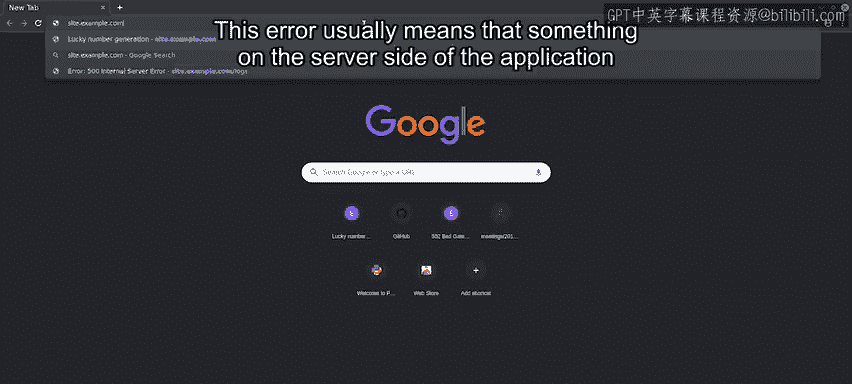
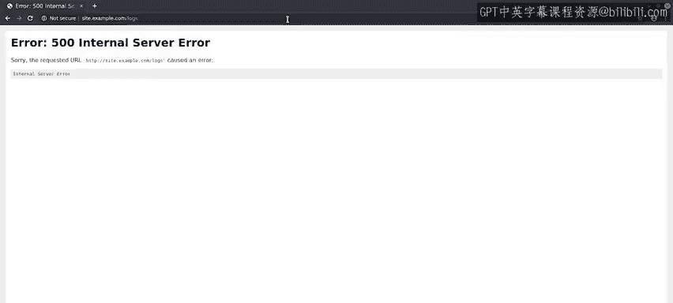
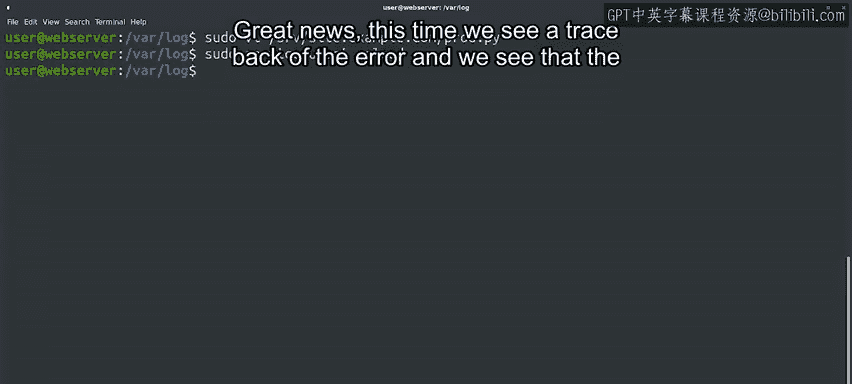
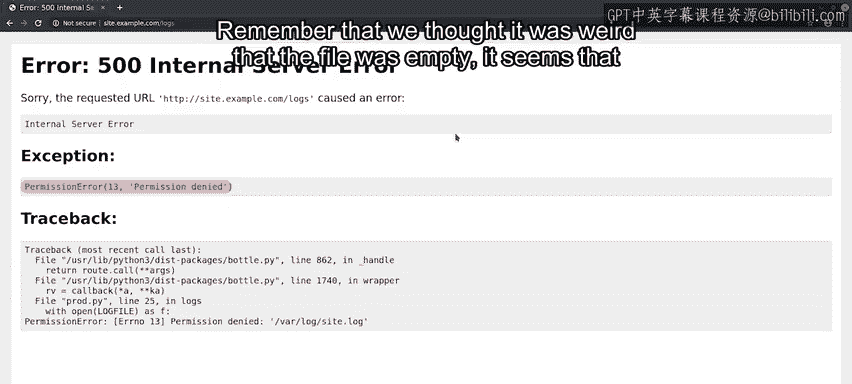
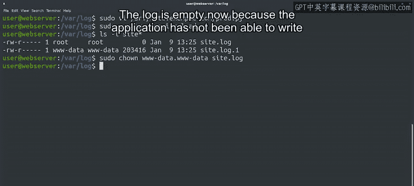
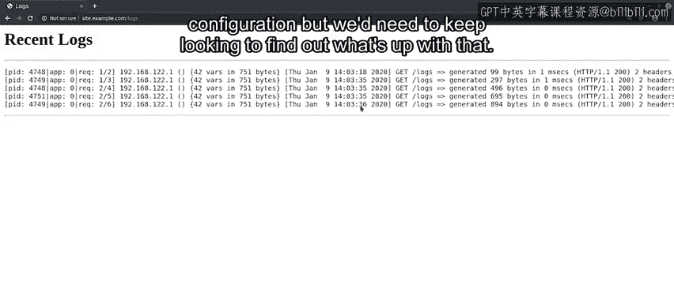

#  091：排查内部服务器错误 🔍


在本节课中，我们将学习如何诊断和修复一个Web服务器上的“500内部服务器错误”。我们将从接收错误报告开始，逐步深入系统内部，检查日志、分析网络连接、查看配置文件，最终定位并解决一个由文件权限问题引发的故障。

---

一位同事提醒我们，公司Web服务器上的一个页面无法正常工作。和以往一样，我们需要弄清楚这具体意味着什么。我们向同事询问了更多细节，他告知我们出错的网页地址是 `site.example.com/logs`。



让我们检查一下，这个页面是否对我们同样失效。




问题出现了，服务器返回了 **500错误**。


这个错误通常意味着应用程序的服务器端有东西崩溃了。但我们不知道具体是什么。我们需要进行调查以获取更多信息。

让我们连接到Web服务器，尝试找出问题所在。第一步是查看日志。正如我们之前提到的，在Linux系统上，日志通常位于 `/var/log` 目录下。

为此，我们先使用 `date` 命令确认当前日期，然后切换到日志目录，检查是否有关于我们错误的最新日志。

```bash
cd /var/log
```

接着，我们使用 `ls -lt` 命令，该命令会按最后修改日期排序文件。我们将其输出通过管道连接到 `head` 命令，以仅查看前10行。

```bash
ls -lt | head -10
```

我们刚刚触发了错误，但日志中似乎没有任何最近的记录。为了以防万一，让我们用 `tail` 命令查看 `syslog` 的最后几行。

```bash
tail -20 /var/log/syslog
```

不，这里也没有发现什么有用的信息。

我们需要找到获取更多信息的方法，但我们甚至不知道这台计算机上运行的是哪种Web服务软件。不过，我们知道Web服务器运行在80端口，这是默认的Web服务端口。

我们如何找到哪个软件正在监听80端口呢？我们可以使用 `netstat` 命令。根据我们传递的标志，这个命令可以提供大量关于网络连接的信息。此命令访问的许多套接字仅限于Linux上的管理员用户 `root`，因此我们需要使用 `sudo` 来以root权限运行它。

然后，我们将向 `netstat` 传递一系列标志：`-n` 用于打印数字地址而非解析主机名，`-l` 用于仅查看正在监听连接的套接字，`-p` 用于打印每个套接字所属的进程ID和名称。由于我们只关心80端口，我们将把输出通过管道连接到 `grep` 命令来查找 `:80`。

```bash
sudo netstat -nlp | grep :80
```

很好，我们获得了新信息。我们看到监听80端口的进程叫做 `nginx`，这是一个流行的Web服务应用程序。

现在，我们想查看我们站点的配置。在Linux上，配置文件通常存储在 `/etc` 目录中，所以让我们看看 `/etc/nginx`。

```bash
ls /etc/nginx
```

这里有很多文件，Web服务器中可以设置许多不同的配置选项。我们正在寻找与特定站点相关的配置，所以让我们查看 `/etc/nginx/sites-enabled`。

```bash
ls /etc/nginx/sites-enabled
```

这里有两个文件，一个是默认站点的，另一个是 `site.example.com` 站点的。这正是我们需要的。让我们用 `vi` 编辑器打开它。

```bash
sudo vi /etc/nginx/sites-enabled/site.example.com
```

内容不多，但在底部我们看到一行：`uwsgi_pass` 后面跟着本地主机地址和一个不同的端口号。看来这个网站并非直接由Nginx提供服务。相反，该软件将连接的控制权传递给了 `uwsgi`，这是一种常用于将Web服务器连接到生成动态页面的程序的解决方案。

那么，让我们看看是否能找到 `uwsgi` 的配置。我们用 `:q` 退出 `vi`，然后查看 `/etc/uwsgi` 目录下是否有有趣的内容。

```bash
ls /etc/uwsgi
```

这里只看到两个目录：`apps-available` 和 `apps-enabled`。让我们看看 `apps-enabled` 里有什么。

```bash
ls /etc/uwsgi/apps-enabled
```

很好，我们找到了站点的 `uwsgi` 配置文件，让我们检查一下。

```bash
sudo vi /etc/uwsgi/apps-enabled/site.example.com.ini
```

这个文件信息丰富得多。我们看到应用程序的主目录是 `/srv/site.example.com`，应用程序以 `www-data` 用户和组身份运行，它运行一个名为 `prod.py` 的Python3脚本，日志存储在 `/var/log/site.log`，以及其他一些信息。

好的，让我们利用这些额外信息，看看能否找出问题所在。再次用 `:q` 退出，然后检查那个日志文件。

```bash
ls -l /var/log/site.log
```

奇怪，日志文件的大小是零。这看起来不对。让我们看看能否通过查看 `uwsgi` 执行的Python脚本来发现其他线索。

```bash
sudo vi /srv/site.example.com/prod.py
```

这个文件配置了几个不同的网页。它使用了 `Bottle`，这是一个用于生成动态网页的Python模块。在底部，我们看到了当前出错的日志页面的配置。幸运的是，一位同事留下了一条注释，说明我们可以通过取消注释调用 `bottle.debug(True)` 的那一行来获取调试信息。

这正是我们需要的。要取消注释这一行，我们需要对文件有写权限，而 `vi` 当前是以只读模式打开的。让我们退出并以 `sudo` 重新打开以便修改。

```bash
sudo vi /srv/site.example.com/prod.py
```



我们已经做出了更改，按照说明保存它并重新加载 `uwsgi`。

```bash
sudo service uwsgi reload
```



好的，我们已经添加了调试信息，希望这能告诉我们页面失败的原因。让我们重新加载网站看看会发生什么。


好消息！这次我们看到了错误的回溯信息。我们看到问题是应用程序在尝试打开 `/var/log/site.log` 时收到了“权限被拒绝”的错误。


还记得我们觉得这个文件为空很奇怪吗？看来它不知怎么损坏了。让我们再仔细看看。这次，检查一下是否有其他以 `site.log` 开头的文件。

```bash
ls -l /var/log/site.log*
```

有一个 `site.log` 文件和一个 `site.log.1` 文件。在使用 `logrotate` 轮转日志以避免它们变得太大时，这很常见。但这里有些不对劲。注意一个文件属于 `root` 用户，而另一个属于 `www-data` 用户。

如果你查看文件的权限，可能会注意到它们被设置为允许所有者写入，所有者和组读取，但其他用户无法访问。我们之前看到应用程序是以 `www-data` 用户运行的，所以如果 `site.log` 属于 `root` 用户，应用程序将无法读取或写入这个日志文件。

叮！叮！看来我们找到了问题的根本原因。让我们更改 `site.log` 文件的所有者来解决眼前的问题。



```bash
sudo chown www-data:www-data /var/log/site.log
```

现在尝试重新加载我们的页面。




成功了！日志现在是空的，因为应用程序之前无法写入它，但如果我们持续刷新，就会看到它被我们的访问记录填满。

好的，我们已经解决了眼前的问题，我们的网页再次正常工作了。但我们仍然需要处理长期的修复措施。为什么文件的所有权会出错呢？


我们怀疑 `logrotate` 的配置可能有问题，但我们需要继续调查以找出原因。

---

在本节课中，我们一起研究了如何排查一个失败的应用程序。我们检查了一系列不同的工具和思路，这些都能帮助我们理解正在发生的情况并获取更多信息，直到找到问题的根本原因。希望你现在开始明白，这些课程提供了诊断和解决工作中肯定会遇到问题的宝贵工具。

接下来，我们将有一篇阅读材料，其中包含一些链接，帮助你了解更多可能导致计算机崩溃的不同情况，然后是一个快速练习测验。