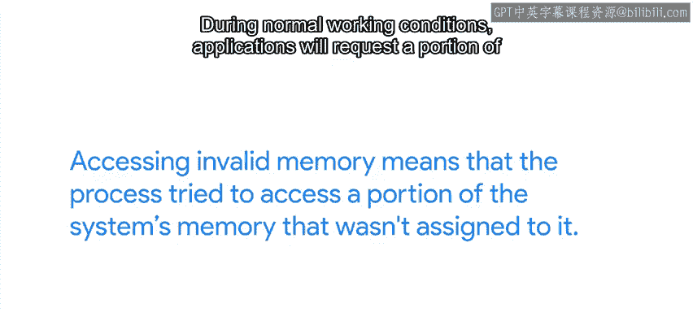
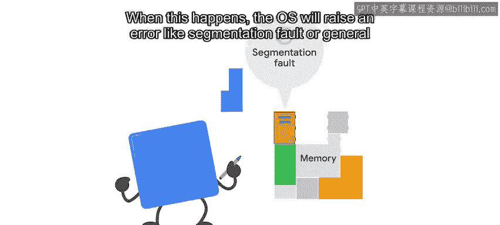
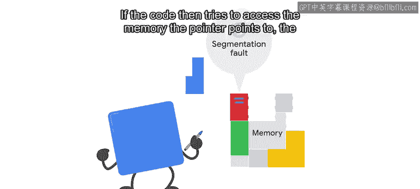
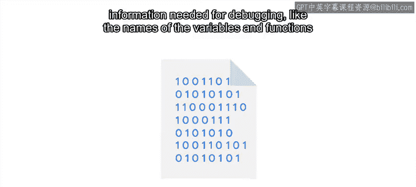
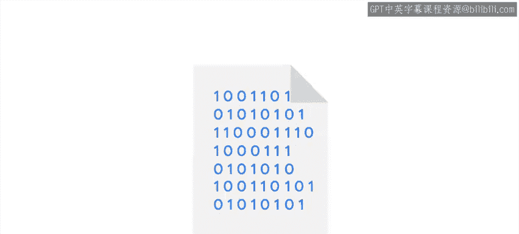
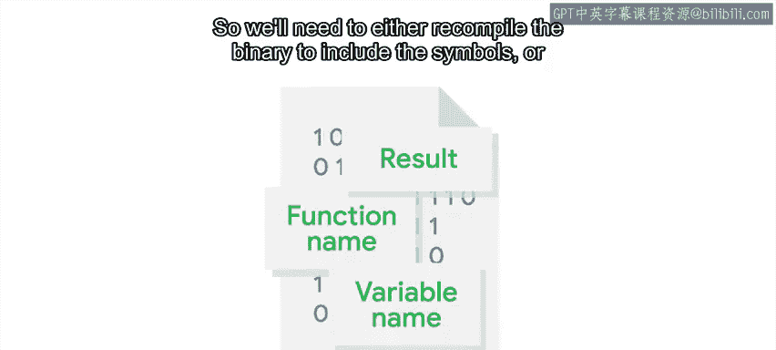
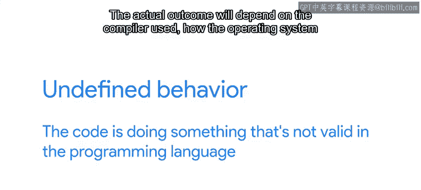
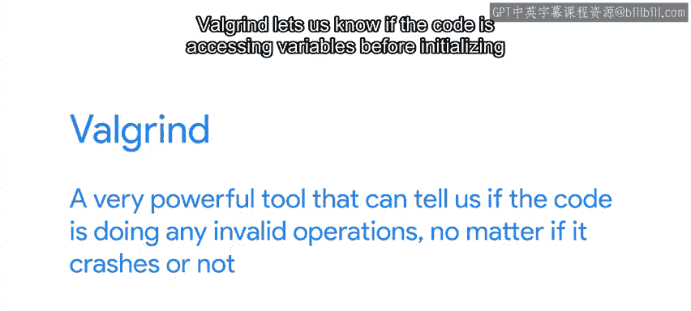

#  092：访问无效内存 🧠

在本节课中，我们将学习程序崩溃的一个常见原因——访问无效内存。我们将探讨其背后的原理、如何诊断此类问题以及可能的解决方案。

## 概述：什么是访问无效内存？

在之前的视频中，我们探讨了多种可能导致软件崩溃的原因，以及当无法直接修改代码时我们可以采取的措施。然而，如果我们能让应用程序行为正确，我们就有更多处理崩溃的选项。当然，要应用这些修复，我们需要理解崩溃发生的原因。

程序崩溃的一个常见原因是它试图访问无效内存。为了理解这意味着什么，让我们快速解释一下现代操作系统中内存的使用方式。

## 内存管理基础

运行在我们计算机上的每个进程都会向操作系统请求一块内存。这块内存用于在程序执行期间存储值和对其进行操作。

操作系统维护一个映射表，记录哪个进程被分配了哪部分内存。

进程不允许在其被分配的内存部分之外进行读取或写入操作。

因此，访问无效内存意味着进程试图访问系统中未分配给它的那部分内存。

## 为什么会发生访问无效内存？

那么，在正常工作条件下，这种情况是如何发生的呢？应用程序会请求一部分内存，然后使用操作系统分配给它们的空间。

但是，编程错误可能导致进程试图在有效范围之外的内存地址进行读取或写入。

当这种情况发生时，操作系统会引发一个错误，例如**分段错误**或**一般保护错误**。

## 导致无效内存访问的编程错误

这是哪种编程错误呢？它通常发生在像C或C++这样的低级语言中，在这些语言中，程序员需要负责管理程序将要使用的内存，并在不再需要时将其归还。

在这些语言中，存储内存地址的变量被称为**指针**。

它们就像代码中的任何其他变量一样，可以根据需要进行修改。

因此，如果一个指针被设置为超出该进程有效内存范围的值，它将指向无效内存。如果代码随后尝试访问该指针指向的内存，应用程序就会崩溃。

以下是导致分段错误的常见编程错误：

*   **忘记初始化变量**：使用未分配初始值的指针。
*   **访问列表有效范围之外的元素**：例如，尝试读取一个长度为5的列表的第10个元素。
*   **在归还内存后仍尝试使用它**：这被称为“释放后使用”。
*   **尝试写入超过所请求内存部分容量的数据**：这被称为“缓冲区溢出”。

## 如何诊断分段错误？

如果你有一个程序出现了分段错误，该怎么办？理解问题所在的最佳方法是将调试器附加到有问题的程序上。这样，当程序崩溃时，你将获得有关故障发生所在函数的信息。

你会知道函数接收到的参数，并找出无效的内存地址。这可能已经足够理解问题了。也许某个变量初始化得太晚，或者代码试图读取列表中的过多项。

如果这还不够，调试器可以为你提供关于应用程序正在做什么以及为什么内存无效的更多详细信息。为此，我们的程序需要使用调试符号进行编译。

这意味着，除了计算机用于执行程序的信息外，可执行二进制文件还需要包含调试所需的额外信息，例如正在使用的变量和函数的名称。

这些符号通常从我们运行的可执行文件中剥离，以使其更小。因此，我们需要重新编译二进制文件以包含符号，或者从软件提供商处下载调试符号（如果可用）。像Debian或Ubuntu这样的Linux发行版会为发行版中的所有软件包提供包含调试符号的独立软件包。

## 诊断流程与工具

要调试一个出现分段错误的应用程序，我们下载该应用程序的调试符号，将调试器附加到它，并查看故障发生的位置。这样做时，我们可能会发现崩溃发生在对库函数的调用内部。这与应用程序本身是分开的，因此我们需要为该库安装调试符号。我们可能需要重复这个循环几次，才能识别出有问题的代码部分。

微软的编译器也可以在一个单独的PDB文件中生成调试符号。一些Windows软件提供商允许用户下载与其二进制文件对应的PDB文件，以便他们正确调试故障。

关于无效内存访问最棘手的事情之一是，我们通常处理的是**未定义行为**。这意味着代码正在做编程语言中无效的事情。

实际结果将取决于所使用的编译器、操作系统如何为进程分配内存，甚至所使用的库的版本。一个在运行Windows的计算机上运行良好的程序，可能在运行Linux的计算机上触发分段错误，反之亦然。

在尝试理解与处理无效内存相关的问题时，**Valgrind**可以给我们很大帮助。Valgrind是一个非常强大的工具，它可以告诉我们代码是否正在执行任何无效操作，无论它是否崩溃。

Valgrind让我们知道代码是否在初始化变量之前访问它们，代码是否未能释放请求的部分内存，指针是否指向无效的内存地址，以及更多事情。Valgrind在Linux和macOS上可用。**Dr. Memory**是一个类似的工具，可以在Windows和Linux上使用。

## 发现原因后怎么办？

那么，说了这么多，当我们最终发现分段错误的原因时，我们该怎么做呢？你会希望要么自己修改代码，要么让开发人员在下一个版本中修复问题。

如果你从未使用过应用程序所用的编程语言，这听起来可能很可怕。但是，当你知道代码有什么问题时，通常不难找出如何修复它。

如果一个变量初始化得太晚，修复问题可能就像将初始化移到代码的正确部分一样简单。或者，如果一个循环正在访问超出列表长度的项，你可以通过检查迭代次数是否超过所需来解决这个问题。

在本课程中，我们一直在教你这些概念，以便你可以将它们应用到任何代码片段中，无论程序使用哪种语言。所以，不要害怕将其付诸实践，你已经具备了相应的技能。

如果程序是开源项目的一部分，你可能会发现其他人已经完成了这项工作，因此你可以应用网上可用的补丁。如果没有补丁，你自己也无法找出错误，你总是可以联系开发人员，询问他们是否可以修复问题并创建必要的补丁。

## 高级语言中的情况

在像Python这样的高级语言中，解释器几乎肯定会自己捕获这类问题。然后它会抛出一个异常，而不是让无效的内存访问到达操作系统。但是，这些异常仍然可能相当烦人。我们将在下一个视频中讨论这些。

## 总结

本节课中，我们一起学习了程序崩溃的常见原因——访问无效内存。我们了解了操作系统如何管理内存，以及编程错误（如指针错误、缓冲区溢出等）如何导致分段错误。我们探讨了使用调试器和调试符号来诊断问题的方法，并介绍了Valgrind等辅助工具。最后，我们讨论了发现根本原因后的修复策略，以及在高级语言中此类问题的不同表现形式。掌握这些知识将帮助你更有效地诊断和解决复杂的软件崩溃问题。