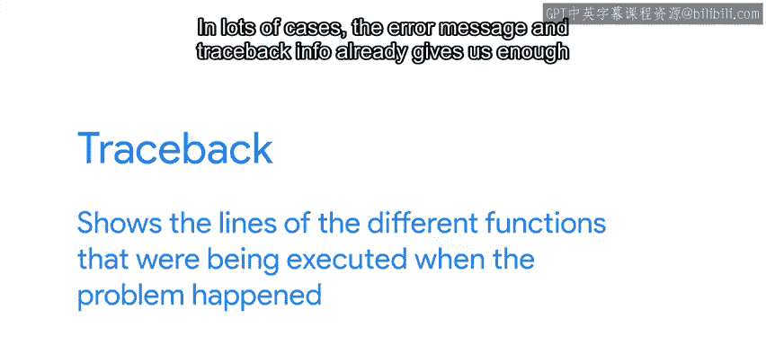
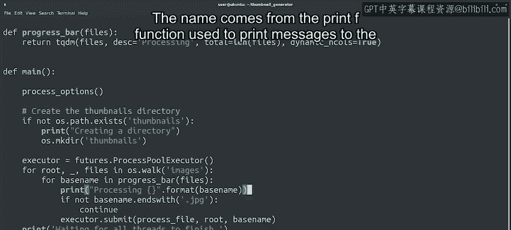

#  093：未处理的错误和异常 🐛

在本节课中，我们将要学习程序运行时可能遇到的未处理错误和异常。我们将了解它们产生的原因，如何通过调试来定位问题，以及最终如何修复这些问题，使程序更加健壮和用户友好。

## 从内存错误到程序异常

上一节我们介绍了程序访问无效内存可能引发的问题。正确处理内存是一个难题，因此出现了像Python、Java或Ruby这样的编程语言来为我们管理内存。

但这并不意味着用这些语言编写的程序就不会触发奇怪的问题。在这些语言中，当程序遇到代码中未正确处理的意外情况时，就会触发错误或异常。

以下是Python中几种常见的错误类型：
*   **索引错误**：尝试访问列表末尾之后的元素时触发。
    ```python
    my_list = [1, 2, 3]
    print(my_list[5])  # 这将引发 IndexError
    ```
*   **类型错误或属性错误**：尝试对未正确初始化的变量执行操作时触发。
*   **除零错误**：尝试进行除以零的操作时触发。

当代码产生这些错误而未妥善处理时，程序通常会意外终止。一般而言，未处理的错误发生是因为代码做出了错误的假设。

## 理解错误信息与回溯

当这些故障发生时，运行程序的解释器会打印错误类型、导致故障的代码行以及回溯信息。




回溯显示了问题发生时正在执行的不同函数的代码行。

在许多情况下，错误信息和回溯信息已经足以让我们理解发生了什么，从而着手解决问题。但遗憾的是，情况并非总是如此。

一段代码在某个函数中崩溃，并不意味着错误一定就在那个函数里。例如，问题可能是由之前调用的某个函数引起的，它把一个变量设置成了错误的值，而崩溃的函数只是访问了这个变量。

## 调试代码以定位问题

因此，当错误信息不足以定位问题时，我们需要调试代码来找出问题所在。

对于Python程序，我们可以使用PDB交互式调试器。它允许我们执行所有典型的调试操作，例如逐行执行代码，或者在试图理解一个行为异常的函数时，观察变量值的变化。

除了使用调试器，常见的做法是添加打印与代码执行相关数据的语句。




以下是这类语句可以显示的内容：
*   变量的内容。
*   函数的返回值。
*   元数据，如列表的长度或文件的大小。

这种技术被称为“打印调试”。该名称来源于C编程语言中用于向屏幕打印消息的`printf`函数。但我们可以在所有语言中使用这种技术，无论我们使用`print`、`puts`还是`echo`来在屏幕上显示文本。

## 使用日志模块进行更好的调试

让我们更进一步。在修改代码以向屏幕打印消息时，最好的方法是以一种可以轻松启用或禁用的方式添加消息，这取决于我们是否需要调试信息。

在Python中，我们可以使用`logging`模块来实现这一点。该模块允许我们设置希望代码的详细程度。我们可以选择是包含所有调试消息，还是仅包含信息、警告或错误消息。然后在打印消息时，我们指定正在打印的消息类型。这样，我们就可以通过一个标志或配置设置来更改调试级别。

## 修复错误与增强程序健壮性

假设你已经找出了抛出意外异常的原因。接下来该怎么做？

解决方案可能是修复编程错误，例如确保变量在使用前被初始化，或者确保代码不会尝试访问列表末尾之后的元素。也可能需要将某些未考虑到的用例添加到代码中。

总的来说，你会希望程序对故障有更强的恢复能力。与其意外崩溃，不如让程序告知用户问题所在，并告诉他们需要做什么。

例如，假设你有一个应用程序因“权限被拒绝”错误而崩溃。与其让程序意外终止，不如修改代码以捕获该错误，并告诉用户权限问题是什么，以便他们可以修复它。例如：“无法在`/tmp`目录中写入新文件，请确保您的用户对该目录拥有写入权限。”

在某些情况下，如果某些条件不满足，我们的程序甚至没有运行的意义。在这种情况下，程序在触发错误时终止是可以接受的。但同样，它应该以一种告诉用户如何解决问题的方式终止。

例如，如果一个应用程序必须连接到数据库，但数据库服务器没有响应，那么应用程序以错误信息“无法连接到数据库服务器”终止是合理的。同时，包含所有连接尝试的详细信息（如主机、端口或用于连接的用户名）也是有意义的。

## 课程总结

本节课中我们一起学习了如何处理未处理的错误和异常。我们来总结一下关键步骤：

1.  **调试定位**：如果程序因未处理的错误而崩溃，首先需要进行一些调试以找出问题的原因。
2.  **修复与捕获**：一旦找出原因，你需要确保修复任何编程错误，并捕获任何可能触发错误的条件。

通过这种方式，你可以确保程序不会崩溃，从而避免让用户感到沮丧。

接下来，我们将讨论在尝试修复他人代码时可以做些什么。